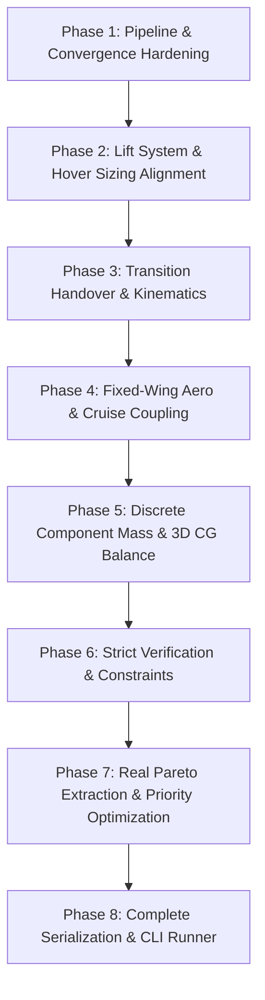

# VTOL BACKEND — FORENSIC INVENTORY REPORT
**Torq Wings Multidisciplinary Aircraft Design Framework**  
**Date:** September 20, 2026  
**Status:** FORENSIC INVENTORY ONLY (NO PRODUCTION CODE MODIFIED)  

---

## 1. Executive Summary

This forensic audit represents an exhaustive, code-level inspection of the entire VTOL (Vertical Takeoff and Landing) backend implementation in the Torq Wings repository (`backend/design/vtol/` and `tests/design/vtol/`). 

### Core Inventory Findings
1. **Scale & Structure:** The VTOL backend consists of **342 source files** distributed across **21 functional directories** in `backend/design/vtol/`, paired with **21 test files** (containing **71 test functions**) in `tests/design/vtol/`. It mirrors a highly uniform 20-stage multidisciplinary architecture (`<module>_engine.py`, `<module>_strategy.py`, `<module>_requirements.py`, `<module>_result.py`, `<module>_profile.py`, `<module>_analysis.py`, `<module>_constraints.py`, `<module>_validator.py`, `<module>_registry.py`).
2. **Orchestrator Pipeline:** An end-to-end 21-stage sequential sizing pipeline exists in [`VTOLDesignPipeline`](file:///c:/Users/acer/Documents/torqwings%20studio%20v2/backend/design/vtol/pipeline/vtol_design_pipeline.py#L110) with an under-relaxation convergence loop. A `DesignEngine` adapter exists in [`VTOLDesignEngine`](file:///c:/Users/acer/Documents/torqwings%20studio%20v2/backend/design/vtol/pipeline/vtol_design_pipeline.py#L750).
3. **Reuse of Locked Fixed-Wing Backend:** **0.0%**. The VTOL backend contains **zero imports and zero function calls** to `backend.design.fixed_wing`. Wing sizing, airfoil selection, tail sizing, fuselage sizing, drag build-up, and forward propulsion are completely duplicated or re-implemented independently inside `backend/design/vtol/`.
4. **Convergence Defect:** The multidisciplinary convergence loop in `VTOLDesignPipeline` has a critical structural defect: [`MassPropertiesEngine`](file:///c:/Users/acer/Documents/torqwings%20studio%20v2/backend/design/vtol/mass_properties/mass_strategy.py#L187) assigns `max_takeoff_weight_kg = estimated_mtow_kg` (which is `old_mtow`). Because `raw_new_mtow` equals `old_mtow`, the residual is immediately 0.0, and the sizing loop exits without actually performing iterative mass accumulation.
5. **Transition Engine Reality:** The transition module (`backend/design/vtol/transition/`) contains **no dynamic aero-propulsive or 6-DOF equations of motion**. Transition scheduling is a static piecewise interpolation (`[0%, 25%, 50%, 75%, 100%]`), wing lift growth is a fixed dummy coefficient (`0.055`), and transition energy is a simple multiplier of hover power ($P_{\text{trans}} = 1.2 \cdot P_{\text{hover}}$).
6. **Optimization & Pareto Reality:** Optimization (`backend/design/vtol/optimization/`) is a **pure synthetic stub**. All 7 optimizer strategies (`NSGA-II`, `PSO`, `GA`, `Bayesian`, etc.) return identical hardcoded `DesignVariables`, synthetic iteration histories generated by an arithmetic formula (`0.55 + 0.30*(i/N)`), and a static 3-point `ParetoFront`. True multi-objective Pareto front extraction is **ABSENT**.
7. **Validation Enforcement Split:** Hardware and structural stages (`mission`, `configuration`, `wing`, `airfoil`, `tail`, `fuselage`, `lift_system`, `forward_propulsion`, `electrical`) raise hard `ValidationError` exceptions that abort the pipeline upon violation. In contrast, flight dynamics and synthesis stages (`hover_performance`, `transition`, `cruise_performance`, `mass_properties`, `verification`, `optimization`) only generate string warnings that are appended to `result.warnings` and never enforce failure.
8. **Serialization Gap:** [`vtol_specification.json`](file:///c:/Users/acer/Documents/torqwings%20studio%20v2/backend/design/vtol/pipeline/vtol_design_pipeline.py#L678) exports only 5 top-level numbers and snippets from 3 subsystems. 15 out of the 20 design subsystems are completely omitted from the JSON output.

---

## 2. Repository Structure

### 2.1 Backend Modules (`backend/design/vtol/`)
Total backend files: **342 Python files** across **21 subdirectories**:

| Directory | File Count | Primary Role / Responsibility | Key Classes & Facades |
| :--- | :---: | :--- | :--- |
| [`airfoil/`](file:///c:/Users/acer/Documents/torqwings%20studio%20v2/backend/design/vtol/airfoil/) | 15 | Wing airfoil selection, polar polars, slipstream correction | [`AirfoilEngine`](file:///c:/Users/acer/Documents/torqwings%20studio%20v2/backend/design/vtol/airfoil/airfoil_engine.py#L27), `AirfoilSelector`, `AirfoilDatabase` |
| [`avionics/`](file:///c:/Users/acer/Documents/torqwings%20studio%20v2/backend/design/vtol/avionics/) | 20 | Flight controller, sensors, telemetry, redundancy | [`AvionicsEngine`](file:///c:/Users/acer/Documents/torqwings%20studio%20v2/backend/design/vtol/avionics/avionics_engine.py#L8), `AvionicsStrategy` |
| [`cad/`](file:///c:/Users/acer/Documents/torqwings%20studio%20v2/backend/design/vtol/cad/) | 17 | 3D wireframe / STEP assembly generation references | [`VTOLCADEngine`](file:///c:/Users/acer/Documents/torqwings%20studio%20v2/backend/design/vtol/cad/cad_engine.py#L8), `CADStrategy` |
| [`configuration/`](file:///c:/Users/acer/Documents/torqwings%20studio%20v2/backend/design/vtol/configuration/) | 15 | VTOL layout selection, actuator & rotor coordinates | [`ConfigurationEngine`](file:///c:/Users/acer/Documents/torqwings%20studio%20v2/backend/design/vtol/configuration/configuration_engine.py#L26), `LayoutGenerator`, `ConfigurationSelector` |
| [`cruise_performance/`](file:///c:/Users/acer/Documents/torqwings%20studio%20v2/backend/design/vtol/cruise_performance/) | 18 | Fixed-wing forward cruise endurance, range, maneuvers | [`CruisePerformanceEngine`](file:///c:/Users/acer/Documents/torqwings%20studio%20v2/backend/design/vtol/cruise_performance/cruise_engine.py#L8), `CruisePerformanceStrategy` |
| [`electrical/`](file:///c:/Users/acer/Documents/torqwings%20studio%20v2/backend/design/vtol/electrical/) | 19 | Battery pack sizing (S/P), power buses, C-rates | [`ElectricalEngine`](file:///c:/Users/acer/Documents/torqwings%20studio%20v2/backend/design/vtol/electrical/electrical_engine.py#L31), `BatterySelector`, `PowerBudget` |
| [`forward_propulsion/`](file:///c:/Users/acer/Documents/torqwings%20studio%20v2/backend/design/vtol/forward_propulsion/) | 16 | Cruise motor, propeller, ESC sizing & drag match | [`ForwardPropulsionEngine`](file:///c:/Users/acer/Documents/torqwings%20studio%20v2/backend/design/vtol/forward_propulsion/forward_propulsion_engine.py#L29), `CruiseMotorSelector`, `CruisePropellerSelector` |
| [`fuselage/`](file:///c:/Users/acer/Documents/torqwings%20studio%20v2/backend/design/vtol/fuselage/) | 18 | Body geometry, compartments, boom/gear interfaces | [`FuselageEngine`](file:///c:/Users/acer/Documents/torqwings%20studio%20v2/backend/design/vtol/fuselage/fuselage_engine.py#L31), `FuselageStrategy` |
| [`hover_performance/`](file:///c:/Users/acer/Documents/torqwings%20studio%20v2/backend/design/vtol/hover_performance/) | 18 | Momentum theory hover power, IGE/OGE, hover control | [`HoverPerformanceEngine`](file:///c:/Users/acer/Documents/torqwings%20studio%20v2/backend/design/vtol/hover_performance/hover_engine.py#L8), `HoverStrategy` |
| [`lift_system/`](file:///c:/Users/acer/Documents/torqwings%20studio%20v2/backend/design/vtol/lift_system/) | 16 | Lift rotor/motor sizing, boom coordinates, OEI check | [`LiftSystemEngine`](file:///c:/Users/acer/Documents/torqwings%20studio%20v2/backend/design/vtol/lift_system/lift_system_engine.py#L28), `LiftMotorSelector`, `LiftPropellerSelector` |
| [`manufacturing/`](file:///c:/Users/acer/Documents/torqwings%20studio%20v2/backend/design/vtol/manufacturing/) | 18 | Bill of materials, tooling, composite layup cost estimates | [`VTOLManufacturingEngine`](file:///c:/Users/acer/Documents/torqwings%20studio%20v2/backend/design/vtol/manufacturing/manufacturing_engine.py#L8), `ManufacturingStrategy` |
| [`mass_properties/`](file:///c:/Users/acer/Documents/torqwings%20studio%20v2/backend/design/vtol/mass_properties/) | 17 | Weight budget, CG calculation, inertia tensor, shifts | [`MassPropertiesEngine`](file:///c:/Users/acer/Documents/torqwings%20studio%20v2/backend/design/vtol/mass_properties/mass_properties_engine.py#L8), `MassStrategy` |
| [`mission/`](file:///c:/Users/acer/Documents/torqwings%20studio%20v2/backend/design/vtol/mission/) | 13 | Requirement translation, atmospheric density, energy | [`MissionEngine`](file:///c:/Users/acer/Documents/torqwings%20studio%20v2/backend/design/vtol/mission/mission_engine.py#L27), `BaseMissionStrategy` |
| [`optimization/`](file:///c:/Users/acer/Documents/torqwings%20studio%20v2/backend/design/vtol/optimization/) | 18 | Design variable tradeoff & synthetic Pareto generation | [`OptimizationEngine`](file:///c:/Users/acer/Documents/torqwings%20studio%20v2/backend/design/vtol/optimization/optimization_engine.py#L8), `OptimizationStrategy` |
| [`payload/`](file:///c:/Users/acer/Documents/torqwings%20studio%20v2/backend/design/vtol/payload/) | 17 | Sensor/camera/cargo selection, mounts, balance | [`PayloadEngine`](file:///c:/Users/acer/Documents/torqwings%20studio%20v2/backend/design/vtol/payload/payload_engine.py#L8), `PayloadStrategy` |
| [`pipeline/`](file:///c:/Users/acer/Documents/torqwings%20studio%20v2/backend/design/vtol/pipeline/) | 4 | Orchestration loop, convergence manager, router adapter | [`VTOLDesignPipeline`](file:///c:/Users/acer/Documents/torqwings%20studio%20v2/backend/design/vtol/pipeline/vtol_design_pipeline.py#L110), [`VTOLDesignEngine`](file:///c:/Users/acer/Documents/torqwings%20studio%20v2/backend/design/vtol/pipeline/vtol_design_pipeline.py#L750), `VTOLConvergenceManager` |
| [`report/`](file:///c:/Users/acer/Documents/torqwings%20studio%20v2/backend/design/vtol/report/) | 18 | Text/markdown summary generator | [`VTOLReportEngine`](file:///c:/Users/acer/Documents/torqwings%20studio%20v2/backend/design/vtol/report/report_engine.py#L8), `ReportStrategy` |
| [`tail/`](file:///c:/Users/acer/Documents/torqwings%20studio%20v2/backend/design/vtol/tail/) | 14 | Horizontal & vertical tail volume sizing | [`TailEngine`](file:///c:/Users/acer/Documents/torqwings%20studio%20v2/backend/design/vtol/tail/tail_engine.py#L24), `TailSizer` |
| [`transition/`](file:///c:/Users/acer/Documents/torqwings%20studio%20v2/backend/design/vtol/transition/) | 18 | Conversion scheduling, energy, and stability margins | [`TransitionFlightEngine`](file:///c:/Users/acer/Documents/torqwings%20studio%20v2/backend/design/vtol/transition/transition_engine.py#L8), `TransitionStrategy` |
| [`verification/`](file:///c:/Users/acer/Documents/torqwings%20studio%20v2/backend/design/vtol/verification/) | 19 | Compliance matrix, MTBF, safety checks | [`VTOLVerificationEngine`](file:///c:/Users/acer/Documents/torqwings%20studio%20v2/backend/design/vtol/verification/verification_engine.py#L8), `VerificationStrategy` |
| [`wing/`](file:///c:/Users/acer/Documents/torqwings%20studio%20v2/backend/design/vtol/wing/) | 14 | Planform area, aspect ratio, chords, motor mounts | [`WingEngine`](file:///c:/Users/acer/Documents/torqwings%20studio%20v2/backend/design/vtol/wing/wing_engine.py#L25), `WingSizer` |

### 2.2 Pipeline Entry Points & Runners
- **Primary Pipeline Class:** [`VTOLDesignPipeline`](file:///c:/Users/acer/Documents/torqwings%20studio%20v2/backend/design/vtol/pipeline/vtol_design_pipeline.py#L110) in `backend/design/vtol/pipeline/vtol_design_pipeline.py`.
- **Router Adapter:** [`VTOLDesignEngine`](file:///c:/Users/acer/Documents/torqwings%20studio%20v2/backend/design/vtol/pipeline/vtol_design_pipeline.py#L750) subclassing [`DesignEngine`](file:///c:/Users/acer/Documents/torqwings%20studio%20v2/backend/design/router/design_engine.py).
- **Standalone Runner Script:** **ABSENT**. There is no `run_vtol_pipeline.py` in `scripts/`. VTOL execution is currently invoked solely via unit/integration test fixtures in [`tests/design/vtol/pipeline/test_vtol_pipeline.py`](file:///c:/Users/acer/Documents/torqwings%20studio%20v2/tests/design/vtol/pipeline/test_vtol_pipeline.py).
- **Registry Integration:** `VTOLDesignEngine` is **not registered by default** in [`DesignEngineRegistry`](file:///c:/Users/acer/Documents/torqwings%20studio%20v2/backend/design/router/design_engine_registry.py). It must be registered manually at runtime.

---

## 3. Requirement Model

### 3.1 Sizing Requirements Classes
- **Canonical Input Model:** [`RequirementModel`](file:///c:/Users/acer/Documents/torqwings%20studio%20v2/backend/design/common/requirements/requirement_model.py) in `backend/design/common/requirements/requirement_model.py`.
- **VTOL-Specific Model:** [`MissionRequirements`](file:///c:/Users/acer/Documents/torqwings%20studio%20v2/backend/design/vtol/mission/mission_requirements.py#L85) in `backend/design/vtol/mission/mission_requirements.py`.
- **Translation Method:** [`VTOLDesignPipeline._translate_requirements()`](file:///c:/Users/acer/Documents/torqwings%20studio%20v2/backend/design/vtol/pipeline/vtol_design_pipeline.py#L587).

### 3.2 Required & Optional Inputs in `MissionRequirements`

| Field Name | Type | Required / Optional | Default Value | Notes / Sizing Role |
| :--- | :--- | :--- | :--- | :--- |
| `mission_category` | `VTOLMissionCategory` | Required | Mapped from `req.mission_type` | Selects strategy across all 20 modules |
| `vtol_type` | `VTOLType` | Required | `VTOLType.LIFT_CRUISE` | Selects structural & propulsion layout |
| `payload_kg` | `float` | Required | From `req.payload_weight_kg` | Sizing payload mass |
| `hover_reqs` | `HoverRequirements` | Required | Sub-dataclass | Hover duration, altitude, climb/descent rate |
| `transition_reqs` | `TransitionRequirements`| Required | Sub-dataclass | Transition speed, duration, max pitch |
| `cruise_reqs` | `CruiseRequirements` | Required | Sub-dataclass | Cruise speed, range, endurance |
| `max_altitude_m` | `float` | Required | `1000.0` (via meta) | Atmospheric density floor & ceiling |
| `environment` | `EnvironmentType` | Required | Mapped from `OperatingEnvironment` | Terrain complexity score |
| `takeoff_method` | `TakeoffMethod` | Required | `TakeoffMethod.VERTICAL` | Sizing launch mode |
| `landing_method` | `LandingMethod` | Required | `LandingMethod.VERTICAL` | Sizing recovery mode |
| `wind_limit_max_kts`| `float` | Required | `22.0` (via meta) | Control margin check |
| `temperature_limit_min_c` | `float` | Required | `-10.0` | Operating temperature boundary |
| `temperature_limit_max_c` | `float` | Required | `40.0` | Thermal sizing boundary |
| `rain_tolerance` | `str` | Required | `"Light"` | Ingress protection check |
| `autonomy_level` | `AutonomyLevel` | Required | `FULLY_AUTONOMOUS` | Avionics computing allocation |
| `safety_requirements` | `str` | Required | `"Dual GNSS and parachute backup"` | Reliability weighting |
| `budget` | `float \| None` | Optional | `None` | Financial feasibility flag |
| `manufacturing_preference` | `str` | Optional | `"Composite"` | Material selection |
| `metadata` | `Dict[str, Any]` | Optional | `{}` | Sizing overrides & hyper-parameters |

### 3.3 Enums
1. [`VTOLMissionCategory`](file:///c:/Users/acer/Documents/torqwings%20studio%20v2/backend/design/vtol/mission/mission_requirements.py#L18): `CARGO`, `SURVEY`, `MAPPING`, `INSPECTION`, `AGRICULTURE`, `LONG_ENDURANCE`, `MILITARY`, `RESEARCH`, `DELIVERY`, `EMERGENCY_RESPONSE`, `SEARCH_AND_RESCUE`, `CUSTOM`.
2. [`VTOLType`](file:///c:/Users/acer/Documents/torqwings%20studio%20v2/backend/design/vtol/mission/mission_requirements.py#L34): `QUADPLANE`, `TILT_ROTOR`, `TILT_WING`, `TAIL_SITTER`, `LIFT_CRUISE`, `VECTORED_THRUST`, `HYBRID_VTOL`, `TWIN_BOOM_VTOL`, `BOX_WING_VTOL`, `CUSTOM`.
3. [`TakeoffMethod`](file:///c:/Users/acer/Documents/torqwings%20studio%20v2/backend/design/vtol/mission/mission_requirements.py#L48): `VERTICAL`, `RUNWAY`, `CATAPULT`, `HAND_LAUNCH`, `CUSTOM`.
4. [`LandingMethod`](file:///c:/Users/acer/Documents/torqwings%20studio%20v2/backend/design/vtol/mission/mission_requirements.py#L57): `VERTICAL`, `RUNWAY`, `BELLY_LANDING`, `PARACHUTE`, `CUSTOM`.
5. [`EnvironmentType`](file:///c:/Users/acer/Documents/torqwings%20studio%20v2/backend/design/vtol/mission/mission_requirements.py#L66): `RURAL`, `URBAN`, `FOREST`, `MOUNTAIN`, `DESERT`, `MARINE`.
6. [`AutonomyLevel`](file:///c:/Users/acer/Documents/torqwings%20studio%20v2/backend/design/vtol/mission/mission_requirements.py#L76): `MANUAL`, `ASSISTED`, `SEMI_AUTONOMOUS`, `FULLY_AUTONOMOUS`.

### 3.4 Missing Canonical Linkages
- `OptimizationPriority`: Canonical priority enum (`RANGE_FIRST`, `ENDURANCE_FIRST`, etc.) is **NOT read, mapped, or used** by VTOL mission requirements.
- `DesignMode`: Design mode (`BALANCED`, `AGGRESSIVE`, etc.) is **NOT mapped or supported**.

---

## 4. Mission Analysis

### 4.1 Implemented Components
- **Facade:** [`MissionEngine`](file:///c:/Users/acer/Documents/torqwings%20studio%20v2/backend/design/vtol/mission/mission_engine.py#L27) in `backend/design/vtol/mission/mission_engine.py`.
- **Strategy Pattern:** [`MissionStrategy`](file:///c:/Users/acer/Documents/torqwings%20studio%20v2/backend/design/vtol/mission/mission_strategy.py#L22) and [`BaseMissionStrategy`](file:///c:/Users/acer/Documents/torqwings%20studio%20v2/backend/design/vtol/mission/mission_strategy.py#L74) in `mission_strategy.py`.
- **Concrete Strategies:** `SurveyMissionStrategy`, `CargoMissionStrategy`, `MappingMissionStrategy`, `LongEnduranceMissionStrategy`, `EmergencyMissionStrategy`, `MilitaryMissionStrategy`, `ResearchMissionStrategy`, `BalancedMissionStrategy`.
- **Profile:** [`MissionProfile`](file:///c:/Users/acer/Documents/torqwings%20studio%20v2/backend/design/vtol/mission/mission_profile.py) capturing altitude air densities, endurance, and segmented energies.
- **Analysis:** [`MissionAnalysis`](file:///c:/Users/acer/Documents/torqwings%20studio%20v2/backend/design/vtol/mission/mission_analysis.py) capturing hover priority, cruise priority, transition complexity, initial MTOW estimation, and L/D estimates.

### 4.2 Energy Segmentation Equations (`BaseMissionStrategy.estimate_physics`)
Located in [`mission_strategy.py:L99-L137`](file:///c:/Users/acer/Documents/torqwings%20studio%20v2/backend/design/vtol/mission/mission_strategy.py#L99):

1. **Hover Segment:**
   $$W_N = \text{MTOW} \times 9.80665$$
   $$P_{\text{hover}} = \frac{W_N \times 11.5 \times (1.20 / \rho_{\text{hover}})}{\eta_{\text{hover}}}$$
   $$E_{\text{hover}} = \frac{P_{\text{hover}} \times (t_{\text{hover, min}} / 60.0)}{1000.0} \quad [\text{kWh}]$$
2. **Transition Segment:**
   $$P_{\text{trans}} = P_{\text{hover}} \times 1.4$$
   $$E_{\text{trans}} = \frac{P_{\text{trans}} \times (t_{\text{trans, s}} / 3600.0)}{1000.0} \quad [\text{kWh}]$$
3. **Cruise Segment:**
   $$V_{\text{cruise}} = \frac{V_{\text{cruise, km/h}}}{3.6} \quad [\text{m/s}]$$
   $$P_{\text{cruise, aero}} = \frac{W_N}{L/D} \times \frac{V_{\text{cruise}}}{\eta_{\text{prop}}}$$
   $$P_{\text{avionics+payload}} = 25.0 + (\text{payload}_{\text{kg}} \times 8.0)$$
   $$P_{\text{cruise, total}} = P_{\text{cruise, aero}} + P_{\text{avionics+payload}}$$
   $$E_{\text{cruise}} = \frac{P_{\text{cruise, total}} \times (t_{\text{cruise, min}} / 60.0)}{1000.0} \quad [\text{kWh}]$$
4. **Total Mission Energy:**
   $$E_{\text{total}} = E_{\text{hover}} + E_{\text{trans}} + E_{\text{cruise}}$$

### 4.3 Missing Mission Segments
- **Landing Segment:** There is **no separate landing energy segment**; landing hover time is assumed to be included in `hover_duration_min`, or omitted.
- **Climb & Descent Segments:** Dynamic vertical climb and horizontal climb energy increments are omitted from the mission energy summation.

---

## 5. Configuration Engine

### 5.1 Configuration Support Matrix
Located in [`ConfigurationEngine`](file:///c:/Users/acer/Documents/torqwings%20studio%20v2/backend/design/vtol/configuration/configuration_engine.py#L26) and [`LayoutGenerator`](file:///c:/Users/acer/Documents/torqwings%20studio%20v2/backend/design/vtol/configuration/layout_generator.py#L13):

| Configuration (`VTOLType`) | Enum Exists? | Executable Layout Code? | Downstream Sizing Feasibility | Sizing Implementation Reality |
| :--- | :---: | :---: | :---: | :--- |
| **Lift + Cruise** | Yes | Yes | **Full** | Dedicated hover rotors on booms + 1 rear pusher motor. Primary operational path. |
| **QuadPlane** | Yes | Yes | **Full** | 4 hover motors in X-frame on wing booms + 1 tractor/pusher cruise motor. |
| **Tilt Rotor** | Yes | Partial | **Incompatible** | Generates 2 or 4 tilting motor coordinates, but downstream `lift_system` and `forward_propulsion` treat them as separate motors. |
| **Tilt Wing** | Yes | Partial | **Incompatible** | Tilts whole wing; downstream sizing does not model wing tilt dynamics or servo torque scaling. |
| **Tail Sitter** | Yes | Minimal | **Incompatible** | Generates 2 wing motor coordinates; vertical landing physics and elevon hover controls are unmodeled. |
| **Vectored Thrust** | Yes | Fallback | **Fallback** | Falls back to `Lift + Cruise` layout generator. |
| **Twin Boom VTOL** | Yes | Fallback | **Fallback** | Falls back to `Lift + Cruise` layout generator. |
| **Box Wing VTOL** | Yes | Fallback | **Fallback** | Falls back to `Lift + Cruise` layout generator. |
| **Hybrid VTOL** | Yes | Fallback | **Fallback** | Falls back to `Lift + Cruise` layout generator. |
| **Multicopter** | No | N/A | N/A | Pure multicopter is not in `VTOLType` (lives in `backend/design/multirotor/`). |

### 5.2 Motor & Rotor Layout Logic (`LayoutGenerator.generate_layout`)
- Scale factor: $\text{scale} = \max(0.6, \min(2.5, (\text{MTOW} / 10.0)^{0.33}))$.
- QuadPlane / Lift+Cruise:
  - Lift motors placed at $(\pm 0.4 \cdot \text{scale}, \pm 0.4 \cdot \text{scale}, 0.0)$.
  - Cruise motor placed at $(-0.6 \cdot \text{scale}, 0.0, 0.0)$.
  - Control surfaces: 4 servos (Left Aileron, Right Aileron, Elevator, Rudder).

---

## 6. Hover Sizing

### 6.1 Implemented Calculations
Hover sizing is split between two modules:
1. [`LiftSystemEngine`](file:///c:/Users/acer/Documents/torqwings%20studio%20v2/backend/design/vtol/lift_system/lift_system_engine.py#L28) (Hardware selection & component layout)
2. [`HoverPerformanceEngine`](file:///c:/Users/acer/Documents/torqwings%20studio%20v2/backend/design/vtol/hover_performance/hover_engine.py#L8) (Aerodynamic loading & ground effect)

### 6.2 Sizing Equations

#### A. Required Thrust & Motor Allocation (`lift_system_engine.py:L64-L118`)
- Total Required Thrust:
  $$T_{\text{req, total}} = W_N \times f_{\text{safety}} \quad (f_{\text{safety}} = 1.30 \text{ to } 1.45)$$
- Coaxial Loss Correction:
  $$\text{coaxial\_loss} = 0.15 \quad (\text{if coaxial, else } 0.0)$$
  $$\text{coaxial\_correction} = 1.0 - (0.5 \times \text{coaxial\_loss})$$
- Thrust Per Rotor:
  $$T_{\text{per\_rotor}} = \frac{T_{\text{req, total}} / N_{\text{motors}}}{\text{coaxial\_correction}}$$
- Available Thrust & Thrust-to-Weight Ratio:
  $$T_{\text{avail, total}} = N_{\text{motors}} \times T_{\text{motor, max}} \times \text{coaxial\_correction}$$
  $$(T/W) = \frac{T_{\text{avail, total}}}{W_N}$$

#### B. Component Selection & Disk Loading (`lift_system_engine.py:L85-L106`)
- Catalogs: [`LiftMotorSelector`](file:///c:/Users/acer/Documents/torqwings%20studio%20v2/backend/design/vtol/lift_system/lift_motor_selector.py) queries 10 off-the-shelf motors (T-Motor U8, U10, U13, U15, MN6007, MN8014, Hobbywing XRotor 8120, 10120, etc.).
- Propeller Catalog: [`LiftPropellerSelector`](file:///c:/Users/acer/Documents/torqwings%20studio%20v2/backend/design/vtol/lift_system/lift_propeller_selector.py) selects matching carbon fiber blades (20 to 40 inches).
- Disk Loading:
  $$A_{\text{total}} = N_{\text{motors}} \times \left(\frac{\pi}{4} D_{\text{prop}}^2\right)$$
  $$\text{Disk Loading} = \frac{W_N}{A_{\text{total}}} \quad [\text{N/m}^2]$$
  Constraint: $\text{Disk Loading} \le 150.0 \text{ N/m}^2$.

#### C. Hover Electrical Power & Currents (`lift_system_engine.py:L208-L240`)
- Hover Efficiency ($g/W$ lookup based on prop diameter):
  $$\text{hover}_{g/W} = 8.5 \quad (D \ge 0.70\text{m}), \quad 7.4 \quad (D \ge 0.50\text{m}), \quad 6.2 \quad (D < 0.50\text{m})$$
- Power per Motor:
  $$P_{\text{motor, W}} = \frac{(W_N / N_{\text{motors}}) / 9.80665 \times 1000.0}{\text{hover}_{g/W}}$$
- Total Hover Electrical Power:
  $$P_{\text{hover, total, kW}} = \frac{N_{\text{motors}} \times P_{\text{motor, W}}}{1000.0}$$
- Currents:
  $$I_{\text{total, A}} = \frac{P_{\text{hover, total, W}}}{V_{\text{nominal}}}$$
  $$I_{\text{ESC, A}} = \frac{I_{\text{total, A}}}{N_{\text{motors}}}$$
  $$\text{Required Battery C-Rate} = \frac{I_{\text{total, A}}}{\text{Capacity}_{\text{Ah}}}$$

#### D. Momentum Theory & Ground Effect (`hover_strategy.py:L80-L93`)
- Induced Power:
  $$P_{\text{induced}} = \left(\frac{T_{\max}^{1.5}}{\sqrt{2 \rho A}}\right) \times \kappa_i \quad (\kappa_i = 1.15)$$
- Profile Drag Power:
  $$P_{\text{profile}} = P_{\text{induced}} \times 0.25$$
- Hayden Ground Effect Formula (IGE vs OGE):
  $$\text{IGE Multiplier} = \frac{1.0}{1.0 - 0.99 \times \left(\frac{R_{\text{rotor}}}{4 h}\right)^2}$$
- Figure of Merit:
  $$FM = \frac{P_{\text{induced}}}{P_{\text{total}}}$$

#### E. One Engine Inoperative (OEI) Check (`lift_system_engine.py:L242-L257`)
- Sizing check: $(N_{\text{motors}} - 1) \times T_{\text{motor, max}} \times \text{coaxial\_correction} \ge W_N$.
- Only reported as status string (`"Single Motor Out Controllable"` if $N \ge 6$ and $T_{\text{OEI}} \ge W_N$).

---

## 7. Cruise / Fixed-Wing Integration

### 7.1 Reuse of Fixed-Wing Module
**ABSENT.** The VTOL backend does **NOT** call or import any code from `backend.design.fixed_wing`. 

### 7.2 Independent / Duplicated VTOL Implementations

| Subsystem | Fixed-Wing Locked Implementation | VTOL Implementation | Separation / Findings |
| :--- | :--- | :--- | :--- |
| **Wing Planform** | `WingSizingStage` & `WingGeometry` | [`WingSizer`](file:///c:/Users/acer/Documents/torqwings%20studio%20v2/backend/design/vtol/wing/wing_sizer.py) in `vtol/wing/` | Duplicated: $S = \text{MTOW} / \text{WS}$, $b = \sqrt{S \cdot AR}$. Simplified weight scaling. |
| **Wing Aerodynamics** | `AeroSynthesisStage`, 3D polars | [`WingEngine`](file:///c:/Users/acer/Documents/torqwings%20studio%20v2/backend/design/vtol/wing/wing_engine.py#L141) in `vtol/wing/` | Independent: $C_{L,\text{cruise}} = W / (q S)$, $V_{\text{stall}} = \sqrt{2W / (\rho C_{L,\max} S)}$. |
| **Airfoil** | Catalog & XFoil polar lookups | [`AirfoilEngine`](file:///c:/Users/acer/Documents/torqwings%20studio%20v2/backend/design/vtol/airfoil/airfoil_engine.py#L27) in `vtol/airfoil/` | Independent: Local `AirfoilDatabase` selecting Clark Y, NACA 4412, Selig S1223. |
| **Tail Sizing** | Tail volume coefficients $V_h, V_v$ | [`TailEngine`](file:///c:/Users/acer/Documents/torqwings%20studio%20v2/backend/design/vtol/tail/tail_engine.py#L24) in `vtol/tail/` | Duplicated: Tail arm and surface area formulas implemented independently. |
| **Fuselage Drag** | Form factor drag build-up | [`FuselageEngine`](file:///c:/Users/acer/Documents/torqwings%20studio%20v2/backend/design/vtol/fuselage/fuselage_engine.py#L31) in `vtol/fuselage/` | Independent: Computes volume, cross-section, and parasite $C_{D0,\text{fuse}}$. |
| **Cruise Thrust & Power**| `PropulsionOptimizer` & polar curve | [`ForwardPropulsionEngine`](file:///c:/Users/acer/Documents/torqwings%20studio%20v2/backend/design/vtol/forward_propulsion/forward_propulsion_engine.py#L29) | Independent: Parabolic drag polar $C_D = C_{D0} + \frac{C_L^2}{\pi e AR}$, $P_{\text{elec}} = \frac{D \cdot V}{\eta_p \eta_m}$. |
| **Cruise Range & Endur.**| Breguet / numerical battery integrator | [`CruisePerformanceStrategy`](file:///c:/Users/acer/Documents/torqwings%20studio%20v2/backend/design/vtol/cruise_performance/cruise_strategy.py#L91) | Disconnected: Uses flat $L/D$ assumption, ignoring `ForwardPropulsionEngine` drag polar. |

---

## 8. Transition

### 8.1 Critical Audit Findings
The VTOL transition subsystem (`backend/design/vtol/transition/`) was subjected to a line-by-line inspection. 

**Conclusion:** The transition engine is **NOT** a physical flight dynamics or aero-propulsive simulation. It is an empirical schedule generator with static placeholder calculations.

### 8.2 What Is Actually Implemented (`transition_strategy.py:L22-L127`)
1. **Transition Speed:**
   - Airspeed is either taken from `reqs.preferred_transition_speed_kmh` or defaults to `55.0 km/h` (or `65.0 km/h` from pipeline translation).
2. **Transition Duration:**
   - Duration is taken from `reqs.preferred_transition_duration_s` or defaults to `18.0 s` (or `15.0 s`).
3. **Transition Schedule:**
   - Discretizes into 5 fixed airspeed points: `[0.0, 0.25*V, 0.50*V, 0.75*V, 1.0*V]`.
   - Discretizes lift throttle to fixed steps: `[100.0%, 80.0%, 50.0%, 20.0%, 0.0%]`.
   - Discretizes forward throttle to fixed steps: `[0.0%, 30.0%, 60.0%, 80.0%, 100.0%]`.
   - Surface control effectiveness: `[0.0%, 15.0%, 45.0%, 80.0%, 100.0%]`.
4. **Attitude & Dynamics:**
   - Maximum pitch excursion is hardcoded to `8.5 deg`.
   - Stability margin is hardcoded to `0.08`.
   - Neutral point travel is hardcoded to `0.15 m`.
   - Wing lift growth coefficient is hardcoded to `0.055`.
   - Conversion drag peak is hardcoded to `45.0 N`.
   - Rotor unloading speed is hardcoded to `0.50 * V`.
   - Lift motor shutdown speed is hardcoded to `0.85 * V`.
5. **Transition Energy:**
   $$E_{\text{trans}} = \frac{P_{\text{hover}} \times 1.2}{1000.0} \times \left(\frac{t_{\text{duration}}}{3600.0}\right) \quad [\text{kWh}]$$
6. **Transition Constraints:**
   - Sizing checks exist in [`TransitionValidator`](file:///c:/Users/acer/Documents/torqwings%20studio%20v2/backend/design/vtol/transition/transition_validator.py) (e.g. $t_{\text{trans}} \le 30.0\text{ s}$, $V_{\text{trans}} \in [45, 90]\text{ km/h}$).
   - However, violations only append warning strings to `result.warnings`; **no exception is raised and the pipeline does not stop**.

---

## 9. Propulsion

### 9.1 Subsystem Architecture
VTOL uses a **dual-propulsion architecture** with dedicated vertical lift and horizontal cruise subsystems:
- Vertical Propulsion: [`LiftSystemEngine`](file:///c:/Users/acer/Documents/torqwings%20studio%20v2/backend/design/vtol/lift_system/lift_system_engine.py#L28)
- Forward Propulsion: [`ForwardPropulsionEngine`](file:///c:/Users/acer/Documents/torqwings%20studio%20v2/backend/design/vtol/forward_propulsion/forward_propulsion_engine.py#L29)

### 9.2 Propulsion Inventory Summary

| Metric / Parameter | Lift Subsystem (`lift_system`) | Forward Subsystem (`forward_propulsion`) |
| :--- | :--- | :--- |
| **Propulsion Type** | Dedicated vertical multi-rotor | Dedicated horizontal tractor / pusher |
| **Motor Count** | 4 (Quad), 6 (Hex), 8 (Octo), or Coaxial | 1 (Single rear pusher) or 2 (Twin wing tractor) |
| **Catalog Selectors**| `LiftMotorSelector` (10 commercial motors) | `CruiseMotorSelector` (8 commercial motors) |
| **Propeller Sizing** | `LiftPropellerSelector` (20" to 40" CF blades) | `CruisePropellerSelector` (10" to 22" folding/rigid) |
| **ESC Sizing** | Checked against hover current ($I_{\text{hover}} / N$) | `CruiseEscSelector` (30A to 120A ratings) |
| **Thrust Calculation**| Momentum theory + empirical $g/W$ lookup | Aerodynamic drag balance ($T_{\text{req}} = D$) |
| **Power Calculation** | $P_{\text{hover}} = \frac{T / 9.81 \times 1000}{\text{eff}_{g/W}}$ | $P_{\text{elec}} = \frac{T \cdot V_{\text{cruise}}}{\eta_{\text{prop}} \cdot \eta_{\text{motor}}}$ |
| **Redundancy** | OEI check: $(N-1) \cdot T_{\text{motor}} \ge W$ | No OEI check for forward cruise |
| **Variable Pitch** | Metadata flag only (`has_pitch_control=False`) | Metadata flag only (`has_pitch_control=False`) |

---

## 10. Battery / Energy

### 10.1 Implemented Sizing Logic (`ElectricalEngine.design_electrical_system`)
Located in [`backend/design/vtol/electrical/electrical_engine.py:L64-L135`](file:///c:/Users/acer/Documents/torqwings%20studio%20v2/backend/design/vtol/electrical/electrical_engine.py#L64).

1. **Total Required Energy:**
   $$E_{\text{req, Wh}} = E_{\text{mission, demand, Wh}} \times f_{\text{reserve}} \quad (f_{\text{reserve}} = 1.15 \text{ to } 1.25)$$
2. **Cell Chemistry Catalog:**
   - `LiPo`: $180 \text{ Wh/kg}$, $3.7 \text{ V/cell}$, $\max 35\text{C}$
   - `LiHV`: $210 \text{ Wh/kg}$, $3.8 \text{ V/cell}$, $\max 30\text{C}$
   - `SolidState`: $350 \text{ Wh/kg}$, $3.7 \text{ V/cell}$, $\max 15\text{C}$
   - `Li-Ion`: $250 \text{ Wh/kg}$, $3.6 \text{ V/cell}$, $\max 10\text{C}$
3. **Series Count $S$:**
   $$S = 12 \quad (\text{if MTOW} > 15.0\text{ kg}), \quad 6 \quad (\text{otherwise})$$
   $$V_{\text{nominal}} = S \times V_{\text{cell}}$$
4. **Parallel Count $P$ & Pack Capacity:**
   $$C_{\text{req, Ah}} = \frac{E_{\text{req, Wh}}}{V_{\text{nominal}}}$$
   $$P = \left\lceil \frac{C_{\text{req, Ah}}}{C_{\text{cell, Ah}}} \right\rceil \quad (C_{\text{cell, Ah}} = 5.0\text{ Ah default})$$
   $$C_{\text{pack, Ah}} = P \times C_{\text{cell, Ah}}$$
   $$E_{\text{pack, actual, Wh}} = C_{\text{pack, Ah}} \times V_{\text{nominal}}$$
5. **Pack Weight:**
   $$M_{\text{pack, kg}} = \frac{E_{\text{pack, actual, Wh}}}{\text{Chemistry Wh/kg}}$$
6. **Current Limits & C-Rate Check:**
   $$I_{\text{cont, max}} = C_{\text{pack, Ah}} \times C_{\text{max}} \times 0.70$$
   $$I_{\text{peak, max}} = C_{\text{pack, Ah}} \times C_{\text{max}}$$
   - If hover current exceeds $I_{\text{peak, max}}$ or required C-rate exceeds $45\text{C}$, `ElectricalValidator` raises `ElectricalValidationError`.

---

## 11. Mass Properties

### 11.1 Component Mass Accounting (`mass_strategy.py:L22-L54`)
The mass build-up in [`MassStrategy._compile_components`](file:///c:/Users/acer/Documents/torqwings%20studio%20v2/backend/design/vtol/mass_properties/mass_strategy.py#L22) defines **7 lumped components**:

| Component Name | Mass Calculation Formula | Coordinate $X$ (m) | Coordinate $Y$ (m) | Coordinate $Z$ (m) |
| :--- | :--- | :---: | :---: | :---: |
| **Wing Structure** | $\text{empty\_weight} \times 0.25$ | $0.50$ | $0.0$ | $0.10$ |
| **Fuselage Assembly** | $\text{empty\_weight} \times 0.35$ | $0.45$ | $0.0$ | $0.00$ |
| **Tail Structure** | $\text{empty\_weight} \times 0.10$ | $1.20$ | $0.0$ | $0.20$ |
| **Propulsion Components** | $\text{empty\_weight} \times 0.15$ | $0.50$ | $0.0$ | $-0.05$ |
| **Avionics Compartment** | $1.20 \text{ kg}$ | $0.25$ | $0.0$ | $0.05$ |
| **Primary Batteries** | $\text{empty\_weight} \times 0.30$ | $0.40$ | $0.0$ | $-0.10$ |
| **Payload Module** | $\text{payload\_mass}$ | $0.30$ | $0.0$ | $-0.12$ |

### 11.2 Critical Deficiencies
1. **Lumped Propulsion:** All lift motors, lift propellers, lift ESCs, forward motor, forward propeller, forward ESC, and motor booms are aggregated into a single point mass: `ComponentMass("Propulsion Components", empty_weight * 0.15, 0.50, 0.0, -0.05)`. The actual spatial placements calculated in `LiftSystemEngine` and `ConfigurationEngine` are **not connected**.
2. **Fractional Mass Instead of Sized Accumulation:** The weights of the wing, fuselage, tail, propulsion, and battery are computed as percentage fractions of `empty_weight` ($0.25 + 0.35 + 0.10 + 0.15 + 0.30 = 1.15$), completely overriding the physically sized outputs from `WingEngine`, `TailEngine`, and `ElectricalEngine`.
3. **Omission of Landing Gear:** Landing gear mass is not accounted for in `_compile_components`.

### 11.3 Inertia & CG Calculations
- CG Coordinates: $X_{\text{cg}} = \frac{\sum m_i x_i}{\sum m_i}$, $Y_{\text{cg}} = \frac{\sum m_i y_i}{\sum m_i}$, $Z_{\text{cg}} = \frac{\sum m_i z_i}{\sum m_i}$.
- Point Mass Inertia Tensor:
  $$I_{xx} = \sum m_i (\Delta y_i^2 + \Delta z_i^2), \quad I_{yy} = \sum m_i (\Delta x_i^2 + \Delta z_i^2), \quad I_{zz} = \sum m_i (\Delta x_i^2 + \Delta y_i^2)$$

---

## 12. CG / Stability

### 12.1 Implemented Calculations
- **Center of Gravity (CG):** Computed relative to nose datum in meters and as a percentage of MAC:
  $$\% \text{MAC} = 25.0 + \left(\frac{X_{\text{cg}} - 0.50}{\text{MAC}}\right) \times 100.0$$
- **CG Envelope:** Sized as a hardcoded box $[X_{\text{cg}} - 0.04\text{m}, X_{\text{cg}} + 0.04\text{m}]$.
- **Payload Shift Analysis:** Recomputes dry CG without payload and checks if $\Delta X_{\text{pct, MAC}} \le 8.0\%$.
- **Battery Counterbalance Shift:** Computes battery rail travel $\Delta x_{\text{bat}} = -\Delta X_{\text{cg}} \cdot \frac{M_{\text{total}}}{M_{\text{bat}}}$ (checked against a 20 cm limit).

### 12.2 What Is NOT Calculated
- **Aerodynamic Neutral Point:** Not computed from wing/tail aerodynamics; hardcoded as `0.55 m`.
- **Longitudinal Static Margin:** Hardcoded as `0.15` in cruise and `0.12` in transition.
- **Lateral & Directional Stability:** $C_{l\beta}$, $C_{n\beta}$, and roll/yaw coupling derivatives are **not calculated**.
- **Hover Thrust Center Balance:** Center of vertical thrust from the lift rotor layout is **not balanced** against the 3D CG.
- **Propulsion-Induced Pitching Moments:** Forward motor thrust line offset and vertical motor torque reactions are unmodeled.

---

## 13. Performance

### 13.1 Performance Metrics Implemented Across Subsystems

| Metric | Implementing File | Equation / Method |
| :--- | :--- | :--- |
| **Hover Endurance** | [`hover_strategy.py:L133`](file:///c:/Users/acer/Documents/torqwings%20studio%20v2/backend/design/vtol/hover_performance/hover_strategy.py#L133) | $t_{\text{hover}} = \frac{\text{Battery Capacity [kWh]}}{\text{Energy Rate [kWh/min]}}$ |
| **Cruise Endurance** | [`cruise_strategy.py:L93`](file:///c:/Users/acer/Documents/torqwings%20studio%20v2/backend/design/vtol/cruise_performance/cruise_strategy.py#L93) | $t_{\text{cruise}} = \frac{E_{\text{avail, residual}}}{P_{\text{cruise, kW}}} \times 60 \quad [\text{min}]$ |
| **Total Endurance** | [`vtol_design_pipeline.py:L549`](file:///c:/Users/acer/Documents/torqwings%20studio%20v2/backend/design/vtol/pipeline/vtol_design_pipeline.py#L549) | Directly assigns `cruise_res.cruise_analysis.endurance_min` |
| **Range** | [`cruise_strategy.py:L94`](file:///c:/Users/acer/Documents/torqwings%20studio%20v2/backend/design/vtol/cruise_performance/cruise_strategy.py#L94) | $R = \left(\frac{t_{\text{cruise, min}}}{60.0}\right) \times V_{\text{cruise, km/h}} \quad [\text{km}]$ |
| **Forward Climb Rate** | [`forward_propulsion_engine.py:L156`](file:///c:/Users/acer/Documents/torqwings%20studio%20v2/backend/design/vtol/forward_propulsion/forward_propulsion_engine.py#L156) | $ROC = \frac{P_{\text{avail, max}} - P_{\text{cruise, req}}}{W_N} \quad [\text{m/s}]$ |
| **Maximum Cruise Speed**| [`forward_propulsion_engine.py:L147`](file:///c:/Users/acer/Documents/torqwings%20studio%20v2/backend/design/vtol/forward_propulsion/forward_propulsion_engine.py#L147) | $V_{\max} = V_{\text{cruise}} \times \left(\frac{P_{\max}}{P_{\text{req}}}\right)^{0.33} \quad [\text{m/s}]$ |
| **Stall Speed** | [`wing_engine.py:L147`](file:///c:/Users/acer/Documents/torqwings%20studio%20v2/backend/design/vtol/wing/wing_engine.py#L147) | $V_{\text{stall}} = \sqrt{\frac{2 W_N}{\rho S C_{L,\max}}}$ ($C_{L,\max} = 1.35$) |
| **Hover Ceiling** | [`mission_engine.py:L179`](file:///c:/Users/acer/Documents/torqwings%20studio%20v2/backend/design/vtol/mission/mission_engine.py#L179) | Computes air density at max altitude, but no density-ceiling power cutoff solver |

---

## 14. Constraints / Verification

### 14.1 Two-Tier Enforcement Behavior
The backend contains a structural inconsistency in how constraints are enforced:

1. **Tier 1 — Hard Enforced Stages (Raise Exceptions $\rightarrow$ Pipeline Fails):**
   - `MissionValidator` $\rightarrow$ raises `MissionValidationError`
   - `ConfigurationValidator` $\rightarrow$ raises `ConfigurationValidationError`
   - `WingValidator` $\rightarrow$ raises `WingValidationError`
   - `AirfoilValidator` $\rightarrow$ raises `AirfoilValidationError`
   - `TailValidator` $\rightarrow$ raises `TailValidationError`
   - `FuselageValidator` $\rightarrow$ raises `FuselageValidationError`
   - `LiftSystemValidator` $\rightarrow$ raises `LiftSystemValidationError`
   - `ForwardPropulsionValidator` $\rightarrow$ raises `ForwardPropulsionValidationError`
   - `ElectricalValidator` $\rightarrow$ raises `ElectricalValidationError`

2. **Tier 2 — Soft Reported Stages (Return Warnings $\rightarrow$ Pipeline Ignores):**
   - `HoverValidator` $\rightarrow$ returns `List[str]` (warnings only)
   - `TransitionValidator` $\rightarrow$ returns `List[str]` (warnings only)
   - `CruiseValidator` $\rightarrow$ returns `List[str]` (warnings only)
   - `MassValidator` $\rightarrow$ returns `List[str]` (warnings only)
   - `OptimizationValidator` $\rightarrow$ returns `List[str]` (warnings only)
   - `VerificationValidator` $\rightarrow$ returns `List[str]` (warnings only)

### 14.2 Inventory of Hard Constraints

| Constraint Name | Source File | Input Parameter | Limit Boundary | Failure Behavior |
| :--- | :--- | :--- | :--- | :--- |
| **Payload Limits** | `mission_validator.py` | `payload_kg` | $0.0 < \text{payload} \le 500.0\text{ kg}$ | Raises `MissionValidationError` |
| **Altitude Limits** | `mission_validator.py` | `max_altitude_m` | $0.0 < \text{alt} \le 8000.0\text{ m}$ | Raises `MissionValidationError` |
| **Cruise Speed Limit** | `mission_validator.py` | `cruise_speed_kmh` | $0.0 < V_{\text{cruise}} \le 450.0\text{ km/h}$ | Raises `MissionValidationError` |
| **Speed Consistency** | `mission_validator.py` | $V_{\text{trans}}, V_{\text{cruise}}$ | $V_{\text{trans}} < V_{\text{cruise}}$ | Raises `MissionValidationError` |
| **Range Consistency** | `mission_validator.py` | Range, Speed, Time | $\text{Range} \le 1.5 \times (V \cdot t)$ | Raises `MissionValidationError` |
| **Available Lift Thrust** | `lift_system_validator.py`| $T_{\text{avail}}, T_{\text{req}}$ | $T_{\text{avail}} \ge T_{\text{req}}$ | Raises `LiftSystemValidationError` |
| **Disk Loading** | `lift_system_validator.py`| $W_N / A_{\text{disk}}$ | $5.0 \le DL \le 150.0\text{ N/m}^2$ | Raises `LiftSystemValidationError` |
| **Rotor Tip Clearance** | `lift_system_validator.py`| Rotor distances | $\Delta d_{\text{rotor}} > 1.025 \times D_{\text{prop}}$ | Raises `LiftSystemValidationError` |
| **Battery C-Rate (Hover)**| `lift_system_validator.py`| $C_{\text{rate}}$ | $C_{\text{rate}} \le 45.0\text{C}$ | Raises `LiftSystemValidationError` |
| **Forward Thrust** | `forward_propulsion_validator.py`| $T_{\text{avail}}, T_{\text{req}}$ | $T_{\text{avail}} \ge T_{\text{req}}$ | Raises `ForwardPropulsionValidationError` |
| **Cruise ESC Current** | `forward_propulsion_validator.py`| $I_{\text{cruise}}, I_{\text{ESC, max}}$ | $I_{\text{cruise}} \le I_{\text{ESC, max}}$ | Raises `ForwardPropulsionValidationError` |
| **Forward Prop Clearance**| `forward_propulsion_validator.py`| Prop-to-ground | $\text{clearance} \ge 0.05\text{ m}$ | Raises `ForwardPropulsionValidationError` |
| **Battery Energy Reserve**| `electrical_validator.py` | Reserve Energy | $\text{Reserve} \ge 15.0\%$ | Raises `ElectricalValidationError` |
| **Battery Current Limit**| `electrical_validator.py` | Peak Current | $I_{\text{peak}} \le I_{\text{battery, max}}$ | Raises `ElectricalValidationError` |
| **Wing Aspect Ratio** | `wing_validator.py` | $AR$ | $4.0 \le AR \le 22.0$ | Raises `WingValidationError` |
| **Wing Span Limit** | `wing_validator.py` | Wingspan | $b \le 10.0\text{ m}$ | Raises `WingValidationError` |

---

## 15. Optimization

### 15.1 Optimizer Inventory
Located in [`backend/design/vtol/optimization/`](file:///c:/Users/acer/Documents/torqwings%20studio%20v2/backend/design/vtol/optimization/):
- **Facade:** [`OptimizationEngine`](file:///c:/Users/acer/Documents/torqwings%20studio%20v2/backend/design/vtol/optimization/optimization_engine.py#L8)
- **Base Class:** [`OptimizationStrategy`](file:///c:/Users/acer/Documents/torqwings%20studio%20v2/backend/design/vtol/optimization/optimization_strategy.py#L17)
- **Concrete Strategies:**
  - `NSGA2OptimizationStrategy`
  - `GAOptimizationStrategy`
  - `PSOOptimizationStrategy`
  - `BayesianOptimizationStrategy`
  - `SimulatedAnnealingStrategy`
  - `HybridOptimizationStrategy`
  - `CustomOptimizationStrategy`

### 15.2 Forensic Finding: Pure Synthetic Stub
Every single optimizer strategy calls [`_execute_search_algorithm()`](file:///c:/Users/acer/Documents/torqwings%20studio%20v2/backend/design/vtol/optimization/optimization_strategy.py#L55).
1. **No Candidate Generation:** It does not perturb or sample design variables.
2. **Hardcoded Variables:** Returns static values: Wing Span 2.20m (opt 2.45m), AR 11.0 (opt 12.2), Rotor Diam 0.40m (opt 0.44m), Battery 1.5kWh (opt 1.8kWh), Motor Kv 380 (opt 365).
3. **Synthetic History:** History is generated by an arithmetic loop:
   ```python
   best_objective_values = [0.55 + 0.30 * (i / profile.max_iterations) for i in range(profile.max_iterations)]
   ```
4. **No Convergence / Iteration:** It never executes sizing iterations.
5. **No Integration:** Does not receive or use `OptimizationPriority`, `DesignMode`, or budget.

---

## 16. Pareto

### 16.1 Critical Audit Finding
**STATE: ABSENT.**

### 16.2 Forensic Details
- In Fixed-Wing Phase 6B-6, a true Pareto engine was verified (`ParetoFrontExtractor` with non-dominated sorting and candidate archive).
- In VTOL:
  - Non-dominated sorting: **ABSENT**.
  - Pareto candidate generation: **ABSENT**.
  - Candidate archive: **ABSENT**.
  - Alternative design evaluation: **ABSENT**.
  - Pareto serialization: **ABSENT**.
- What exists: [`ParetoPoint`](file:///c:/Users/acer/Documents/torqwings%20studio%20v2/backend/design/vtol/optimization/pareto_analysis.py#L6) and [`ParetoFront`](file:///c:/Users/acer/Documents/torqwings%20studio%20v2/backend/design/vtol/optimization/pareto_analysis.py#L15) in `pareto_analysis.py` are merely dataclasses instantiated with 3 hardcoded mock points in `_compile_pareto_front()`:
  - Point 1: `[35.0, 22.0, 24.5]`, crowding distance `0.35`
  - Point 2: `[28.0, 32.0, 23.5]`, crowding distance `0.45`
  - Point 3: `[30.5, 25.5, 24.0]`, crowding distance `0.25`

---

## 17. Serialization / API

### 17.1 Return Types & Interfaces
- **Pipeline Return Type:** [`VTOLDesignResult`](file:///c:/Users/acer/Documents/torqwings%20studio%20v2/backend/design/vtol/pipeline/pipeline_result.py#L92) containing `success`, `status`, `iterations`, `converged`, `convergence_history`, `final_specification` ([`VTOLAircraftSpecification`](file:///c:/Users/acer/Documents/torqwings%20studio%20v2/backend/design/vtol/pipeline/pipeline_result.py#L55)), `warnings`, `errors`.
- **Router Adapter Return:** [`VTOLDesignEngine.execute_design(context)`](file:///c:/Users/acer/Documents/torqwings%20studio%20v2/backend/design/vtol/pipeline/vtol_design_pipeline.py#L765) attaches `spec` to `context.design_data["vtol_aircraft_specification"]`.

### 17.2 Export Files (`VTOLDesignPipeline._write_reports`)
Located in [`vtol_design_pipeline.py:L673-L748`](file:///c:/Users/acer/Documents/torqwings%20studio%20v2/backend/design/vtol/pipeline/vtol_design_pipeline.py#L673):
1. `reports/vtol_specification.json`
2. `reports/vtol_bom.csv`
3. `reports/vtol_build_specification.txt`
4. `reports/vtol_engineering_report.md`

### 17.3 Serialization Deficiencies
- **Severe Truncation in JSON:** `vtol_specification.json` only contains:
  - `mtow_kg`, `empty_weight_kg`, `payload_weight_kg`, `endurance_min`, `range_km`, `configuration_type`
  - `subsystems.wing` (span, area)
  - `subsystems.lift_system` (lift motor dict)
  - `subsystems.forward_propulsion` (cruise motor dict)
  - `subsystems.battery` (chemistry, series, parallel)
  **Missing from JSON:** Airfoil, Tail, Fuselage, Avionics, Payload, Mass Properties, CG, Inertia, Hover Performance, Transition Performance, Cruise Performance, Verification, CAD, Manufacturing, Report, and Pareto data.
- **Dataclass Non-Serializable:** `VTOLAircraftSpecification` is a standard dataclass without a `.to_dict()` or Pydantic encoder. Calling `json.dumps(context.design_data)` crashes.

---

## 18. Test Inventory

### 18.1 Test Inventory Breakdown
There are **21 test files** with **71 test functions** in `tests/design/vtol/`:

| Test File | Test Count | Classification | Focus Area |
| :--- | :---: | :--- | :--- |
| [`pipeline/test_vtol_pipeline.py`](file:///c:/Users/acer/Documents/torqwings%20studio%20v2/tests/design/vtol/pipeline/test_vtol_pipeline.py) | 5 | Integration / Regression / Failure | Pipeline registration, router execution, invalid input, propulsion fail, battery fail |
| [`mission/test_mission.py`](file:///c:/Users/acer/Documents/torqwings%20studio%20v2/tests/design/vtol/mission/test_mission.py) | 5 | Unit / Physics / Failure | Requirement validation, atmospheric density, strategy MTOW estimation |
| [`configuration/test_configuration.py`](file:///c:/Users/acer/Documents/torqwings%20studio%20v2/tests/design/vtol/configuration/test_configuration.py) | 3 | Unit / Structure | Layout selection, actuator placement scaling, mode configuration |
| [`wing/test_wing.py`](file:///c:/Users/acer/Documents/torqwings%20studio%20v2/tests/design/vtol/wing/test_wing.py) | 3 | Unit / Structure | Planform area sizing, root bending moment, wing validator |
| [`airfoil/test_airfoil.py`](file:///c:/Users/acer/Documents/torqwings%20studio%20v2/tests/design/vtol/airfoil/test_airfoil.py) | 3 | Unit / Physics | Airfoil catalog lookup, polar interpolation, stall check |
| [`tail/test_tail.py`](file:///c:/Users/acer/Documents/torqwings%20studio%20v2/tests/design/vtol/tail/test_tail.py) | 3 | Unit / Structure | Tail volume coefficients, stability margins, tail validator |
| [`fuselage/test_fuselage.py`](file:///c:/Users/acer/Documents/torqwings%20studio%20v2/tests/design/vtol/fuselage/test_fuselage.py) | 3 | Unit / Structure | Compartment sizing, boom interfaces, fuselage drag |
| [`lift_system/test_lift_system.py`](file:///c:/Users/acer/Documents/torqwings%20studio%20v2/tests/design/vtol/lift_system/test_lift_system.py) | 3 | Unit / Physics / Failure | Motor catalog matching, disk loading boundary, tip clearance failure |
| [`forward_propulsion/test_forward_propulsion.py`](file:///c:/Users/acer/Documents/torqwings%20studio%20v2/tests/design/vtol/forward_propulsion/test_forward_propulsion.py) | 3 | Unit / Physics / Failure | Drag polar matching, cruise motor sizing, ESC limit failure |
| [`electrical/test_electrical.py`](file:///c:/Users/acer/Documents/torqwings%20studio%20v2/tests/design/vtol/electrical/test_electrical.py) | 3 | Unit / Physics / Failure | S/P pack sizing, C-rate discharge check, reserve energy failure |
| [`avionics/test_avionics.py`](file:///c:/Users/acer/Documents/torqwings%20studio%20v2/tests/design/vtol/avionics/test_avionics.py) | 4 | Unit / Integration | Flight controller selection, bus redundancy, power draw |
| [`payload/test_payload.py`](file:///c:/Users/acer/Documents/torqwings%20studio%20v2/tests/design/vtol/payload/test_payload.py) | 4 | Unit / Integration | Sensor/cargo selection, mount packaging, payload CG offset |
| [`mass_properties/test_mass_properties.py`](file:///c:/Users/acer/Documents/torqwings%20studio%20v2/tests/design/vtol/mass_properties/test_mass_properties.py) | 3 | Unit / Physics | 7-component mass summing, inertia tensor, payload shift |
| [`hover_performance/test_hover.py`](file:///c:/Users/acer/Documents/torqwings%20studio%20v2/tests/design/vtol/hover_performance/test_hover.py) | 3 | Unit / Physics | Momentum theory power, Hayden ground effect, hover endurance |
| [`transition/test_transition.py`](file:///c:/Users/acer/Documents/torqwings%20studio%20v2/tests/design/vtol/transition/test_transition.py) | 3 | Unit / Regression | Transition schedule generation, conversion energy, stability check |
| [`cruise_performance/test_cruise.py`](file:///c:/Users/acer/Documents/torqwings%20studio%20v2/tests/design/vtol/cruise_performance/test_cruise.py) | 3 | Unit / Physics | Range and endurance calculations, climb excess power, bank angle |
| [`optimization/test_optimization.py`](file:///c:/Users/acer/Documents/torqwings%20studio%20v2/tests/design/vtol/optimization/test_optimization.py) | 3 | Unit / Mock | NSGA-II stub execution against `MockResult()`, PSO, validator |
| [`verification/test_verification.py`](file:///c:/Users/acer/Documents/torqwings%20studio%20v2/tests/design/vtol/verification/test_verification.py) | 3 | Unit / Integration | Compliance matrix evaluation, MTBF calculation, safety verifier |
| [`cad/test_cad.py`](file:///c:/Users/acer/Documents/torqwings%20studio%20v2/tests/design/vtol/cad/test_cad.py) | 3 | Unit / Structure | 3D wireframe coordinates, export package creation |
| [`manufacturing/test_manufacturing.py`](file:///c:/Users/acer/Documents/torqwings%20studio%20v2/tests/design/vtol/manufacturing/test_manufacturing.py) | 3 | Unit / Structure | BOM generation, composite layup costing, tooling lead times |
| [`report/test_report.py`](file:///c:/Users/acer/Documents/torqwings%20studio%20v2/tests/design/vtol/report/test_report.py) | 3 | Unit / Structure | Markdown and text report sheet compilation |

---

## 19. Fixed-Wing Reuse Opportunities

Comparing the VTOL backend against the now-locked Fixed-Wing backend reveals major reuse opportunities:

| Candidate Component | Locked Fixed-Wing Implementation | Current VTOL Status | Reuse Classification | Rationale & Architectural Path |
| :--- | :--- | :--- | :--- | :--- |
| **`RequirementModel`** | `common/requirements/requirement_model.py` | Translated in pipeline | **REUSABLE AS-IS** | Canonical model already accepted; translation can be streamlined. |
| **`OptimizationPriority`**| `common/requirements/optimization_priority.py` | Absent in VTOL | **REUSABLE AS-IS** | Enum and priority weights can be plugged directly into VTOL evaluators. |
| **`ParetoFrontExtractor`**| `fixed_wing/pareto/pareto_front_extractor.py` | Absent in VTOL (stub) | **REUSABLE AS-IS** | The non-dominated sorting algorithm is domain-agnostic and can archive VTOL candidates. |
| **`PayloadEngine`** | Catalog & sensor database | Independent duplicated catalog | **REUSABLE WITH ADAPTER**| Unify sensor payloads, camera weights, gimbal mounts across fixed-wing and VTOL. |
| **`BatterySizer`** | Target-aware battery optimizer | Closed-form $S/P$ calculation | **REUSABLE WITH ADAPTER**| Adapt Peukert, DOD ($\le 80\%$), cell degradation models for dual hover+cruise discharge. |
| **`MassPropertiesEngine`**| Detailed component accumulation | 7 lumped fractional items | **REUSABLE WITH ADAPTER**| Adapt Fixed-Wing bottom-up mass build-up, adding multi-rotor booms and lift motors. |
| **`CG / Stability Engine`**| 3D moments & aero static margin | Hardcoded static margin ($0.15$) | **REUSABLE WITH ADAPTER**| Adapt forward flight neutral point and downwash; add VTOL hover thrust center balance. |
| **`ConvergenceManager`** | `AircraftConvergenceStage` | Disconnected MTOW bypass | **REUSABLE WITH ADAPTER**| Adopt Fixed-Wing convergence loop with under-relaxation on true bottom-up MTOW. |
| **`VerificationFramework`**| Strict compliance matrix | Warnings only in physics stages | **REUSABLE WITH ADAPTER**| Adopt Fixed-Wing strict validation rules, adding $T/W_{\text{hover}}$ and transition margins. |
| **`JSON Serialization`** | Comprehensive schema export | Truncated 5-field export | **REUSABLE WITH ADAPTER**| Adopt Fixed-Wing full subsystem export schema for complete VTOL auditability. |
| **Takeoff/Landing Roll** | Ground roll & runway sizing | Vertical or runway | **NOT APPLICABLE** | VTOL vertical climbout and transition physics require VTOL-specific formulation. |
| **Lift Rotor System** | N/A | `LiftSystemEngine` | **VTOL-SPECIFIC** | Vertical thrust, disk loading, rotor tip clearance, OEI redundancy must remain VTOL-specific. |
| **Transition Dynamics** | N/A | `TransitionFlightEngine` | **VTOL-SPECIFIC** | Aero-propulsive transition scheduling must be developed as a dedicated VTOL capability. |

---

## 20. Missing Capabilities

1. **Physical Transition Sizing:** Lack of a real aero-propulsive transition engine calculating forward acceleration ($m \frac{dv}{dt} = T_x - D$), continuous lift handover from rotors to wing ($L_{\text{wing}} = \frac{1}{2} \rho V^2 S C_L$), and pitch control authority.
2. **True Bottom-Up MTOW Feedback:** Sizing loop does not recalculate MTOW from the sum of sized parts ($M_{\text{empty, sized}} + M_{\text{payload}} + M_{\text{battery}}$), breaking convergence physics.
3. **Component-Level Multi-Rotor Mass & CG Placement:** Individual lift motors, props, ESCs, and booms are not placed as discrete mass items at their $(x, y, z)$ coordinates.
4. **Hover Center of Thrust Balance:** No check ensuring the centroid of vertical lift rotor thrust coincides with the 3D aircraft CG.
5. **Real Multi-Objective Optimization:** No candidate exploration loop varying wingspan, rotor diameter, battery capacity, or motor selection.
6. **Complete Results Serialization:** Subsystems 4 through 18 are not serialized to JSON.
7. **CLI Runner Script:** No executable script in `scripts/` to run, test, and benchmark the VTOL pipeline from command line.
8. **Runtime Engine Registration:** `VTOLDesignEngine` is not registered in `DesignEngineRegistry` by default.

---

## 21. Existing Problems

1. **Circular MTOW Passthrough:** In [`vtol_design_pipeline.py:L400`](file:///c:/Users/acer/Documents/torqwings%20studio%20v2/backend/design/vtol/pipeline/vtol_design_pipeline.py#L400), `raw_new_mtow` is assigned `mass_res.weight_budget.max_takeoff_weight_kg`. In [`mass_strategy.py:L187`](file:///c:/Users/acer/Documents/torqwings%20studio%20v2/backend/design/vtol/mass_properties/mass_strategy.py#L187), `budget.max_takeoff_weight_kg` is set directly to `mtow` (which came from `old_mtow`). Thus $\text{residual} = |\text{old} - \text{new}| \equiv 0.0$. The loop converges artificially on iteration 1.
2. **Aerodynamic Value Discrepancy:**
   - `wing_engine.py` calculates stall speed from $C_{L,\max} = 1.35$ and wing area.
   - `cruise_performance/cruise_strategy.py` completely ignores `wing_engine` and hardcodes stall speed to `42.0 km/h` and uses a flat $L/D = 10.0 - 12.5$.
3. **Hover Power Calculation Discrepancy:**
   - `lift_system_engine.py` calculates hover power from motor $g/W$ lookup ($6.2 - 8.5\text{ g/W}$).
   - `hover_performance/hover_strategy.py` calculates hover power from momentum theory induced power ($P_i + P_o$). The two values do not match.
4. **Mocked Optimization & Fake Pareto:** All optimizer strategies in `backend/design/vtol/optimization/` return static mock data and an identical 3-point Pareto front.
5. **Soft Validators in Flight Dynamics:** Sizing constraints in `hover_performance`, `transition`, and `cruise_performance` only append warning strings and never fail infeasible designs.
6. **Unimplemented Configurations:** Tilt-rotor, tilt-wing, and tail-sitter configurations generate coordinate stubs but cannot be sized physically by downstream engines.

---

## 22. Recommended Development Order

To systematically bring the VTOL backend to the locked, production-grade standard established for Fixed-Wing, the following phased sequence is recommended:



1. **Phase 1 — Pipeline & Convergence Hardening:**
   - Register `VTOLDesignEngine` in `DesignEngineRegistry`.
   - Fix the circular MTOW loop: compute `raw_new_mtow` from true sum of sized empty weight + payload + battery.
   - Wire `VTOLConvergenceManager` with proper convergence history and divergence guards.
2. **Phase 2 — Lift System & Hover Sizing Alignment:**
   - Unify hover power calculations between `lift_system` and `hover_performance`.
   - Ensure catalog motors, props, and ESCs are sized with physical disk loading and C-rate constraints.
3. **Phase 3 — Transition Handover & Kinematics:**
   - Implement physics-based transition model: compute required forward acceleration, wing lift buildup vs speed, rotor thrust unloading, and transition energy.
4. **Phase 4 — Fixed-Wing Aero & Cruise Coupling:**
   - Couple `cruise_performance` to `wing_engine`, `airfoil_engine`, and `forward_propulsion_engine` drag polars instead of flat $L/D$ constants.
5. **Phase 5 — Discrete Component Mass & 3D CG Balance:**
   - Place individual lift motors, props, ESCs, and booms at their $(x, y, z)$ coordinates in mass properties.
   - Compute true 3D CG and balance vertical lift thrust center relative to aircraft CG.
6. **Phase 6 — Strict Verification & Constraints:**
   - Upgrade soft validators (`hover`, `transition`, `cruise`, `mass`) to enforce hard constraints and trigger pipeline failure codes when violated.
7. **Phase 7 — Real Pareto Extraction & Priority Optimization:**
   - Import/adapt `ParetoFrontExtractor` from Fixed-Wing Phase 6B-6.
   - Wire `OptimizationPriority` into candidate scoring.
   - Replace synthetic optimization stub with real multi-variable candidate evaluator.
8. **Phase 8 — Complete Serialization & CLI Runner:**
   - Expand `vtol_specification.json` to serialize all 20 subsystems.
   - Add `.to_dict()` serialization to `VTOLAircraftSpecification`.
   - Build `scripts/run_vtol_pipeline.py` CLI runner script for automated benchmarking.

---

## 23. Files Reviewed

### Core Pipeline & Router
- [`backend/design/vtol/pipeline/vtol_design_pipeline.py`](file:///c:/Users/acer/Documents/torqwings%20studio%20v2/backend/design/vtol/pipeline/vtol_design_pipeline.py) — Main orchestrator (`VTOLDesignPipeline`, `VTOLDesignEngine`, `_translate_requirements`, `_write_reports`).
- [`backend/design/vtol/pipeline/pipeline_result.py`](file:///c:/Users/acer/Documents/torqwings%20studio%20v2/backend/design/vtol/pipeline/pipeline_result.py) — Result models (`VTOLDesignResult`, `VTOLAircraftSpecification`, `PipelineStatus`).
- [`backend/design/vtol/pipeline/convergence.py`](file:///c:/Users/acer/Documents/torqwings%20studio%20v2/backend/design/vtol/pipeline/convergence.py) — Convergence tracking (`VTOLConvergenceManager`, `IterationRecord`).
- [`backend/design/router/design_engine_registry.py`](file:///c:/Users/acer/Documents/torqwings%20studio%20v2/backend/design/router/design_engine_registry.py) — Studio engine registry.
- [`backend/design/router/design_engine.py`](file:///c:/Users/acer/Documents/torqwings%20studio%20v2/backend/design/router/design_engine.py) — Abstract engine contract.

### Requirements & Mission
- [`backend/design/common/requirements/requirement_model.py`](file:///c:/Users/acer/Documents/torqwings%20studio%20v2/backend/design/common/requirements/requirement_model.py) — Canonical user requirement model.
- [`backend/design/vtol/mission/mission_requirements.py`](file:///c:/Users/acer/Documents/torqwings%20studio%20v2/backend/design/vtol/mission/mission_requirements.py) — VTOL mission requirements, enums (`VTOLMissionCategory`, `VTOLType`).
- [`backend/design/vtol/mission/hover_requirements.py`](file:///c:/Users/acer/Documents/torqwings%20studio%20v2/backend/design/vtol/mission/hover_requirements.py) — Hover parameters dataclass.
- [`backend/design/vtol/mission/transition_requirements.py`](file:///c:/Users/acer/Documents/torqwings%20studio%20v2/backend/design/vtol/mission/transition_requirements.py) — Transition parameters dataclass.
- [`backend/design/vtol/mission/cruise_requirements.py`](file:///c:/Users/acer/Documents/torqwings%20studio%20v2/backend/design/vtol/mission/cruise_requirements.py) — Cruise parameters dataclass.
- [`backend/design/vtol/mission/mission_engine.py`](file:///c:/Users/acer/Documents/torqwings%20studio%20v2/backend/design/vtol/mission/mission_engine.py) — Mission facade orchestrator.
- [`backend/design/vtol/mission/mission_strategy.py`](file:///c:/Users/acer/Documents/torqwings%20studio%20v2/backend/design/vtol/mission/mission_strategy.py) — Concrete mission strategies, physical energy estimations.
- [`backend/design/vtol/mission/mission_profile.py`](file:///c:/Users/acer/Documents/torqwings%20studio%20v2/backend/design/vtol/mission/mission_profile.py) — Mission profile dataclass.
- [`backend/design/vtol/mission/mission_analysis.py`](file:///c:/Users/acer/Documents/torqwings%20studio%20v2/backend/design/vtol/mission/mission_analysis.py) — Mission analysis dataclass.
- [`backend/design/vtol/mission/mission_validator.py`](file:///c:/Users/acer/Documents/torqwings%20studio%20v2/backend/design/vtol/mission/mission_validator.py) — Physical bounds & consistency validator.

### Configuration & Layout
- [`backend/design/vtol/configuration/configuration_engine.py`](file:///c:/Users/acer/Documents/torqwings%20studio%20v2/backend/design/vtol/configuration/configuration_engine.py) — Layout engine facade.
- [`backend/design/vtol/configuration/configuration_strategy.py`](file:///c:/Users/acer/Documents/torqwings%20studio%20v2/backend/design/vtol/configuration/configuration_strategy.py) — Configuration trade-off strategies.
- [`backend/design/vtol/configuration/configuration_selector.py`](file:///c:/Users/acer/Documents/torqwings%20studio%20v2/backend/design/vtol/configuration/configuration_selector.py) — Optimal layout selector.
- [`backend/design/vtol/configuration/layout_generator.py`](file:///c:/Users/acer/Documents/torqwings%20studio%20v2/backend/design/vtol/configuration/layout_generator.py) — 3D spatial coordinate generator.
- [`backend/design/vtol/configuration/propulsion_layout.py`](file:///c:/Users/acer/Documents/torqwings%20studio%20v2/backend/design/vtol/configuration/propulsion_layout.py) — Propulsion architecture dataclass.
- [`backend/design/vtol/configuration/actuator_layout.py`](file:///c:/Users/acer/Documents/torqwings%20studio%20v2/backend/design/vtol/configuration/actuator_layout.py) — Actuator coordinate placement dataclass.
- [`backend/design/vtol/configuration/flight_mode_configuration.py`](file:///c:/Users/acer/Documents/torqwings%20studio%20v2/backend/design/vtol/configuration/flight_mode_configuration.py) — Flight modes configuration dataclass.

### Aerodynamics, Wing, Tail, Fuselage
- [`backend/design/vtol/wing/wing_engine.py`](file:///c:/Users/acer/Documents/torqwings%20studio%20v2/backend/design/vtol/wing/wing_engine.py) — Wing planform sizing facade.
- [`backend/design/vtol/wing/wing_sizer.py`](file:///c:/Users/acer/Documents/torqwings%20studio%20v2/backend/design/vtol/wing/wing_sizer.py) — Closed-form wing geometry solver.
- [`backend/design/vtol/wing/wing_analysis.py`](file:///c:/Users/acer/Documents/torqwings%20studio%20v2/backend/design/vtol/wing/wing_analysis.py) — Wing loading & root bending moments.
- [`backend/design/vtol/wing/wing_validator.py`](file:///c:/Users/acer/Documents/torqwings%20studio%20v2/backend/design/vtol/wing/wing_validator.py) — Wing geometry validator.
- [`backend/design/vtol/airfoil/airfoil_engine.py`](file:///c:/Users/acer/Documents/torqwings%20studio%20v2/backend/design/vtol/airfoil/airfoil_engine.py) — Airfoil selection & polar facade.
- [`backend/design/vtol/tail/tail_engine.py`](file:///c:/Users/acer/Documents/torqwings%20studio%20v2/backend/design/vtol/tail/tail_engine.py) — Empennage volume sizing facade.
- [`backend/design/vtol/fuselage/fuselage_engine.py`](file:///c:/Users/acer/Documents/torqwings%20studio%20v2/backend/design/vtol/fuselage/fuselage_engine.py) — Fuselage dimensions & compartment packaging.

### Propulsion & Electrical
- [`backend/design/vtol/lift_system/lift_system_engine.py`](file:///c:/Users/acer/Documents/torqwings%20studio%20v2/backend/design/vtol/lift_system/lift_system_engine.py) — Vertical lift propulsion facade.
- [`backend/design/vtol/lift_system/lift_motor_selector.py`](file:///c:/Users/acer/Documents/torqwings%20studio%20v2/backend/design/vtol/lift_system/lift_motor_selector.py) — Lift motor commercial catalog.
- [`backend/design/vtol/lift_system/lift_propeller_selector.py`](file:///c:/Users/acer/Documents/torqwings%20studio%20v2/backend/design/vtol/lift_system/lift_propeller_selector.py) — Lift propeller commercial catalog.
- [`backend/design/vtol/lift_system/lift_system_validator.py`](file:///c:/Users/acer/Documents/torqwings%20studio%20v2/backend/design/vtol/lift_system/lift_system_validator.py) — Lift system clearances & thermal validator.
- [`backend/design/vtol/forward_propulsion/forward_propulsion_engine.py`](file:///c:/Users/acer/Documents/torqwings%20studio%20v2/backend/design/vtol/forward_propulsion/forward_propulsion_engine.py) — Forward cruise propulsion facade.
- [`backend/design/vtol/forward_propulsion/cruise_motor_selector.py`](file:///c:/Users/acer/Documents/torqwings%20studio%20v2/backend/design/vtol/forward_propulsion/cruise_motor_selector.py) — Cruise motor catalog.
- [`backend/design/vtol/forward_propulsion/cruise_propeller_selector.py`](file:///c:/Users/acer/Documents/torqwings%20studio%20v2/backend/design/vtol/forward_propulsion/cruise_propeller_selector.py) — Cruise propeller catalog.
- [`backend/design/vtol/forward_propulsion/cruise_esc_selector.py`](file:///c:/Users/acer/Documents/torqwings%20studio%20v2/backend/design/vtol/forward_propulsion/cruise_esc_selector.py) — Cruise ESC catalog.
- [`backend/design/vtol/forward_propulsion/forward_propulsion_validator.py`](file:///c:/Users/acer/Documents/torqwings%20studio%20v2/backend/design/vtol/forward_propulsion/forward_propulsion_validator.py) — Forward propulsion validator.
- [`backend/design/vtol/electrical/electrical_engine.py`](file:///c:/Users/acer/Documents/torqwings%20studio%20v2/backend/design/vtol/electrical/electrical_engine.py) — Battery pack & power bus facade.
- [`backend/design/vtol/electrical/battery_selector.py`](file:///c:/Users/acer/Documents/torqwings%20studio%20v2/backend/design/vtol/electrical/battery_selector.py) — Battery chemistry catalog.
- [`backend/design/vtol/electrical/electrical_validator.py`](file:///c:/Users/acer/Documents/torqwings%20studio%20v2/backend/design/vtol/electrical/electrical_validator.py) — Electrical C-rate & reserve validator.

### Mass Properties & Flight Performance
- [`backend/design/vtol/mass_properties/mass_properties_engine.py`](file:///c:/Users/acer/Documents/torqwings%20studio%20v2/backend/design/vtol/mass_properties/mass_properties_engine.py) — Mass properties facade.
- [`backend/design/vtol/mass_properties/mass_strategy.py`](file:///c:/Users/acer/Documents/torqwings%20studio%20v2/backend/design/vtol/mass_properties/mass_strategy.py) — Mass build-up, CG, inertia, shift analyses.
- [`backend/design/vtol/mass_properties/mass_validator.py`](file:///c:/Users/acer/Documents/torqwings%20studio%20v2/backend/design/vtol/mass_properties/mass_validator.py) — Mass properties validator (soft warnings).
- [`backend/design/vtol/hover_performance/hover_engine.py`](file:///c:/Users/acer/Documents/torqwings%20studio%20v2/backend/design/vtol/hover_performance/hover_engine.py) — Hover performance facade.
- [`backend/design/vtol/hover_performance/hover_strategy.py`](file:///c:/Users/acer/Documents/torqwings%20studio%20v2/backend/design/vtol/hover_performance/hover_strategy.py) — Hover momentum theory, IGE, figure of merit.
- [`backend/design/vtol/hover_performance/hover_validator.py`](file:///c:/Users/acer/Documents/torqwings%20studio%20v2/backend/design/vtol/hover_performance/hover_validator.py) — Hover validator (soft warnings).
- [`backend/design/vtol/transition/transition_engine.py`](file:///c:/Users/acer/Documents/torqwings%20studio%20v2/backend/design/vtol/transition/transition_engine.py) — Transition flight facade.
- [`backend/design/vtol/transition/transition_strategy.py`](file:///c:/Users/acer/Documents/torqwings%20studio%20v2/backend/design/vtol/transition/transition_strategy.py) — Transition schedules & energy estimation.
- [`backend/design/vtol/transition/transition_validator.py`](file:///c:/Users/acer/Documents/torqwings%20studio%20v2/backend/design/vtol/transition/transition_validator.py) — Transition validator (soft warnings).
- [`backend/design/vtol/cruise_performance/cruise_engine.py`](file:///c:/Users/acer/Documents/torqwings%20studio%20v2/backend/design/vtol/cruise_performance/cruise_engine.py) — Cruise performance facade.
- [`backend/design/vtol/cruise_performance/cruise_strategy.py`](file:///c:/Users/acer/Documents/torqwings%20studio%20v2/backend/design/vtol/cruise_performance/cruise_strategy.py) — Cruise range, endurance, maneuvers.
- [`backend/design/vtol/cruise_performance/cruise_validator.py`](file:///c:/Users/acer/Documents/torqwings%20studio%20v2/backend/design/vtol/cruise_performance/cruise_validator.py) — Cruise validator (soft warnings).

### Optimization, Verification & CAD/Mfg/Report
- [`backend/design/vtol/optimization/optimization_engine.py`](file:///c:/Users/acer/Documents/torqwings%20studio%20v2/backend/design/vtol/optimization/optimization_engine.py) — Optimization facade.
- [`backend/design/vtol/optimization/optimization_strategy.py`](file:///c:/Users/acer/Documents/torqwings%20studio%20v2/backend/design/vtol/optimization/optimization_strategy.py) — Synthetic optimizer stub strategies.
- [`backend/design/vtol/optimization/pareto_analysis.py`](file:///c:/Users/acer/Documents/torqwings%20studio%20v2/backend/design/vtol/optimization/pareto_analysis.py) — Pareto dataclasses.
- [`backend/design/vtol/verification/verification_engine.py`](file:///c:/Users/acer/Documents/torqwings%20studio%20v2/backend/design/vtol/verification/verification_engine.py) — Verification facade.
- [`backend/design/vtol/verification/verification_strategy.py`](file:///c:/Users/acer/Documents/torqwings%20studio%20v2/backend/design/vtol/verification/verification_strategy.py) — Compliance matrix & MTBF evaluation.
- [`backend/design/vtol/cad/cad_engine.py`](file:///c:/Users/acer/Documents/torqwings%20studio%20v2/backend/design/vtol/cad/cad_engine.py) — CAD package generator facade.
- [`backend/design/vtol/manufacturing/manufacturing_engine.py`](file:///c:/Users/acer/Documents/torqwings%20studio%20v2/backend/design/vtol/manufacturing/manufacturing_engine.py) — Manufacturing package facade.
- [`backend/design/vtol/report/report_engine.py`](file:///c:/Users/acer/Documents/torqwings%20studio%20v2/backend/design/vtol/report/report_engine.py) — Report compiler facade.

### Tests
- [`tests/design/vtol/pipeline/test_vtol_pipeline.py`](file:///c:/Users/acer/Documents/torqwings%20studio%20v2/tests/design/vtol/pipeline/test_vtol_pipeline.py) — 5 end-to-end integration and failure tests.
- 20 module unit test files in `tests/design/vtol/` (airfoil, avionics, cad, configuration, cruise_performance, electrical, forward_propulsion, fuselage, hover_performance, lift_system, manufacturing, mass_properties, mission, optimization, payload, report, tail, transition, verification, wing).

---
*Report compiled autonomously via forensic static audit of active codebase.*  
*Zero lines of production code were altered.*
