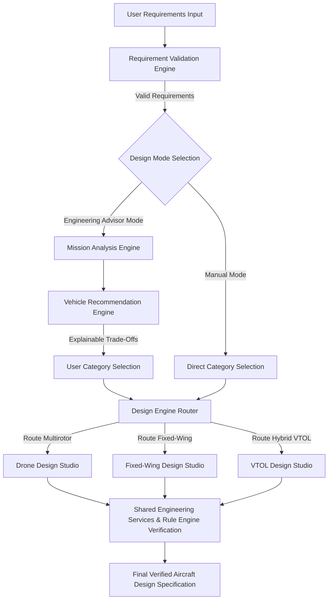

# Phase 5: AI Aircraft Design Platform Architecture Specification

> **Document Status**: Official Architecture Specification  
> **Target System**: Torq Wings Design Studio Backend  
> **Phase**: Phase 5 – AI Aircraft Design Platform Architecture Freeze  
> **Author**: Torq Wings Core Engineering Team  
> **Version**: 1.0.0  

---

## Executive Summary

This specification establishes the official architecture for **Phase 5 – AI Aircraft Design Platform** of the Torq Wings AI-powered aircraft engineering system. Building upon the foundational layers established in Phases 1 through 4 (Engineering Knowledge Repository, Knowledge Platform, Knowledge Graph, and Engineering Rules Platform), Phase 5 introduces specialized, AI-driven design engines and specialized design studios for **Multirotor Drones**, **Fixed-Wing UAVs**, and **Hybrid VTOL Aircraft**.

---

## 1. Introduction

Torq Wings is an AI-powered aircraft engineering platform engineered to assist human engineers, researchers, and operators in designing high-performance unmanned aerial vehicles (UAVs) and advanced air mobility (AAM) platforms.

Phase 5 transitions Torq Wings from a knowledge storage and rule evaluation framework into an active, intelligent **Aircraft Design Platform**. It introduces specialized design studios that synthesize mission requirements, query the engineering knowledge graph, evaluate rule constraints, select optimal components, and output verified aircraft specifications.

---

## 2. Vision

To establish an intelligent, fully explainable, human-in-the-loop aircraft engineering platform that accelerates unmanned aircraft design from weeks to minutes while enforcing strict aerodynamic, structural, electrical, and regulatory physics constraints.

---

## 3. Scope

### In-Scope (Phase 5)
- **User Requirement Acquisition & Validation Engine**: Structured parsing and sanity validation of payload, range, endurance, and operational environment inputs.
- **Mission Analysis Engine**: Translation of mission parameters into aerodynamic power, thrust, and energy budget requirements.
- **Vehicle Recommendation Engine**: Multi-criteria decision matrix (MCDM) and explainable AI trade-off analysis for vehicle category suitability.
- **Design Engine Router**: Dynamic routing and lifecycle orchestration of specialized design studios.
- **Drone Design Studio (Multirotor)**: Propulsion matching, frame sizing, hover efficiency, battery sizing, and weight breakdown.
- **Fixed-Wing Design Studio (UAV)**: Wing loading, stall speed, aspect ratio, glide ratio, cruise power, propulsion, and stability derivatives.
- **VTOL Design Studio (Hybrid)**: Dual-mode propulsion (hover vs. forward flight transition), transition energy analysis, wing loading, and hover power margin.
- **Shared Engineering Services**: Unified power budget calculator, weight breakdown manager, aerodynamic estimator, and rule verification bridge.

### Explicitly Out of Scope
- Direct 3D CAD mesh generation (reserved for external CAD exporter plugins).
- Real-time hardware-in-the-loop flight control firmware flashing.
- Physical manufacturing and supply chain procurement logistics.

---

## 4. Design Philosophy

The Phase 5 architecture adheres to ten core engineering principles:

1. **AI-Assisted Engineering**: AI acts as a co-pilot, augmenting human decision-making with high-speed trade-off analysis and constraint checking.
2. **Explainable Engineering Decisions**: Every AI recommendation must include a transparent, physics-based explanation detailing trade-offs and performance margins.
3. **Clean Architecture**: Strict separation of concerns across presentation, domain models, application services, and infrastructure adapters.
4. **SOLID Principles**: Single responsibility, open/closed extension, Liskov substitution, interface segregation, and dependency inversion.
5. **Domain-Driven Design (DDD)**: Explicit bounded contexts for Mission Analysis, Vehicle Recommendation, and Category-Specific Design Studios.
6. **Modular Design Engines**: Independent design studios operating autonomously without sharing aircraft-specific sizing logic.
7. **Shared Engineering Services**: Common physics, aerodynamic, electrical, and constraint-checking algorithms exposed via reusable core services.
8. **Extensible Aircraft Categories**: Plugin-based architecture supporting seamless addition of future aircraft types.
9. **Separation of Responsibilities**: Sizing engines perform physics calculations; recommendation engines evaluate suitability; rule engines enforce safety boundaries.
10. **Human-in-the-Loop Engineering**: The human designer retains full authority over aircraft category selection and design parameter overrides.

---

## 5. System Overview

The Phase 5 platform layers on top of existing backend subsystems:

```
┌─────────────────────────────────────────────────────────────────────────────┐
│                      PHASE 5: AI AIRCRAFT DESIGN PLATFORM                   │
│                                                                             │
│  ┌───────────────────────┐   ┌───────────────────────────────────────────┐  │
│  │   Design Mode Choice   │───│  Engineering Advisor Mode / Manual Mode   │  │
│  └───────────────────────┘   └───────────────────────────────────────────┘  │
│              │                                     │                        │
│              ▼                                     ▼                        │
│  ┌───────────────────────┐   ┌───────────────────────────────────────────┐  │
│  │ Mission Analysis      │───│ Vehicle Recommendation Engine             │  │
│  └───────────────────────┘   └───────────────────────────────────────────┘  │
│              │                                     │                        │
│              └──────────────────┬──────────────────┘                        │
│                                 ▼                                           │
│                  ┌──────────────────────────────┐                           │
│                  │     Design Engine Router     │                           │
│                  └──────────────┬───────────────┘                           │
│                                 │                                           │
│         ┌───────────────────────┼───────────────────────┐                   │
│         ▼                       ▼                       ▼                   │
│  ┌──────────────┐       ┌──────────────┐       ┌──────────────┐             │
│  │ Drone Studio │       │  Fixed-Wing  │       │ VTOL Studio  │             │
│  │ (Multirotor) │       │    Studio    │       │   (Hybrid)   │             │
│  └──────────────┘       └──────────────┘       └──────────────┘             │
│         │                       │                       │                   │
│         └───────────────────────┼───────────────────────┘                   │
│                                 ▼                                           │
│                  ┌──────────────────────────────┐                           │
│                  │  Shared Engineering Services │                           │
│                  └──────────────────────────────┘                           │
└─────────────────────────────────┬───────────────────────────────────────────┘
                                  │
┌─────────────────────────────────┴───────────────────────────────────────────┐
│                      FOUNDATIONAL PLATFORM SUBSYSTEMS                       │
│                                                                             │
│ ┌──────────────────────┐ ┌────────────────────┐ ┌──────────────────────────┐ │
│ │ Engineering Rules    │ │ Knowledge Graph    │ │ Knowledge Repository     │ │
│ │ (Phase 4)            │ │ (Phase 3)          │ │ (Phases 1-2)             │ │
│ └──────────────────────┘ └────────────────────┘ └──────────────────────────┘ │
└─────────────────────────────────────────────────────────────────────────────┘
```

---

## 6. High-Level Architecture

The platform executes a sequential, deterministic workflow from user input to final sizing output:



---

## 7. User Requirement Acquisition

Requirements are acquired via structured JSON data models capturing operational environment, payload specifications, performance targets, and regulatory bounds.

### Input Requirement Schema

```json
{
  "mission_profile": {
    "payload_capacity_kg": 2.5,
    "target_range_km": 40.0,
    "target_endurance_minutes": 45.0,
    "cruise_altitude_m": 150.0,
    "max_wind_resistance_m_s": 12.0
  },
  "operational_environment": {
    "operating_temperature_c": 25.0,
    "takeoff_elevation_m": 300.0,
    "environment_type": "AGRICULTURAL_SPRAYING"
  },
  "constraints": {
    "max_takeoff_weight_limit_kg": 25.0,
    "max_wingspan_m": 3.0,
    "regulatory_class": "FAA_PART_107"
  }
}
```

---

## 8. Requirement Validation

The `RequirementValidationEngine` inspects input parameters before analysis or sizing begins.

### Validation Rules
1. **Physical Feasibility**: `payload_capacity_kg > 0` and `target_range_km >= 0`.
2. **Boundary Consistency**: `max_takeoff_weight_limit_kg >= payload_capacity_kg`.
3. **Environment Bounds**: Operating temperature within \(-40^\circ\text{C}\) to \(+60^\circ\text{C}\).
4. **Energy Feasibility**: Non-zero endurance or range requested.

If validation fails, a `RequirementValidationError` is returned containing precise parameter error descriptions.

---

## 9. Design Modes

Torq Wings supports **exactly two** explicit design modes:

```
┌─────────────────────────────────────────────────────────────────────────────┐
│                           DESIGN MODES ARCHITECTURE                         │
├─────────────────────────────────────────────────────────────────────────────┤
│                                                                             │
│  1. ENGINEERING ADVISOR MODE (Default)                                      │
│     Mission Input ──► Analysis ──► AI Recommendation ──► User Approval      │
│                                                          │                  │
│                                                          ▼                  │
│                                                  Launch Design Studio       │
│                                                                             │
│  2. MANUAL MODE                                                             │
│     Direct User Category Selection ─────────────────────► Launch Studio     │
│                                                                             │
│  CRITICAL POLICY: NO AUTOMATIC MODE IS PERMITTED.                           │
│  The AI must NEVER silently select an aircraft category without approval.   │
│                                                                             │
└─────────────────────────────────────────────────────────────────────────────┘
```

---

## 10. Mission Analysis Engine

The `MissionAnalysisEngine` computes mission physics parameters from validated requirements:

- **Hover Power Required (\(P_{\text{hover}}\))**: Actuator disk momentum theory calculation.
- **Cruise Power Required (\(P_{\text{cruise}}\))**: Parasitic and induced drag power estimation.
- **Energy Budget (\(E_{\text{mission}}\))**: Total watt-hour requirement including hover, transition, cruise, and reserve energy.
- **Payload Ratio (\(\eta_{\text{payload}}\))**: Payload weight divided by total estimated takeoff weight.

---

## 11. Vehicle Recommendation Engine

The `VehicleRecommendationEngine` evaluates aircraft suitability across category candidates (Multirotor, Fixed-Wing, Hybrid VTOL) using Multi-Criteria Decision Analysis (MCDA).

### Evaluation Criteria
- **Hover Capability Target**: High score for Multirotor and Hybrid VTOL.
- **High-Speed Range Target**: High score for Fixed-Wing and Hybrid VTOL.
- **Payload Capacity vs MTOW**: Structural efficiency comparison.
- **Operational Complexity**: Setup time, runway requirement, and wind susceptibility.

### Explanation Output
For every recommendation, the engine outputs a structured explanation:

```json
{
  "recommendations": [
    {
      "category": "HYBRID_VTOL",
      "suitability_score": 0.92,
      "rank": 1,
      "explanation": "Hybrid VTOL is recommended because the mission requires precision hover for takeoff/landing in constrained agricultural fields (rendering Fixed-Wing unfeasible) combined with a 40 km range requirement (exceeding multirotor battery energy density capabilities)."
    }
  ]
}
```

---

## 12. Design Engine Router

The `DesignEngineRouter` acts as the single point of dispatch for design studio lifecycle execution.

```python
class DesignEngineRouter:
    def route_design(
        self,
        category: AircraftCategory,
        requirements: ValidatedRequirements
    ) -> BaseDesignStudio:
        ...
```

---

## 13. Drone Design Studio (Multirotor)

Dedicated sizing engine for multirotor configurations (Quadcopter, Hexacopter, Octocopter).

### Key Modules
- **Propulsion Matcher**: Thrust-to-weight ratio balancing (minimum 2.0:1 MTOW ratio).
- **Frame Sizing Engine**: Arm length, motor-to-motor diagonal distance, and propeller tip clearance calculation.
- **Hover Efficiency Sizing**: Propeller disk loading and motor KV matching.
- **Battery Sizing Engine**: LiPo C-rating, cell count (S/P configuration), and discharge depth calculation.

---

## 14. Fixed-Wing Design Studio (UAV)

Dedicated sizing engine for conventional, V-tail, and flying wing UAV configurations.

### Key Modules
- **Wing Loading Calculator (\(W/S\))**: Sizing wing surface area based on stall speed constraints.
- **Aspect Ratio & Planform Sizing**: Span, root chord, tip chord, and taper ratio calculation.
- **Aerodynamics & Glide Ratio (\(L/D\))**: Drag polar estimation (\(C_{D0} + K C_L^2\)).
- **Cruise Propulsion Sizer**: Motor KV, propeller pitch/diameter, and cruise throttle percentage optimization.

---

## 15. VTOL Design Studio (Hybrid)

Dedicated sizing engine for hybrid VTOL platforms (Lift+Cruise, Tilt-Rotor, Tailsitter).

### Key Modules
- **Dual Propulsion Architecture**: Sizing separate lift motors/rotors and cruise pusher/puller motor.
- **Transition Energy Calculator**: Energy consumption during hover-to-wing-borne flight acceleration phase.
- **Wing Loading vs Hover Disk Loading Balancing**: Optimizing wing area to avoid excessive hover download penalty.

---

## 16. Shared Engineering Services

Shared services provide underlying physics calculations to all design studios:

```
┌─────────────────────────────────────────────────────────────────────────────┐
│                        SHARED ENGINEERING SERVICES                          │
├─────────────────────────────────────────────────────────────────────────────┤
│  1. PowerBudgetCalculator     │  Calculates electrical & mechanical loads   │
│  2. WeightBreakdownManager    │  Builds mass properties & CG estimation     │
│  3. AerodynamicEstimator      │  Computes lift, drag, and thrust polars     │
│  4. RuleVerificationBridge    │  Evaluates Phase 4 engineering constraints  │
└─────────────────────────────────────────────────────────────────────────────┘
```

---

## 17. Data Flow

```sequence
User -> RequirementValidationEngine: Submit Raw Requirements JSON
RequirementValidationEngine -> User: Return Validated Requirements
User -> ModeSelector: Select Engineering Advisor Mode
ModeSelector -> MissionAnalysisEngine: Compute Mission Energy & Power
MissionAnalysisEngine -> VehicleRecommendationEngine: Pass Physics Metrics
VehicleRecommendationEngine -> User: Display Ranked Categories + Explanations
User -> DesignEngineRouter: Select Approved Category
DesignEngineRouter -> DesignStudio: Dispatch Requirements & Specs
DesignStudio -> SharedEngineeringServices: Request Sizing & Physics Calculations
SharedEngineeringServices -> RuleEngine: Verify Constraints
RuleEngine -> SharedEngineeringServices: Return Rule Verification Result
DesignStudio -> User: Return Complete Verified Aircraft Specification
```

---

## 18. Engine Responsibility Matrix

| Engine | Core Responsibilities | Inputs | Outputs | Explicitly Out of Scope |
| :--- | :--- | :--- | :--- | :--- |
| **RequirementValidationEngine** | Input sanitization, range checks, sanity verification | Raw Requirements JSON | ValidatedRequirements | Mission energy calculation |
| **MissionAnalysisEngine** | Power/energy budget calculation | ValidatedRequirements | MissionPhysicsSummary | Vehicle selection |
| **VehicleRecommendationEngine**| MCDA category scoring & explanation generation | MissionPhysicsSummary | RecommendationReport | Component sizing |
| **DesignEngineRouter** | Studio dispatch & lifecycle management | Approved Category & Specs | SizedAircraftSpec | Physics sizing |
| **DroneDesignStudio** | Multirotor propulsion, frame, hover sizing | ValidatedRequirements | MultirotorAircraftSpec | Wing aerodynamic sizing |
| **FixedWingDesignStudio** | Wing loading, drag polar, cruise propulsion | ValidatedRequirements | FixedWingAircraftSpec | Hover motor sizing |
| **VTOLDesignStudio** | Dual propulsion, transition energy sizing | ValidatedRequirements | VTOLAircraftSpec | Single-mode hover sizing |
| **SharedEngineeringServices** | Physics formulas, weight estimation, rule checks | Sizing Parameters | PhysicsCalculationResult| Studio orchestration |

---

## 19. Data Contracts Between Engines

Each engine consumes a strongly typed domain object and outputs a strongly typed domain object:

```
RawRequirements ──► [RequirementValidationEngine] ──► ValidatedRequirements
ValidatedRequirements ──► [MissionAnalysisEngine] ──► MissionPhysicsSummary
MissionPhysicsSummary ──► [VehicleRecommendationEngine] ──► RecommendationReport
(Category, ValidatedRequirements) ──► [DesignEngineRouter] ──► SizedAircraftSpec
```

---

## 20. Folder Structure

The Phase 5 codebase will be organized under `backend/design/`:

```text
backend/design/
├── __init__.py
├── models/
│   ├── __init__.py
│   ├── validated_requirements.py
│   ├── mission_physics_summary.py
│   ├── recommendation_report.py
│   └── aircraft_specification.py
├── validation/
│   ├── __init__.py
│   └── requirement_validation_engine.py
├── mission/
│   ├── __init__.py
│   └── mission_analysis_engine.py
├── recommendation/
│   ├── __init__.py
│   └── vehicle_recommendation_engine.py
├── router/
│   ├── __init__.py
│   └── design_engine_router.py
├── studios/
│   ├── __init__.py
│   ├── drone_design_studio.py
│   ├── fixed_wing_design_studio.py
│   └── vtol_design_studio.py
└── services/
    ├── __init__.py
    ├── power_budget_calculator.py
    ├── weight_breakdown_manager.py
    ├── aerodynamic_estimator.py
    └── rule_verification_bridge.py
```

---

## 21. Future Expansion

The platform architecture reserves explicit integration hooks for future specialized design studios:

- **Helicopter Design Studio**: Single main rotor + tail rotor sizing.
- **Amphibious UAV Design Studio**: Hydrodynamic hull sizing + water takeoff drag analysis.
- **Swarm Drone Design Studio**: Micro-scale multirotor sizing optimized for mass manufacture.
- **Hybrid Electric Aircraft Studio**: Gas-generator + LiPo battery hybrid power architecture.
- **Rocket Design Studio**: Solid/liquid propellant rocket motor sizing.
- **Satellite Mission Design Studio**: CubeSat power, thermal, and orbital decay sizing.

---

## 22. Architecture Decision Records (ADR)

### ADR-001: Two Explicit Design Modes Only
- **Context**: Need to support both novel users and expert drone designers.
- **Decision**: Restrict interaction to **Engineering Advisor Mode** (AI-guided) and **Manual Mode** (direct execution).
- **Rationale**: Eliminates confusion and guarantees human oversight.

### ADR-002: Strict Exclusion of Automatic Category Selection
- **Context**: Risk of AI silently choosing an inappropriate vehicle category.
- **Decision**: Prohibit any automatic category dispatch without explicit user approval.
- **Rationale**: Enforces human-in-the-loop engineering safety.

### ADR-003: Independent Design Studios
- **Context**: Multirotor, fixed-wing, and VTOL sizing rely on vastly different aerodynamic formulas.
- **Decision**: Implement completely independent design studio classes.
- **Rationale**: Preserves Single Responsibility Principle and prevents monolithic sizing scripts.

---

## 23. Development Roadmap

```
Sprint E1: Requirements & Validation (Engine & Data Models)
Sprint E2: Mission Analysis & Vehicle Recommendation Engines
Sprint E3: Design Engine Router & Shared Engineering Services
Sprint E4: Drone Design Studio Implementation
Sprint E5: Fixed-Wing Design Studio Implementation
Sprint E6: VTOL Design Studio Implementation
Sprint E7: End-to-End Integration & Rule Platform Verification
```

---

## 24. Conclusion

The Phase 5 AI Aircraft Design Platform Architecture Specification provides a complete, deterministic, and modular design for the Torq Wings Design Studio backend. By establishing clean contracts, explainable AI recommendation workflows, and isolated category design studios, this specification guarantees scalability, maintainability, and uncompromised engineering rigor across all future aircraft design capabilities.
