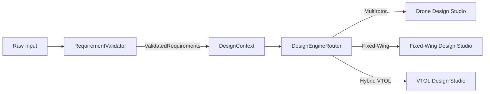
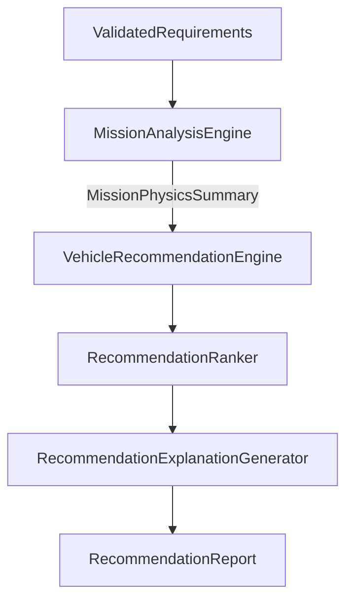

# Phase 5: AI Aircraft Design Platform Component Specification

> **Document Status**: Definitive Component Specification  
> **Target System**: Torq Wings Design Studio Backend  
> **Phase**: Phase 5.0 – Component Architecture Specification  
> **Blueprint Reference**: [`docs/architecture/phase5_ai_aircraft_design_platform.md`](file:///c:/Users/acer/Documents/torqwings%20studio%20v2/docs/architecture/phase5_ai_aircraft_design_platform.md)  
> **Author**: Torq Wings Core Engineering Team  
> **Version**: 1.0.0  

---

## Executive Summary

This document establishes the official **Component Specification** for Phase 5 of the Torq Wings AI-powered aircraft engineering platform. While the high-level architecture is defined in `phase5_ai_aircraft_design_platform.md`, this specification defines every software component, domain model, engine, interface contract, and responsibility boundary required for implementation.

---

## 1. Domain Models

Phase 5 introduces domain models representing requirements, mission states, recommendation scores, component selections, mass properties, and category-specific design states.

```
┌─────────────────────────────────────────────────────────────────────────────┐
│                           PHASE 5 DOMAIN MODELS                             │
├─────────────────────────────────────────────────────────────────────────────┤
│  • RequirementModel           • PowerSystem                                 │
│  • MissionProfile             • WeightBreakdown                             │
│  • DesignContext              • CenterOfGravity                             │
│  • VehicleRecommendation      • PerformanceResult                           │
│  • VehicleScore               • DroneDesign                                 │
│  • ComponentSelection         • FixedWingDesign                             │
│  • RecommendationReport       • VTOLDesign                                  │
└─────────────────────────────────────────────────────────────────────────────┘
```

### Core Domain Model Specifications

#### `RequirementModel`
- **Purpose**: Encapsulates raw and validated mission requirements (payload, range, endurance, flight environment, operational constraints).
- **Attributes**: `payload_capacity_kg`, `target_range_km`, `target_endurance_minutes`, `cruise_altitude_m`, `max_wind_resistance_m_s`, `regulatory_class`.

#### `MissionProfile`
- **Purpose**: Encapsulates operational environment parameters (altitude, ambient temperature, air density, wind profile, mission phase durations).
- **Attributes**: `takeoff_elevation_m`, `operating_temperature_c`, `air_density_kg_m3`, `hover_duration_minutes`, `cruise_duration_minutes`.

#### `DesignContext`
- **Purpose**: Carries runtime design state, parameter overrides, and intermediate sizing outputs across design studios.
- **Attributes**: `design_id`, `category`, `requirements`, `state_variables`, `overrides`, `verified_rules`.

#### `VehicleRecommendation` & `VehicleScore`
- **Purpose**: Captures vehicle category suitability rankings, MCDA trade-off scores, and physics-based natural language explanations.
- **Attributes**: `category`, `overall_score`, `hover_suitability`, `range_suitability`, `payload_efficiency`, `explanation`.

#### `ComponentSelection` & `PowerSystem`
- **Purpose**: Encapsulates selected hardware components (motors, propellers, ESCs, batteries, flight controllers) and electrical power distribution calculations.
- **Attributes**: `selected_motor_id`, `selected_prop_id`, `selected_battery_id`, `total_power_required_w`, `c_rating_required`, `bus_voltage_v`.

#### `WeightBreakdown` & `CenterOfGravity`
- **Purpose**: Stores mass distribution breakdown (structure, propulsion, avionics, payload, battery) and 3D CG coordinate estimates.
- **Attributes**: `mtow_kg`, `empty_weight_kg`, `battery_mass_kg`, `payload_mass_kg`, `cg_x_m`, `cg_y_m`, `cg_z_m`.

#### `DroneDesign`, `FixedWingDesign`, `VTOLDesign`
- **Purpose**: Category-specific aggregate root domain models capturing complete aircraft design specifications.

---

## 2. Common Design Platform Subsystem

The Common Design Platform handles requirement acquisition, validation, context initialization, and design routing.



### Component Breakdown

#### 2.1 `RequirementValidator`
- **Purpose**: Performs structural, physical feasibility, and regulatory boundary validation on input requirements.
- **Consumes**: `RequirementModel`
- **Produces**: `ValidatedRequirements`
- **Dependencies**: None
- **Public API**: `validate(requirements: RequirementModel) -> ValidatedRequirements`
- **Out of Scope**: Physics calculations, energy estimation, vehicle selection.

#### 2.2 `DesignEngineRouter`
- **Purpose**: Routes validated design context to the appropriate category-specific design studio.
- **Consumes**: `DesignContext`, `AircraftCategory`
- **Produces**: `BaseDesignStudio` instance
- **Dependencies**: `DroneDesignStudio`, `FixedWingDesignStudio`, `VTOLDesignStudio`
- **Public API**: `route_design(category: AircraftCategory, context: DesignContext) -> BaseDesignStudio`
- **Out of Scope**: Aircraft component sizing, aerodynamic modeling.

---

## 3. Engineering Advisor Subsystem

The Engineering Advisor Platform analyzes mission physics, computes suitability trade-offs, and generates explainable vehicle category recommendations.



### Component Breakdown

#### 3.1 `MissionAnalysisEngine`
- **Purpose**: Computes baseline physics parameters (hover power, cruise drag power, total energy budget, payload ratio).
- **Consumes**: `ValidatedRequirements`
- **Produces**: `MissionPhysicsSummary`
- **Dependencies**: `AerodynamicEstimator`, `PowerBudgetCalculator`
- **Public API**: `analyze_mission(requirements: ValidatedRequirements) -> MissionPhysicsSummary`

#### 3.2 `VehicleRecommendationEngine`
- **Purpose**: Evaluates candidate aircraft categories (Multirotor, Fixed-Wing, Hybrid VTOL) against mission physics.
- **Consumes**: `MissionPhysicsSummary`
- **Produces**: `list[VehicleScore]`
- **Dependencies**: `RecommendationRanker`, `RecommendationExplanationGenerator`
- **Public API**: `evaluate_suitability(summary: MissionPhysicsSummary) -> RecommendationReport`

#### 3.3 `RecommendationRanker` & `RecommendationExplanationGenerator`
- **Purpose**: Ranks vehicle categories using MCDA algorithms and generates human-readable trade-off rationale.

---

## 4. Drone Design Studio Subsystem

The Drone Design Studio sizes multirotor aircraft (quadcopters, hexacopters, octocopters).

```
┌─────────────────────────────────────────────────────────────────────────────┐
│                          DRONE DESIGN STUDIO ENGINES                        │
├─────────────────────────────────────────────────────────────────────────────┤
│  1. FrameSelectionEngine              7. PayloadIntegrationEngine           │
│  2. MotorSelectionEngine              8. PowerSystemEngine                  │
│  3. PropellerSelectionEngine          9. WeightEstimator                    │
│  4. ESCSelectionEngine               10. PerformanceAnalyzer                │
│  5. BatterySelectionEngine           11. OptimizationEngine                 │
│  6. FlightControllerSelectionEngine  12. DroneDesignReportGenerator         │
└─────────────────────────────────────────────────────────────────────────────┘
```

### Component Breakdown

#### 4.1 `FrameSelectionEngine`
- **Purpose**: Selects frame geometry (X4, XC4, Hexa-X, Octo-Coaxial) and calculates motor-to-motor diagonal distance.
- **Consumes**: `PropellerSpecification`, `PayloadSpecification`
- **Produces**: `FrameSpecification`

#### 4.2 `MotorSelectionEngine` & `PropellerSelectionEngine`
- **Purpose**: Matches motor KV, stator size, peak current, and propeller diameter/pitch to achieve \(\ge 2.0:1\) thrust-to-weight ratio.
- **Consumes**: `MTOWTarget`, `KnowledgeRepository`
- **Produces**: `MotorSelection`, `PropellerSelection`

#### 4.3 `ESCSelectionEngine` & `BatterySelectionEngine`
- **Purpose**: Sizes ESC continuous current capacity (\(I_{\text{ESC}} \ge 1.25 \times I_{\text{motor, max}}\)) and battery LiPo cell configuration (S/P) and C-rating.

---

## 5. Fixed-Wing Design Studio Subsystem

The Fixed-Wing Design Studio sizes conventional, V-tail, and flying wing UAVs.

### Component Breakdown

#### 5.1 `WingSizingEngine` & `AirfoilSelectionEngine`
- **Purpose**: Sizes wing area (\(S\)), wingspan (\(b\)), aspect ratio (\(AR\)), and selects wing airfoil based on stall speed (\(V_{\text{stall}} = \sqrt{\frac{2 W}{\rho S C_{L,\text{max}}}}\)).

#### 5.2 `TailSizingEngine` & `FuselageSizingEngine`
- **Purpose**: Computes horizontal tail volume coefficient (\(V_H\)) and vertical tail volume coefficient (\(V_V\)), and sizes fuselage internal volume.

#### 5.3 `CGEstimator` & `CADGenerator`
- **Purpose**: Estimates longitudinal CG location (\(% \text{MAC}\)) and generates open-standard 3D CAD geometry parameters.

---

## 6. VTOL Design Studio Subsystem

The VTOL Design Studio sizes hybrid tilt-rotor, lift+cruise, and tailsitter platforms.

### Component Breakdown

#### 6.1 `VTOLConfigurationEngine`
- **Purpose**: Selects VTOL hybrid architecture (Lift+Cruise vs Tilt-Rotor vs Tailsitter) based on range vs hover requirements.

#### 6.2 `HoverPropulsionEngine` & `CruisePropulsionEngine`
- **Purpose**: Independently sizes hover lift rotors and cruise pusher/puller propulsion systems.

#### 6.3 `TransitionAnalysisEngine` & `ControlAllocationEngine`
- **Purpose**: Simulates energy consumption during hover-to-wing-borne flight acceleration and maps control surface vs thrust vectoring channels.

---

## 7. Shared Engineering Services Subsystem

Shared services encapsulate common physics, electrical, weight, and verification utilities across all design studios:

```
┌─────────────────────────────────────────────────────────────────────────────┐
│                        SHARED ENGINEERING SERVICES                          │
├─────────────────────────────────────────────────────────────────────────────┤
│  • KnowledgeRepositoryBridge      • WeightBreakdownManager                  │
│  • KnowledgeGraphQueryBridge      • AerodynamicEstimator                    │
│  • RuleVerificationBridge         • ComponentDatabaseService                │
│  • PowerBudgetCalculator          • PerformanceFramework                    │
└─────────────────────────────────────────────────────────────────────────────┘
```

---

## 8. Package Folder Structure

The complete Phase 5 codebase will be organized under `backend/design/`:

```text
backend/design/
├── __init__.py
├── models/
│   ├── __init__.py
│   ├── requirement_model.py
│   ├── validated_requirements.py
│   ├── mission_profile.py
│   ├── design_context.py
│   ├── vehicle_recommendation.py
│   ├── vehicle_score.py
│   ├── recommendation_report.py
│   ├── component_selection.py
│   ├── power_system.py
│   ├── weight_breakdown.py
│   ├── center_of_gravity.py
│   ├── performance_result.py
│   ├── drone_design.py
│   ├── fixed_wing_design.py
│   └── vtol_design.py
├── common/
│   ├── __init__.py
│   └── requirement_validator.py
├── advisor/
│   ├── __init__.py
│   ├── mission_analysis_engine.py
│   ├── vehicle_recommendation_engine.py
│   ├── recommendation_ranker.py
│   └── recommendation_explanation_generator.py
├── router/
│   ├── __init__.py
│   └── design_engine_router.py
├── drone/
│   ├── __init__.py
│   ├── frame_selection_engine.py
│   ├── motor_selection_engine.py
│   ├── propeller_selection_engine.py
│   ├── esc_selection_engine.py
│   ├── battery_selection_engine.py
│   ├── flight_controller_selection_engine.py
│   ├── payload_integration_engine.py
│   ├── power_system_engine.py
│   ├── weight_estimator.py
│   ├── performance_analyzer.py
│   ├── optimization_engine.py
│   └── drone_design_report_generator.py
├── fixed_wing/
│   ├── __init__.py
│   ├── aircraft_configuration_engine.py
│   ├── wing_sizing_engine.py
│   ├── airfoil_selection_engine.py
│   ├── tail_sizing_engine.py
│   ├── fuselage_sizing_engine.py
│   ├── power_system_engine.py
│   ├── electronics_engine.py
│   ├── cg_estimator.py
│   ├── weight_estimator.py
│   ├── performance_analyzer.py
│   ├── optimization_engine.py
│   └── cad_generator.py
├── vtol/
│   ├── __init__.py
│   ├── vtol_configuration_engine.py
│   ├── wing_sizing_engine.py
│   ├── hover_propulsion_engine.py
│   ├── cruise_propulsion_engine.py
│   ├── transition_analysis_engine.py
│   ├── control_allocation_engine.py
│   ├── weight_estimator.py
│   ├── performance_analyzer.py
│   ├── optimization_engine.py
│   └── cad_generator.py
├── shared/
│   ├── __init__.py
│   ├── power_budget_calculator.py
│   ├── weight_breakdown_manager.py
│   ├── aerodynamic_estimator.py
│   ├── rule_verification_bridge.py
│   └── component_database_service.py
└── reports/
    ├── __init__.py
    └── design_report_generator.py
```

---

## 9. Component Responsibility Matrix

| Component | Purpose | Consumes | Produces | Depends On | Explicitly Out of Scope |
| :--- | :--- | :--- | :--- | :--- | :--- |
| `RequirementValidator` | Input validation | `RequirementModel` | `ValidatedRequirements` | None | Physics calculations |
| `MissionAnalysisEngine` | Mission physics calculation | `ValidatedRequirements` | `MissionPhysicsSummary` | `PowerBudgetCalculator` | Vehicle recommendation |
| `VehicleRecommendationEngine` | MCDA category scoring | `MissionPhysicsSummary` | `RecommendationReport` | `RecommendationRanker` | Component selection |
| `DesignEngineRouter` | Studio lifecycle dispatch | `DesignContext` | `BaseDesignStudio` | Studio Implementations | Sizing math |
| `DroneDesignStudio` | Multirotor sizing | `ValidatedRequirements` | `DroneDesign` | Shared Services | Wing aerodynamic sizing |
| `FixedWingDesignStudio` | Fixed-wing sizing | `ValidatedRequirements` | `FixedWingDesign` | Shared Services | Hover rotor sizing |
| `VTOLDesignStudio` | Hybrid VTOL sizing | `ValidatedRequirements` | `VTOLDesign` | Shared Services | Pure multirotor sizing |
| `RuleVerificationBridge` | Phase 4 rule checks | `DesignContext` | `RuleEngineResult` | `RuleEngine` | Sizing calculations |

---

## 10. Conclusion

This component specification establishes explicit structural boundaries, interface contracts, data models, and folder structures for Phase 5 development. All implementation steps in Phase 5 must adhere strictly to the contracts and responsibility assignments defined in this document.
