# Architecture Diagram — Torq Wings Design Studio
## Fixed-Wing Design Sizing Pipeline Structure & Data Flow

This document details the system design, subsystem interfaces, and loop controllers for Fixed-Wing aircraft sizing.

---

## 1. Subsystem Architecture Map

The Design Studio processes design requirements through distinct functional subsystems:

```mermaid
graph LR
    subgraph Sizing Inputs
        A[RequirementModel]
    end

    subgraph Design Pipeline Facade
        B[FixedWingDesignPipeline]
    end

    subgraph Sizing Convergence Loop
        C[Wing Sizer] --> D[Fuselage Sizer]
        D --> E[Payload Packaging]
        E --> F[Tail Sizer]
        F --> G[Propulsion Sizing]
        G --> H[Electrical Routing]
        H --> I[Mass Properties]
        I --> J[CG & Balance]
        J --> K[Performance Sizer]
        K --> L{Convergence Check}
        L -- "rel_delta > 1%" --> C
    end

    subgraph Certification & Quality Gate
        L -- "rel_delta <= 1%" --> M[VerificationEngine]
    end

    subgraph Sizing Outputs
        M --> N[PipelineFinalAircraftSpecification]
        M --> O[Certification Report]
    end

    A --> B
    B --> C
```

---

## 2. Convergence Feedback Data Flow

During iterations, intermediate sizing dimensions are fed back into subsequent optimization stages:

1. **Wing Loading Feed**: Sized MTOW feeds back into the Wing Sizer to recalculate reference wing area:
   
   $$S = \frac{MTOW}{\text{Wing Loading}}$$

2. **Tail Moment Arm Feed**: Fuselage geometry length changes shift the aerodynamic tail moment arm ($l_t$), which forces the Tail Sizer to re-optimize horizontal and vertical stabilizers area to satisfy volume coefficients.
3. **CG & Balancing Feed**: Component placements (such as the Energy Battery) are shifted horizontally inside the fuselage bounds to minimize trim drag and satisfy stability constraints.
4. **Propulsion Torque & Thrust Feed**: Aerodynamic lift-to-drag ($L/D$) and stall speed calculations feed into the motor catalog lookup to re-evaluate ESC peak currents and battery capacity.
