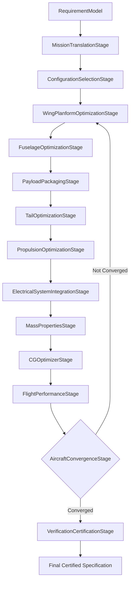

# Developer Manual — Fixed-Wing Design Studio
## Code Architecture, Pipeline Lifecycle, and Extension Guide

This guide describes the software architecture of Torq Wings Design Studio V3 for fixed-wing aircraft synthesis.

---

## 1. Software Structure & Directory Layout

The workspace root is organized as follows:
```
backend/design/
├── common/                # Shared framework components (requirements, optimization, verification)
└── fixed_wing/            # Fixed-wing specific studio
    ├── airfoil/           # Airfoil analysis & databases
    ├── avionics/          # Avionics selection (GPS, telemetry, etc.)
    ├── configuration/     # Wing position, tail, and landing configurations
    ├── convergence/       # Convergence loop controller & specs definition
    ├── electrical/        # Electrical power selection & candidate scoring
    ├── flight_performance/# Aerodynamic, range, speed, and climb analyzers
    ├── fuselage/          # Fuselage geometry sizing & internal layout
    ├── mass_properties/   # Weight build-up, CG coordination, and clamping
    ├── mission/           # Mission profile translation & requirement check
    ├── payload/           # Camera/sensor packaging & bay sizing
    ├── pipeline/          # Facade, stages, executors, exceptions (CORE entry point)
    ├── propulsion/        # Brushless motor, propeller, and ESC selector
    ├── tail/              # Tail geometry optimization (horizontal & vertical)
    ├── verification/      # Safety & compliance checks strategy registry
    └── wing/              # Wing geometry & aspect ratio optimization
```

---

## 2. Sizing Pipeline Lifecycle & Stages

`FixedWingDesignPipeline` implements a sequential pipeline architecture driving the design stages.



### The 13 Pipeline Stages
1. **MissionTranslationStage**: Translates `RequirementModel` enums to `MissionCategory`, `LaunchMethod`, and `LandingMethod`, runs `MissionEngine`.
2. **ConfigurationSelectionStage**: Scores configurations and locks wing mount, tail layout, and landing gear style.
3. **WingPlanformOptimizationStage**: Sizes wingspan, aspect ratio, chords, sweep, and dihedral. Invokes `AirfoilEngine` to select lift/drag profiles.
4. **FuselageOptimizationStage**: Sizes fuselage cabin length, cones, fineness ratios, and bay sizes.
5. **PayloadPackagingStage**: Selects cameras/sensors, sizes payload bay, and determines structural positioning.
6. **TailOptimizationStage**: Sizes horizontal and vertical tail surfaces using volume coefficients.
7. **PropulsionOptimizationStage**: Selects brushless motor, propeller, and ESC. Calculates thrust/power requirements.
8. **ElectricalSystemIntegrationStage**: Models current draw, wiring gauges, connector types, and checks power budgets.
9. **MassPropertiesStage**: Updates total empty and loaded weight build-ups.
10. **CGOptimizerStage**: Tracks center of gravity and clamps battery/component placements inside structural limits.
11. **FlightPerformanceStage**: Runs stall speed, range, maximum speed, climb, turn, and descent analyses.
12. **AircraftConvergenceStage**: Evaluates relative MTOW delta. Loops back to Stage 3 if not converged (up to `max_iterations`).
13. **VerificationCertificationStage**: Executes safety rules audits, outputs `VerificationResult` and compliance levels.

---

## 3. Extending the Sizing Pipeline

To register a new sizing stage:
1. Create a class subclassing `PipelineStage` (from `backend/design/fixed_wing/pipeline/pipeline_stage.py`):
   ```python
   class CustomThermalOptimizationStage(PipelineStage):
       def execute(self, context: FixedWingPipelineContext) -> None:
           # Read intermediate inputs from context
           mtow = context.mass_properties_result.weight_breakdown.useful_load_kg
           # Execute custom logic or optimizer...
           # Write outputs back to context
           context.subsystem_specifications["ThermalSpecification"] = my_result
   ```
2. Insert your stage class in the execution chain array located inside `FixedWingDesignPipeline.execute()`:
   ```python
   stages = [
       ...
       CGOptimizerStage(),
       CustomThermalOptimizationStage(), # Registered custom stage
       FlightPerformanceStage(),
       ...
   ]
   ```
3. Update `PipelineRequirements` and results models if new outputs need to be exposed across subsequent stages.
