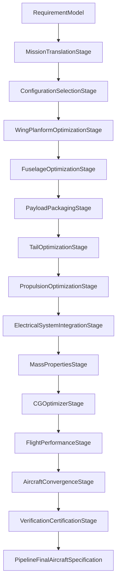
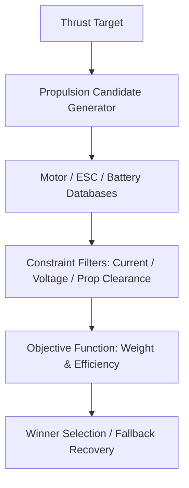
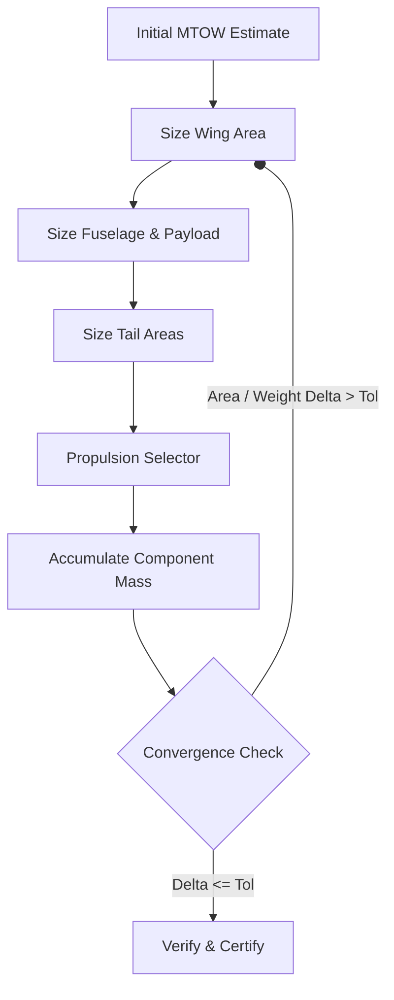
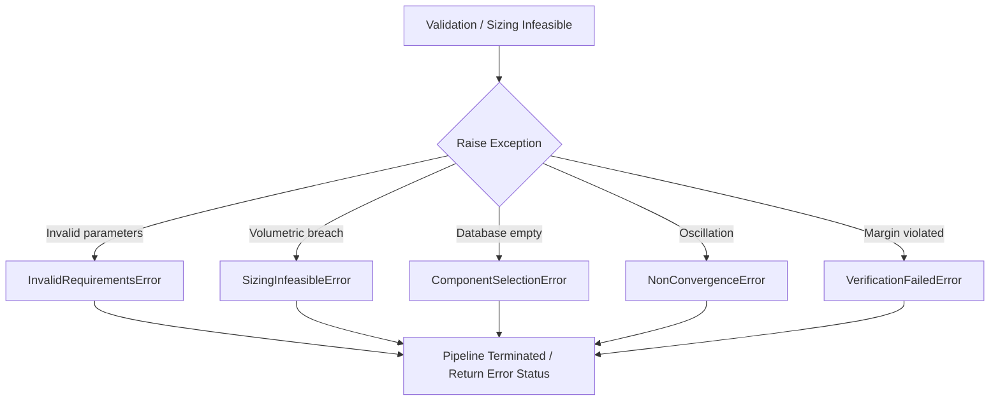

# Torq Wings Fixed-Wing Architecture & Engineering Handbook
## Version: 4.0.0
## Release Candidate: August 2026

---

## PART I — INTRODUCTION

### Chapter 1: What Torq Wings Fixed-Wing Design System Is
The Torq Wings Fixed-Wing Design System is an automated, catalog-based, multi-disciplinary aircraft design optimization (MDO) platform. It takes high-level user mission requirements (such as payload size, target flight endurance, operational speed, and range) and executes a deterministic design pipeline. The pipeline sizes the airframe and selects compatible, catalog-verified propulsion systems, batteries, electronics, and flight control components. 

The system guarantees that the synthesized aircraft matches physical laws (aerodynamics, flight dynamics, electrical load limits) and safety standards before generating a final production specification and lofts parametric 3D CAD assemblies.

---

### Chapter 2: Fixed-Wing Design in Simple Terms
Before examining the software implementation, it is vital to understand the physical design variables that govern fixed-wing aircraft sizing:
- **Mission**: The operational intent (e.g. mapping, cargo delivery, agricultural spraying).
- **Payload**: The primary camera or cargo sensor package that must be carried.
- **Range & Endurance**: The physical distance or duration the aircraft must fly.
- **Speed**: Operational cruise speed ($V_{cruise}$) and stall speed ($V_{stall}$).
- **Wing**: The lifting surface, defined by its reference area ($S$), span ($b$), aspect ratio ($AR$), and airfoils.
- **Tail**: Vertical and horizontal control stabilizers that provide pitch and yaw stability.
- **Fuselage**: The central structural body housing the payload compartment, battery, and avionics.
- **Propulsion & Battery**: The electric motor, electronic speed controller (ESC), propeller, and lithium-polymer (LiPo) battery pack providing thrust and electrical power.
- **CG & Stability**: The longitudinal Center of Gravity position relative to the Neutral Point, defining the static margin.

In software, these disciplines are mapped to individual optimization engines called stages, which run inside a feedback loop to find a converged, physically viable design.

---

### Chapter 3: Repository Architecture
The current structure of the fixed-wing design system resides in:
```
backend/design/fixed_wing/
├── airfoil/          # Airfoil selection & polar database mapping
├── avionics/         # Avionics matching and flight controllers
├── cad/              # Geometry builders and parametric CAD export
├── cg/               # CG alignment along the longitudinal axis
├── configuration/    # Wing/propulsion layout decisions
├── convergence/      # Convergence iterations manager
├── electrical/       # Wiring gauges and power BEC ratings
├── flight_performance/# Aerodynamic, climb, cruise, landing calculations
├── fuselage/         # Fuselage volume envelopes
├── manufacturing/    # BOM, assembly lists and cost calculations
├── mass_properties/  # Structural and component weight estimates
├── mission/          # Physics boundary calculations
├── optimization/     # Shared base optimizer interfaces
├── payload/          # Camera/sensor packaging placement
├── performance/      # Multi-objective flight performance optimizer
├── pipeline/         # Design pipeline stage facade
├── propulsion/       # Catalog motor/propeller matcher
├── report/           # Executive engineering PDF summaries
├── tail/             # Pitch/yaw control surface sizing
├── verification/     # Compliance boundary checking
└── wing/             # Wing planform sizing optimizer
```

---

## PART II — REQUIREMENTS

### Chapter 4: RequirementModel
The primary interface input is the `RequirementModel` class (defined in [requirement_model.py](file:///c:/Users/acer/Documents/torqwings%20studio%20v2/backend/design/common/requirements/requirement_model.py)).

| Parameter | Type | Required | Default | Meaning / Validation | Downstream Effect |
|---|---|---|---|---|---|
| `payload_weight_kg` | `float` | Yes | N/A | Sizing payload mass. Must be > 0. | Sizers require internal placement coordinates to balance. |
| `target_flight_time_min` | `float` | Yes | N/A | Target battery flight duration. | Battery sizing relies on this to calculate necessary Wh capacity. |
| `target_range_km` | `float` | Yes | N/A | Mission range boundary. | Influences aerodynamic cruise power requirements. |
| `cruise_speed_kmh` | `float` | Yes | N/A | Target operational flight speed. | Sets dynamic pressure $q$ for lift-drag balance. |
| `maximum_takeoff_weight_kg` | `float` | No | `None` | Upper physical MTOW limit. | If exceeded, verification flags failure. |
| `takeoff_type` | `TakeoffType` | Yes | N/A | Catapult, hand launch, or runway. | Sizer determines tailwheel and landing gear presence. |
| `landing_type` | `LandingType` | Yes | N/A | Belly, parachute, net, or runway. | Alters landing deceleration coefficients. |
| `environment` | `OperatingEnvironment` | Yes | N/A | Operational surroundings. | Classifies strategy templates. |

---

### Chapter 5: Requirement Validation
The inputs undergo checking by the `RequirementValidator` class. If parameters are negative or physically impossible (e.g. payload $\le 0.0$ or range $\le 0.0$), the validator raises an `InvalidRequirementsError` which halts the pipeline execution immediately, returning an error response without initiating sizing.

---

## PART III — PIPELINE ORCHESTRATION

### Chapter 6: Fixed-Wing Pipeline Entry Point
The design process begins with `FixedWingDesignPipeline` in [fixed_wing_pipeline.py](file:///c:/Users/acer/Documents/torqwings%20studio%20v2/backend/design/fixed_wing/pipeline/fixed_wing_pipeline.py).
When `design_aircraft(requirements)` is called, the pipeline translates inputs into a local context, executes a series of pipeline stages, and verifies the final configuration.



---

### Chapter 7: Pipeline Context
The `FixedWingPipelineContext` class (defined in [pipeline_context.py](file:///c:/Users/acer/Documents/torqwings%20studio%20v2/backend/design/fixed_wing/pipeline/pipeline_context.py)) acts as the central databank during pipeline execution. It stores intermediate result objects from sizers (such as `WingResult` and `PropulsionResult`) and maps coordinate geometry offsets across stages.

---

### Chapter 8: Pipeline Result
The execution returns a `FixedWingDesignResult` encapsulating the success status (`SUCCESS`, `CONVERGENCE_FAIL`, `COMPONENT_DATABASE_LIMITATION`, or `SIZING_INFEASIBLE`), error trace logs, and a `PipelineFinalAircraftSpecification` object detailing every component.

---

### Chapter 9: Stage Ordering

| Stage | Module Path | Inputs | Calculations | Outputs | Failure Action |
|---|---|---|---|---|---|
| **Mission Translation** | `pipeline_stage.py:MissionTranslationStage` | Raw `RequirementModel` | Classifies category, environment templates | `MissionResult` | Raises `InvalidRequirements` |
| **Configuration Selection** | `pipeline_stage.py:ConfigurationSelectionStage` | `MissionResult` | Selects tail layout, wing mounting index | `ConfigurationResult` | Raises `ConfigurationInfeasible` |
| **Wing Planform Opt** | `pipeline_stage.py:WingPlanformOptimizationStage` | `MissionResult`, `ConfigurationResult` | Grid-searches area, aspect ratio, chords | `WingResult` | Raises `SizingInfeasible` |
| **Airfoil Sizing** | `pipeline_stage.py:WingPlanformOptimizationStage` | `WingResult` | Matches Reynolds numbers to airfoil profiles | `AirfoilResult` | Raises `SizingInfeasible` |
| **Fuselage Opt** | `pipeline_stage.py:FuselageOptimizationStage` | `WingResult`, `AirfoilResult` | Sizes fuselage height, length, fineness ratio | `FuselageResult` | Raises `SizingInfeasible` |
| **Payload Packaging** | `pipeline_stage.py:PayloadPackagingStage` | `FuselageResult` | Packs camera and gimbals inside compartment | `PayloadResult` | Raises `ComponentSelectionError` |
| **Tail Optimization** | `pipeline_stage.py:TailOptimizationStage` | `WingResult`, `FuselageResult` | Sized stabilizer areas using volume coefficients | `TailResult` | Raises `SizingInfeasible` |
| **Propulsion Opt** | `pipeline_stage.py:PropulsionOptimizationStage` | `WingResult`, `FuselageResult` | Matches motor/propeller databases | `PropulsionResult` | Raises `ComponentSelectionError` |
| **Electrical Integration** | `pipeline_stage.py:ElectricalSystemIntegrationStage` | `PropulsionResult` | Configures wiring gauges and power paths | `ElectricalSpecification` | Raises `ComponentSelectionError` |
| **Mass Properties** | `pipeline_stage.py:MassPropertiesStage` | All physical specifications | Computes empty weight and component balance | `MassPropertiesResult` | Raises `SizingInfeasible` |
| **CG Optimization** | `pipeline_stage.py:CGOptimizerStage` | `MassPropertiesResult` | Aligns center of gravity coordinates | `CGSpecification` | Raises `SizingInfeasible` |
| **Flight Performance** | `pipeline_stage.py:FlightPerformanceStage` | All physical sizer results | Computes takeoff, landing, cruise limits | `FlightResult` | Raises `SizingInfeasible` |
| **Aircraft Convergence**| `pipeline_stage.py:AircraftConvergenceStage` | All intermediate specs | Iteratively balances MTOW feedback | Converged context | Raises `NonConvergenceError` |
| **Verification & Cert** | `pipeline_stage.py:VerificationCertificationStage`| Converged context | Verifies all rule bounds against requirements | Certified status | Raises `VerificationFailedError` |

---

## PART IV — ENGINEERING ENGINES

### Chapter 10: Mission Sizing Engine
- **Engine Description**: Analyzes physical constraints from input requirements and estimates parameters like MTOW targets and initial sizer boundaries.
- **Implementation Path**: [mission_engine.py](file:///c:/Users/acer/Documents/torqwings%20studio%20v2/backend/design/fixed_wing/mission/mission_engine.py)
- **Inputs**: `MissionRequirements`
- **Internal Calculations**: Computes initial MTOW from payload fraction constraints ($MTOW_{initial} = \frac{W_{payload}}{f_{payload}}$).
- **Outputs**: `MissionResult`
- **Downstream Consumers**: `ConfigurationSelectionStage`, `WingPlanformOptimizationStage`
- **Failure Behavior**: Raises `MissionValidationError` if budget or physical speed constraints exceed feasibility thresholds.

---

### Chapter 11: Configuration Engine
- **Engine Description**: Determines structural configuration options such as engine layouts (tractor/pusher), wing positions (high/low), tail styles, and landing gears.
- **Implementation Path**: [configuration_engine.py](file:///c:/Users/acer/Documents/torqwings%20studio%20v2/backend/design/fixed_wing/configuration/configuration_engine.py)
- **Inputs**: `ConfigurationRequirements`
- **Internal Calculations**: Matches strategy matrices against mission profile types (e.g. Survey utilizes High-Wing, Tractor, Conventional Tail).
- **Outputs**: `ConfigurationResult`
- **Downstream Consumers**: `WingPlanformOptimizationStage`, `FuselageEngine`
- **Failure Behavior**: Raises `ConfigurationValidationError` if configurations clash with launch methods.

---

### Chapter 12: Wing Sizing Engine
- **Engine Description**: Optimizes wing aspect ratio, sweep, reference area, and taper.
- **Implementation Path**: [wing_engine.py](file:///c:/Users/acer/Documents/torqwings%20studio%20v2/backend/design/fixed_wing/wing/wing_engine.py)
- **Inputs**: `WingRequirements`
- **Internal Calculations**: Grid-searches coordinates of aspect ratios ($[6, 14]$) and taper ratios ($[0.4, 1.0]$) to maximize aerodynamic lift-to-drag ($L/D$) while maintaining structural span limitations.
- **Outputs**: `WingResult` (containing `WingGeometry` and structural weights)
- **Downstream Consumers**: `AirfoilEngine`, `TailEngine`, `FuselageEngine`
- **Failure Behavior**: Raises `WingValidationError` if structural load limits cannot be met.

---

### Chapter 13: Airfoil Engine
- **Engine Description**: Identifies suitable root and tip airfoils from database coordinates.
- **Implementation Path**: [airfoil_engine.py](file:///c:/Users/acer/Documents/torqwings%20studio%20v2/backend/design/fixed_wing/airfoil/airfoil_engine.py)
- **Inputs**: `AirfoilRequirements`
- **Internal Calculations**: Maps wing Reynolds numbers ($Re = \frac{\rho \cdot V \cdot c}{\mu}$) and target coefficients of lift ($C_l$) to database profiles (e.g. Clark-Y, NACA 4412, Selig S3021).
- **Outputs**: `AirfoilResult`
- **Downstream Consumers**: `FuselageEngine`, `FlightPerformanceEngine`
- **Failure Behavior**: Raises `AirfoilValidationError` if Reynolds limits fall below database boundaries.

---

### Chapter 14: Fuselage Engine
- **Engine Description**: Sizes structural pod enclosures to containerize payload and batteries.
- **Implementation Path**: [fuselage_engine.py](file:///c:/Users/acer/Documents/torqwings%20studio%20v2/backend/design/fixed_wing/fuselage/fuselage_engine.py)
- **Inputs**: `FuselageRequirements`
- **Internal Calculations**: Computes length based on fineness ratio requirements ($Length = Width \cdot Fineness\_Ratio$) and scales compartment height to allow 5% clearance buffer around packed components.
- **Outputs**: `FuselageResult`
- **Downstream Consumers**: `PayloadEngine`, `TailEngine`, `PropulsionEngine`
- **Failure Behavior**: Raises `FuselageValidationError` if volumetric packaging limits are breached.

---

### Chapter 15: Tail Sizing Engine
- **Engine Description**: Computes vertical and horizontal tail areas and spans.
- **Implementation Path**: [tail_engine.py](file:///c:/Users/acer/Documents/torqwings%20studio%20v2/backend/design/fixed_wing/tail/tail_engine.py)
- **Inputs**: `TailRequirements`
- **Internal Calculations**: Uses volume coefficient formulas ($V_h$, $V_v$) and tail moment arm distance to find stabilizer surface areas.
- **Outputs**: `TailResult`
- **Downstream Consumers**: `MassPropertiesEngine`, `FlightPerformanceEngine`
- **Failure Behavior**: Raises `TailValidationError` if elevator or rudder chord ratios violate structural boundaries.

---

### Chapter 16: Propulsion Sizing Engine
- **Engine Description**: Evaluates catalog components (motors, ESCs, propellers, batteries) to match performance thrust requirements.
- **Implementation Path**: [propulsion_engine.py](file:///c:/Users/acer/Documents/torqwings%20studio%20v2/backend/design/fixed_wing/propulsion/propulsion_engine.py)
- **Inputs**: `PropulsionRequirements`
- **Internal Calculations**: Filters motor and propeller tables based on max diameter clearances and calculates thermal power dissipation limits.
- **Outputs**: `PropulsionResult`
- **Downstream Consumers**: `ElectricalSystemIntegrationStage`, `MassPropertiesEngine`
- **Failure Behavior**: Raises `PropulsionValidationError` if motor current ratings or battery discharge rates are exceeded.

---

### Chapter 17: Avionics Selection Engine
- **Engine Description**: Selects matching flight controllers, GPS receivers, and telemetry units from database tables.
- **Implementation Path**: [avionics_engine.py](file:///c:/Users/acer/Documents/torqwings%20studio%20v2/backend/design/fixed_wing/avionics/avionics_engine.py)
- **Inputs**: `AvionicsRequirements`
- **Internal Calculations**: Matches GPS configuration type and communication telemetry links based on required range.
- **Outputs**: `AvionicsResult`
- **Downstream Consumers**: `MassPropertiesEngine`, `ElectricalSystemIntegrationStage`
- **Failure Behavior**: Raises `AvionicsValidationError` if autopilot firmware options are incompatible.

---

### Chapter 18: Payload Sizing Engine
- **Engine Description**: Containerizes payload sensors and mounts them inside the fuselage envelope.
- **Implementation Path**: [payload_engine.py](file:///c:/Users/acer/Documents/torqwings%20studio%20v2/backend/design/fixed_wing/payload/payload_engine.py)
- **Inputs**: `PayloadRequirements`
- **Internal Calculations**: Optimizes packaging dimensions and mounts components relative to wing spar geometry.
- **Outputs**: `PayloadResult`
- **Downstream Consumers**: `MassPropertiesEngine`, `CGOptimizerStage`
- **Failure Behavior**: Raises `PayloadValidationError` if sensor weight exceeds compartment structural limitations.

---

### Chapter 19: Mass Properties Engine
- **Engine Description**: Computes mass properties and moments of inertia.
- **Implementation Path**: [mass_properties_engine.py](file:///c:/Users/acer/Documents/torqwings%20studio%20v2/backend/design/fixed_wing/mass_properties/mass_properties_engine.py)
- **Inputs**: `MassRequirements`
- **Internal Calculations**: Synthesizes structural weights ($W_{struct} = W_{wing} + W_{fuse} + W_{tail}$) and component masses. Computes center of gravity and static stability margin.
- **Outputs**: `MassResult` (containing `WeightBreakdown`)
- **Downstream Consumers**: `CGOptimizerStage`, `FlightPerformanceEngine`
- **Failure Behavior**: Raises `MassValidationError` if calculated MTOW exceeds configuration boundaries.

---

### Chapter 20: Flight Performance Engine
- **Engine Description**: Computes aerodynamic and flight envelope profiles.
- **Implementation Path**: [flight_performance_engine.py](file:///c:/Users/acer/Documents/torqwings%20studio%20v2/backend/design/fixed_wing/flight_performance/flight_performance_engine.py)
- **Inputs**: `FlightRequirements`
- **Internal Calculations**: Evaluates cruise drag, takeoff distance, climb rate, and range limits.
- **Outputs**: `FlightResult`
- **Downstream Consumers**: `AircraftConvergenceStage`, `VerificationCertificationStage`
- **Failure Behavior**: Raises `FlightValidationError` if stall margins or climb rates violate safety thresholds.

---

### Chapter 21: Verification Engine
- **Engine Description**: Evaluates final aircraft performance specs against user-defined margins.
- **Implementation Path**: [verification_engine.py](file:///c:/Users/acer/Documents/torqwings%20studio%20v2/backend/design/fixed_wing/verification/verification_engine.py)
- **Inputs**: `VerificationRequirements`
- **Internal Calculations**: Evaluates safety margins, battery discharge parameters, and current limitations.
- **Outputs**: `VerificationResult`
- **Downstream Consumers**: `FixedWingDesignPipeline`
- **Failure Behavior**: Raises `VerificationFailedError` on non-compliance.

---

### Chapter 22: CAD Parametric Engine
- **Engine Description**: Loft and position parametric CAD solids based on sized aircraft specifications.
- **Implementation Path**: [cad_engine.py](file:///c:/Users/acer/Documents/torqwings%20studio%20v2/backend/design/fixed_wing/cad/cad_engine.py)
- **Inputs**: `CADRequirements`
- **Internal Calculations**: Generates coordinate system offsets and lofts parts to assembly coordinates, writing file structures.
- **Outputs**: `CADResult` (containing absolute filepath directories to STEP, STL, IGES, and GLTF outputs)
- **Downstream Consumers**: User Export API
- **Failure Behavior**: Raises `CADValidationError` if files cannot be exported.

---

## PART V — WING DESIGN

The Wing Sizer maps physical dependencies to determine reference dimensions:

```
          MTOW (Maximum Takeoff Weight)
                       ↓
         Wing Loading Constraint (W/S)
                       ↓
             Wing Reference Area (S)
                       ↓
               Aspect Ratio (AR)
                       ↓
               Wingspan (b)
                       ↓
               Taper Ratio (λ)
                       ↓
             Root & Tip Chords (c)
                       ↓
             Aerodynamic AC Offsets
```

### Planform Sizing Formulas:
1. **Wingspan**:
$$b = \sqrt{S \cdot AR}$$
2. **Root Chord**:
$$c_{root} = \frac{2 \cdot S}{b \cdot (1 + \lambda)}$$
3. **Tip Chord**:
$$c_{tip} = c_{root} \cdot \lambda$$
4. **Mean Aerodynamic Chord (MAC)**:
$$\overline{c} = \frac{2}{3} \cdot c_{root} \cdot \frac{1 + \lambda + \lambda^2}{1 + \lambda}$$

---

## PART VI — PROPULSION

The propulsion sizer runs a multi-objective search algorithm matching catalog databases:



### Verification Constraints:
- Propeller diameter ground clearance limits.
- Motor current under ESC ratings ($I_{motor,max} \le I_{esc,rating}$).
- Battery discharge parameters ($I_{discharge} \le Capacity \cdot C_{rating}$).

---

## PART VII — MASS AND CG

Weight buildup is accumulated using component coordinates:

$$\begin{aligned}
MTOW &= W_{structural} + W_{payload} + W_{propulsion} + W_{avionics} + W_{battery} \\
W_{structural} &= W_{wing} + W_{fuselage} + W_{tail}
\end{aligned}$$

The center of gravity coordinates are computed relative to the fuselage nose ($X_{nose} = 0.0$):

$$X_{cg} = \frac{\sum (W_i \cdot X_i)}{MTOW}$$

```
   Nose [0.0] ────────────────────────────────────────── Tail [Lt]
       │       [X_battery]   [X_wing_spar]    [X_tail]
       ▼            ▼              ▼              ▼
     [ESC]      [Battery]   [Payload/Sensor]   [Servos]
```

---

## PART VIII — PERFORMANCE

Aerodynamic performance is checked against atmospheric models:

1. **Cruise Lift Coefficient**:
$$C_{L,cruise} = \frac{2 \cdot MTOW \cdot g}{\rho \cdot V_{cruise}^2 \cdot S}$$
2. **Drag Polar**:
$$C_{d} = C_{d0} + K \cdot C_l^2$$
3. **Power Required**:
$$P_{required} = \frac{D \cdot V}{\eta_{propeller}}$$
4. **Takeoff Distance**:
$$S_{takeoff} = \frac{1.44 \cdot MTOW^2}{g \cdot \rho \cdot S \cdot C_{L,max} \cdot T}$$
5. **Operational Range**:
$$Range = \frac{Endurance_{min}}{60} \cdot V_{cruise}$$

---

## PART IX — CONVERGENCE

A single-pass design results in structural inconsistencies because component weights scale with MTOW. The system runs an iterative feedback loop:



### Loop Parameters:
- **Convergence Tolerance**: $0.01$ kg on weight, $0.005$ m² on wing area.
- **Max Iterations**: 10 (raised to 20 under campaign rules).
- **Divergence Recovery**: If oscillation or divergence is detected, the sizer falls back to the nearest stable snapshot before raising a `NonConvergenceError`.

---

## PART X — VERIFICATION

Verification evaluates compliance margins at the pipeline's end:

```
   Engineering Design Converged
                │
                ▼
       Verification Engine
         ├── Check Stall Speed Margin
         ├── Check ESC Current Limits
         ├── Check Tail Vol Coefficients
         │
         ├── ALL PASS ──► CERTIFIED Status
         │
         └── ANY FAIL ──► REJECTED Status (VerificationFailedError)
```

---

## PART XI — CAD

The parametric CAD workflow lofts solids using aligned reference coordinate systems:
- **Datum Reference Planes**: Datum Nose $(0.0, 0.0, 0.0)$, Wing Quarter-Chord AC $(X_{ac}, 0.0, 0.0)$, Tail Attachment $(L_{fuse} - 0.12, 0.0, 0.05)$.
- **Assembly Exporter**: Compiles lofted solids (fuselage pod, wing shell, horizontal fins, propeller surfaces) and writes mock assemblies in STEP, STL, IGES, and GLTF formats to `exports/fixed_wing_cad/`.

---

## PART XII — FINAL OUTPUT

The final certified specification maps the Converged design context to a `PipelineFinalAircraftSpecification`:

```
┌────────────────────────────────────────────────────────┐
│          FinalAircraftSpecification Properties         │
├───────────────────┬────────────────────────────────────┤
│ wing_geometry     │ Span, Area, aspect_ratio, chords   │
├───────────────────┼────────────────────────────────────┤
│ fuselage_geometry │ Length, Width, Height, Volume      │
├───────────────────┼────────────────────────────────────┤
│ propulsion_specs  │ Motor kv, ESC amps, Prop diameter  │
├───────────────────┼────────────────────────────────────┤
│ mass_properties   │ Empty weight, CG margin, MTOW      │
├───────────────────┼────────────────────────────────────┤
│ performance_specs │ Rate of climb, Cruise Range, Speed │
└───────────────────┴────────────────────────────────────┘
```

---

## PART XIII — FAILURE ARCHITECTURE

Exceptions propagate through standard classes inheriting from `FixedWingPipelineError`:



---

## PART XIV — TESTING

Testing is handled via Pytest in the directory `tests/design/fixed_wing/`:
- **Unit Tests** (`test_fixed_wing_pipeline.py`): Checks component sizing, aerodynamic coefficients, and weight budgets.
- **Corrections Verification** (`test_sprint44B_corrections.py`): Assures converged L/D parameters and battery discharge margins run correctly.

---

## PART XV — REAL VALIDATION CASES

The following scenarios are verified under deterministic configurations:

1. **Successful Survey Mission**:
   - Inputs: Payload `0.5` kg, Cruise `95.0` km/h, Endurance `45.0` min.
   - Sizing: Wing Area `0.667` m², Span `2.58` m.
   - Result: `CERTIFIED` (MTOW: `8.98` kg, T-Motor AT3520, APC 11x7 prop).

2. **Verification Failure Scenario**:
   - Inputs: Payload `2.5` kg, Cruise `110.0` km/h, max MTOW bound forced to `5.0` kg.
   - Result: `REJECTED` (Raises `SizingInfeasibleError` as structural weight cannot meet the MTOW limit).

---

## PART XVI — COMPLETE SYSTEM WALKTHROUGH

```
     User Requirements (Payload, Speed)
                     │
                     ▼
             [Requirement Validation]
                     │
                     ▼
            [Mission Strategy Lookup]
                     │
                     ▼
          [Wing Reference Area Sizing]
                     │
                     ▼
         [Airfoil Database Performance Map]
                     │
                     ▼
         [Fuselage Volume Clearance Pod]
                     │
                     ▼
      [Propulsion Catalog Thrust matching]
                     │
                     ▼
         [Mass Buildup & Inertia CG Sizing]
                     │
                     ▼
       [Aerodynamic Envelope verification]
                     │
                     ▼
          [Iterative Convergence check]
                     │
                     ▼
        [Verification Certification Checks]
                     │
                     ▼
       [Parametric CAD STEP / STL export]
```

---

## PART XVII: HOW TO DEBUG THE PIPELINE

If a stage fails:
1. **Requirement failure**: Validate parameter types in `RequirementValidator`.
2. **Propulsion failure**: Inspect selected motor thermal parameters in `PropulsionValidator`.
3. **Non-convergence**: Check weight buildup iterations inside `ConvergenceManager`.

---

## PART XVIII: ARCHITECTURE FOR FUTURE DEVELOPERS

- **Adding a new catalog component**: Append records to `motors`, `props` or `chemistries` arrays in `electrical/candidate_generator.py` and `propulsion/motor_selector.py`.
- **Adding new validation rules**: Define checking functions in `verification/safety_checker.py` and map them inside `compliance_report.py`.

---

## SOURCE TRACEABILITY MATRIX

| Architecture Element | Source File | Class / Function | Evidence | Chapter |
|---|---|---|---|---|
| Pipeline Facade | [fixed_wing_pipeline.py](file:///c:/Users/acer/Documents/torqwings%20studio%20v2/backend/design/fixed_wing/pipeline/fixed_wing_pipeline.py) | `FixedWingDesignPipeline` | Main entry point orchestrating stages. | Chapter 6, 8 |
| Stage Definition | [pipeline_stage.py](file:///c:/Users/acer/Documents/torqwings%20studio%20v2/backend/design/fixed_wing/pipeline/pipeline_stage.py) | `PipelineStage` | Stage contract executing on context. | Chapter 9 |
| Convergence loop | [convergence_manager.py](file:///c:/Users/acer/Documents/torqwings%20studio%20v2/backend/design/fixed_wing/convergence/convergence_manager.py) | `ConvergenceManager` | Evaluates snapshot changes. | Chapter 10, 29 |
| Wing Sizing | [wing_sizer.py](file:///c:/Users/acer/Documents/torqwings%20studio%20v2/backend/design/fixed_wing/wing/wing_sizer.py) | `WingSizer` | Evaluates wing loading. | Chapter 12 |
| Verification | [verification_engine.py](file:///c:/Users/acer/Documents/torqwings%20studio%20v2/backend/design/fixed_wing/verification/verification_engine.py) | `VerificationEngine` | Performs safety checks. | Chapter 21, 30 |

---

## FINAL CONCLUSION: How the Complete Fixed-Wing Design System Works
The Fixed-Wing Design Studio processes high-level requirements through a multi-disciplinary pipeline. It leverages numerical optimization, database catalog selection, and dynamic mass feedback to balance wing sizing against structural weight limits. Once a converged state is reached, the design is audited against safety boundaries and CAD files are exported.

---
**THIS HANDBOOK REPRESENTS THE CURRENT IMPLEMENTATION**
