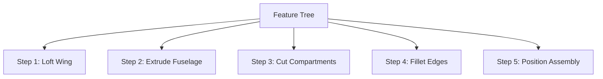

# Fixed-Wing CAD Generation Engineering Framework

## 1. CAD Generation Philosophy

The **Fixed-Wing CAD Generation Framework** bridges aerodynamic calculations and physical manufacturing. By implementing a parametric feature-based modeler, the framework converts abstract sizing results (e.g. wing loading, fuselage volumes, tail coefficients) directly into structured CAD solids.

This feature-based approach guarantees that the 3D shapes can be regenerated whenever downstream optimization loops adjust sizing coordinates.

---

## 2. Parametric Modeling Methodology

Aircraft solids are generated using standard constructive solid geometry and boundary representations:
*   **Wings**: Sized by lofting Root Airfoil cross-sections to Tip Airfoil sections over the span:
    *   Applies dihedral rotations and taper reductions.
*   **Fuselage**: Sized as a box shell parameterized by envelope length, width, and height:
    *   Fillets are applied along the longitudinal edges to represent composite or balsa-carved contours.
*   **Tail horizontal/vertical fins**: Solid extrusions parameterized by horizontal span and vertical fin height.
*   **Propulsion**: Cylindrical motor mounts and sweep propeller disks.

---

## 3. Assembly Generation

hierarchical sub-assemblies are compiled by applying coordinate transformations ($X, Y, Z$ translations and roll/pitch/yaw orientation angles) relative to the aircraft global coordinate origin:
*   **Global Origin ($0,0,0$)**: Sized at the nose tip of the fuselage.
*   **Wing Placement**: Offset along the longitudinal thrust axis to align with the wing's quarter-chord coordinate $X_{\text{qc}}$.
*   **Tail Placement**: Positioned at the aft fuselage coordinates ($l_{\text{fuselage}} - 0.12$).
*   **Propulsion Placement**: Positioned at the firewall face (nose for tractor, tail for pusher).

---

## 4. Reference Geometry

Model building references are established prior to drawing:
*   **Datum Points**: Key center of gravity offsets, neutral points, and attachment firewalls.
*   **Datum Planes**: Symmetry plane normal vectors (Y-Symmetry) to mirror left-hand and right-hand wing panels.
*   **Datum Axes**: Longitudinal thrust vector axes to align motor casings.

---

## 5. Feature Tree

Chronological build operations are tracked in a feature tree:

This enables debugging of regeneration errors and logs parametric history maps.

---

## 6. Export Formats

Parametric assemblies are exported to multiple formats:
*   **STEP (`.step`/`.stp`)**: Standard native parametric format for CAD imports.
*   **IGES (`.igs`)**: Wireframe and surface translation.
*   **Parasolid (`.x_t`)**: Solid modeler kernel translation.
*   **STL (`.stl`)**: Tessellated triangle meshes for 3D printing.
*   **OBJ (`.obj`) / GLTF (`.gltf`)**: Web-compatible visual meshes.

---

## 7. Validation Assumptions

The validator (`CADValidator`) asserts:
*   **Volume**: Total calculated volume must be strictly positive.
*   **Physical limits**: Bounding box coordinates must be non-zero.
*   **Sub-parts**: Main assembly components (wing, fuselage, tail) must exist.
*   **File Integrity**: Sized files must exist on disk and possess non-zero file sizes.

---

## 8. Strategy Extension Mechanism

To add a new CAD strategy:
1.  Inherit from `BaseCADStrategy` in `cad_strategy.py`.
2.  Implement:
    *   `get_generation_parameters() -> Tuple[str, bool, bool]`.
    *   `get_recommendations() -> List[str]`.
3.  Register the strategy in the registry: `CADStrategyRegistry.register("new_type", NewStrategy)`.
