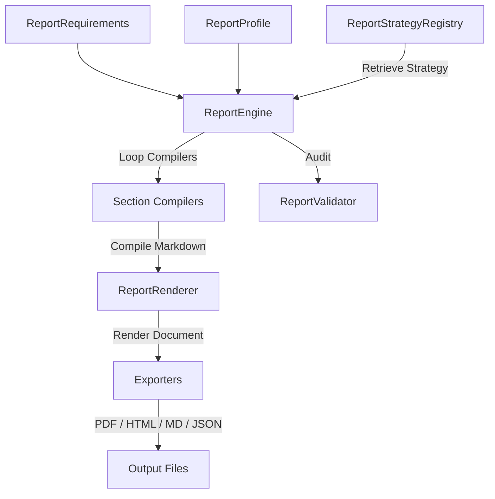

# Fixed-Wing Engineering Report Framework

## 1. Reporting Philosophy

The **Fixed-Wing Engineering Report Framework** is the final output layer of the Torq Wings Design Studio. It consolidates all parameters, geometry analyses, propulsion ratings, mass distributions, flight performances, verification checklists, CAD metadata, and manufacturing files generated throughout the aircraft design workflow. 

It aims to produce:
*   **Traceability**: Transparent cross-references between initial mission constraints and final sizing performance metrics.
*   **Auditable Verification**: A clear check of structural, payload, and range compliance before fabrication starts.
*   **Production Readiness**: Integration of CAD specifications, Bill of Materials (BOM), and QA checklists into the final review package.

---

## 2. Report Architecture

The architecture uses a decoupled **Section Compiler / Strategy / Exporter** layout to maintain strict separation of concerns (Clean Architecture / SOLID):



*   **`ReportRequirements`**: Carries every result node (e.g. `MissionResult`, `WingResult`, etc.) as input.
*   **`ReportStrategyRegistry`**: A registry pattern to retrieve report templates matching the UAV's category.
*   **`ReportRenderer`**: Concatenates compiled sections with unified YAML headers and separators.
*   **`ReportValidator`**: Performs audits on chapter counts, executive summary content, and file write states.

---

## 3. Section Generation

Each report chapter is built by a dedicated class implementing a `compile(requirements)` method:
1.  **Executive Summary**: Sizing milestones, cost summaries, wingspan, and verification ratings.
2.  **Mission Overview**: Target range, launch/recovery configuration, and operating environment.
3.  **Configuration**: High/low wing layout, tractor/pusher layout, tail styling, and gear types.
4.  **Wing Geometry**: Span, aspect ratio, taper, dihedral, incidence, and MAC coordinates.
5.  **Propulsion System**: Brushless motors/engines, propellers, takeoff thrust, and cruise currents.
6.  **Electrical System**: Battery pack weight, cell chemistry, voltages, and regulated avionics buses.
7.  **Avionics Systems**: Autopilots, navigation GPS, control links, and telemetry power.
8.  **Payload Integration**: Compartment volumes, gimbal mount styles, and active cooling ratings.
9.  **Mass Properties**: Subsystem weights, global center of gravity coordinates, and moments of inertia.
10. **Flight Performance**: Ground roll, clean stall speeds, rate of climb, ranges, endurances, and service ceilings.
11. **Mission Verification**: Deficiencies checklist, risk levels, compliance scores, and mitigations.
12. **Optimization Results**: Analytical resizing iterations and convergence status.
13. **CAD Output**: Assembly volume bounds, 3D parts tree depths, and export locations.
14. **Manufacturing Package**: BOM lists, cost projections, drawing inventories, and fabrication methods.

---

## 4. Export Pipeline

Rendered documents are exported to four distinct targets:
*   **Markdown (`.md`)**: The primary text-based output, including tables, lists, and standard formatting.
*   **HTML (`.html`)**: Styled document containing responsive typography, headers, and preformatted blocks.
*   **PDF (`.pdf`)**: A permanent engineering document conforming to standard archival guidelines.
*   **JSON Archive (`.json`)**: A machine-readable database index containing key engineering statistics (e.g. MTOW, wingspan, static margin) to allow downstream API parsing.

---

## 5. Validation Methodology

The `ReportValidator` class audits report completeness and export file integrity:
*   **Executive Summary Audit**: Guarantees the executive summary section exists and is non-empty.
*   **Completeness Check**: Assures a minimum of 5 core chapters are compiled to prevent incomplete reports.
*   **Data Integrity Check**: Validates that all files specified in the output dictionary exist on disk, are non-empty, and are writable.

---

## 6. Strategy Extension Mechanism

To add a new report strategy:
1.  Inherit from `ReportStrategy` in `report_strategy.py`.
2.  Implement:
    *   `get_sections_list() -> List[str]` to declare the required chapters.
    *   `get_recommendations() -> List[str]` to supply custom operator advice.
3.  Register the new strategy in the registry:
    ```python
    ReportStrategyRegistry.register("strategy_key", CustomStrategyClass)
    ```
