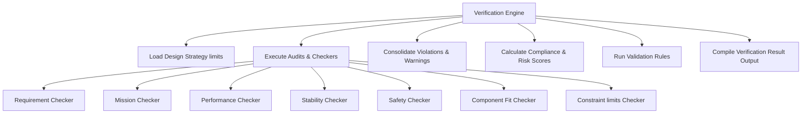

# Fixed-Wing Mission Verification Engineering Framework

## 1. Mission Verification Philosophy

The **Fixed-Wing Mission Verification Framework** is the final quality assurance checkpoint of the Torq Wings Design Studio design flow. Rather than sizing geometry or guessing weights, this framework aggregates results across every preceding discipline (aerodynamics, propulsion, structures, avionics, payload, mass properties, flight performance) and audits them against the overarching operational requirements.

Its primary goal is to determine **Mission success readiness**, **subsystem compatibility**, and **operational design safety risks** before handing the layout off to downstream optimization loops.

---

## 2. Compliance Evaluation Methodology

The compliance index represents the overall "fitness-for-purpose" of the aircraft design:
*   **Categories Audited**: Mission ranges, climb rates, tail stability, structural clearances, failsafe timing, sensor redundancy.
*   **Compliance Scoring**: Scoring starts at a perfect $100\%$ compliance. Deductions are subtracted:
    *   **Critical checker violation** (e.g. range deficiency or physical compartment clash): $-12\%$ deduction.
    *   **Minor safety warnings** (e.g. missing backup telemetry or high static margins): $-4\%$ deduction.
*   The overall design is marked as **Verified** if no critical violations are detected and the compliance score exceeds the strategy's minimum threshold ($80\%$ to $90\%$).

---

## 3. Risk Assessment Methodology

Risks are evaluated quantitatively to avoid unverified operational configurations:
*   **Calculated Risk Index**:
    $$\text{Risk Score} = (\text{Violations} \times 15.0) + (\text{Warnings} \times 5.0)$$
*   **Qualitative Risk Level**:
    *   **Low**: Risk Score $\le 15.0$.
    *   **Medium**: Risk Score $\le 35.0$.
    *   **High**: Risk Score $> 35.0$.
*   **Corrective Remediations**: If risk checks exceed acceptable thresholds, the framework compiles corrective actions tailored to the mission strategy (e.g. widening the fuselage, increasing tail stabilizer area, shifting battery placement coordinates).

---

## 4. Verification Workflow

The engine executes the following verification pipeline:

---

## 5. Engineering & Validation Assumptions

The framework operates under the following assumptions:
*   **Safety Timings**: Standard telemetry failsafe parameters are set at $5.0$ seconds.
*   **Sensor Redundancy**: Airspeed sensors are assumed mandatory for all BVLOS (Beyond Visual Line of Sight) fixed-wing designs.
*   **Clearance Tolerances**: Component widths must not exceed local fuselage section sizes.
*   **Stiffness limits**: Aspect ratios exceeding $25.0$ are flagged as structural stiffness failures due to wing bending.

---

## 6. Strategy Extension Mechanism

To register a custom verification strategy:
1.  Inherit from `BaseVerificationStrategy` in `verification_strategy.py`.
2.  Implement:
    *   `get_passing_bounds() -> Tuple[float, float]`.
    *   `get_remedial_actions() -> List[str]`.
3.  Register the strategy in the registry: `VerificationStrategyRegistry.register("new_type", NewStrategy)`.
