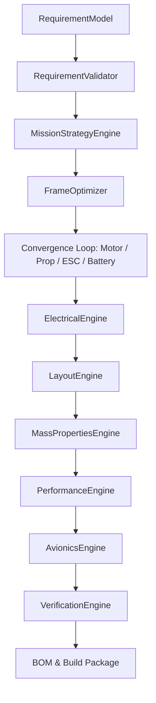

# Torq Wings Multirotor Architecture & Engineering Handbook
## Version: 1.0.0
## Release Candidate: August 2026

---

## PART I — INTRODUCTION

### Chapter 1: What the Torq Wings Multirotor System Does
The Torq Wings Multirotor design system is a catalog-based component selection and synthesis platform. It automates the matching, verification, and building of multirotor unmanned aerial vehicles (UAVs) using catalog components.

Unlike custom CAD generation, the V1 system focuses on selecting pre-existing catalog frames, motors, propellers, electronic speed controllers (ESCs), and battery packs. It outputs a complete Bill of Materials (BOM), assembly guidelines, and performance envelopes.

The Vehicle Selection Engine is responsible for choosing the vehicle **family** (`MULTIROTOR`), after which the Multirotor Design Pipeline selects the individual components and sizes the aircraft.

---

### Chapter 2: Multirotor Design for Beginners
For a beginner, the core terms are:
- **Payload**: The camera or weight carried by the drone.
- **Maximum Takeoff Weight (MTOW)**: The total weight of the drone at takeoff.
- **Thrust-to-Weight Ratio**: The ratio of total propeller thrust to takeoff weight. A value of at least 2.0 is required for stable flight.
- **Motor KV**: The motor RPM per volt of input. High KV is used for small propellers, low KV for large propellers.
- **Battery Cell Count (S)**: Governs system voltage (each cell is nominal 3.7V).
- **Electronic Speed Controller (ESC)**: Regulates motor current limits.

These concepts translate to database bounds that the pipeline optimizer sweeps through to find a viable system matching user requirements.

---

### Chapter 3: Multirotor vs Fixed-Wing vs VTOL
In the Torq Wings ecosystem, the Vehicle Selection Engine acts as the top-level classifier. It routes the user's mission requirements to the appropriate pipeline:

```
Mission Requirements
         │
         ▼
[Vehicle Selection Engine]
   ├── FIXED_WING  ──► Fixed-Wing Sizing Pipeline
   ├── MULTIROTOR  ──► Multirotor Selection Pipeline
   └── VTOL        ──► VTOL Design Pipeline
```

---

## PART II — REQUIREMENTS

### Chapter 4: RequirementModel
The input model is the standard `RequirementModel` class:

| Parameter | Type | Required | Default | Meaning |
|---|---|---|---|---|
| `payload_weight_kg` | `float` | Yes | N/A | Mass of payload camera or package. |
| `target_flight_time_min` | `float` | Yes | N/A | Flight duration target. |
| `target_range_km` | `float` | Yes | N/A | Target travel distance boundary. |
| `cruise_speed_kmh` | `float` | Yes | N/A | Horizontal cruise speed. |
| `metadata` | `dict` | No | `{}` | Accessor for payload dimensions and redundancy. |

---

### Chapter 5: Mission Strategy
Mission inputs are classified by `MissionStrategyEngine` (defined in [mission_strategy_engine.py](file:///c:/Users/acer/Documents/torqwings%20studio%20v2/backend/design/multirotor/mission/mission_strategy_engine.py)) into category strategies (e.g. mapping, cargo) which dictate:
- Target thrust-to-weight ratios (typically $[2.0, 2.5]$).
- Frame size caps (wheelbase limits).
- Priority optimization weights for range, endurance, and cost.

---

## PART III — MULTIROTOR PIPELINE

### Chapter 6: Multirotor Pipeline Entry Point
The entry point class is `MultirotorDesignPipeline` in [multirotor_design_pipeline.py](file:///c:/Users/acer/Documents/torqwings%20studio%20v2/backend/design/multirotor/pipeline/multirotor_design_pipeline.py).
The entry method is `execute(requirements)`.



---

### Chapter 7: Pipeline Context & Results
The sizers exchange context during execution using specific context variables (`FrameContext`, `MotorContext`, etc.). Results are consolidated into the `MultirotorAircraftSpecification` model, detailing selected component records.

---

### Chapter 8: Pipeline Stage Order

| Stage | Module Path | Inputs | Calculations | Outputs |
|---|---|---|---|---|
| **Mission Strategy** | `mission_strategy_engine.py` | `RequirementModel` | Evaluates targets | `StrategySpecification` |
| **Frame Optimizer** | `frame_optimizer.py` | `FrameContext` | Matches wheelbases | `FrameSpecification` |
| **Motor Sizer** | `motor_optimizer.py` | `MotorContext` | Computes KV / Current | `MotorSpecification` |
| **Propeller Sizer** | `propeller_optimizer.py` | `PropellerContext` | Sized diameters | `PropellerSpecification` |
| **ESC Matcher** | `esc_optimizer.py` | `EscContext` | Validates amps | `EscSpecification` |
| **Battery Sizer** | `battery_optimizer.py` | `BatteryContext` | Sized mAh/Wh | `BatterySpecification` |
| **Electrical Engine** | `electrical_engine.py` | `ElectricalContext` | Fits wire gauges | `ElectricalSpecification` |
| **Layout packaging** | `layout_engine.py` | `LayoutContext` | Computes offsets | `LayoutSpecification` |
| **Mass Properties** | `mass_properties_engine.py` | `MassPropertiesContext` | AUW and inertias | `MassPropertiesSpecification` |
| **Performance** | `performance_engine.py` | Adapted models | Sized speed/endurance | `PerformanceResult` |
| **Avionics** | `avionics_engine.py` | Adapted models | Flight controller | `AvionicsResult` |
| **Verification** | `verification_engine.py` | Adapted models | Runs checks | `VerificationResult` |

---

## PART IV — CONFIGURATION

### Chapter 9: Multirotor Configuration Engine
The configuration layouts supported by the Frame catalog are:
1. **Quadcopter X**: 4 motors radially spaced at 90-degree intervals.
2. **Hexacopter X**: 6 motors radially spaced at 60-degree intervals.
3. **Octocopter X**: 8 motors radially spaced at 45-degree intervals.
4. **Coaxial X8**: 8 motors arranged in coaxial pairs (4 arms, top/bottom motors).

---

### Chapter 10: Configuration Decision Logic
The pipeline selects Hexacopter/Octocopter configurations when requirements specify high payload weights ($> 3.0$ kg) or request redundant flight paths (indicated in requirements metadata). Smaller payloads fallback to Quadcopter layouts to minimize structural empty weight.

---

## PART V — FRAME ENGINE

### Chapter 11: Frame Selection
`FrameSelector` reads the database of off-the-shelf carbon fiber plates:
- **Micro 210 Carbon** ($0.21$m wheelbase, max $5$-inch prop)
- **DJI F450 FlameWheel** ($0.45$m wheelbase, max $10$-inch prop)
- **Tarot FY650 Sport** ($0.65$m wheelbase, max $15$-inch prop)
- **Tarot 680PRO Hexa** ($0.68$m wheelbase, max $13$-inch prop)
- **Tarot T810 Carbon** ($0.81$m wheelbase, max $15$-inch prop)
- **Tarot T18 Heavy** ($1.27$m wheelbase, max $18$-inch prop)

---

### Chapter 12: Frame Compatibility
The frame sizer filters candidate wheelbase frames to ensure the selected propeller diameter leaves at least a $10\%$ tip clearance margin relative to adjacent motor arm structures.

---

## PART VI — MOTOR ENGINE

### Chapter 13: Motor Selection
`MotorSelector` filters motor records based on configuration voltage bounds:
- **MN1806-2300**: KV 2300, max current 12.0A, weight 18g.
- **F40 PRO IV-1950**: KV 1950, max current 45.0A, weight 32g.
- **MN4014-370**: KV 370, max current 28.0A, weight 150g.
- **U8 II-190**: KV 190, max current 40.0A, weight 240g.
- **U11 II-120**: KV 120, max current 55.0A, weight 730g.

---

### Chapter 14: Motor Performance
Current draw scales with takeoff weight:
$$I_{hover\_motor} = I_{hover\_motor,ref} \cdot \left(\frac{AUW_{actual}}{AUW_{motor\_ref}}\right)^{1.3}$$
This models propeller thrust-to-power scaling curves.

---

## PART VII — PROPELLER

### Chapter 15: Propeller Selection
Sized propellers must not exceed the frame's structural limits (e.g. max $15$-inch diameter prop for Tarot FY650). Catalog records include:
- **HQProp 5x4.3x3** (5-inch, 3-blade nylon)
- **APC 10x4.7 MR** (10-inch, 2-blade nylon-glass)
- **Tarot 13x5.5 Carbon** (13-inch carbon fiber)
- **Tarot 15x5.5 Carbon** (15-inch carbon fiber)
- **T-Motor 18x6.1 Carbon** (18-inch carbon fiber)

---

## PART VIII — ESC

### Chapter 16: ESC Selection
ESCs are selected by matching motor continuous current limits at max thrust. A $20\%$ safety current headroom margin is enforced:
$$I_{esc,continuous} \ge 1.20 \cdot I_{motor,max}$$

---

## PART IX — BATTERY

### Chapter 17: Battery Selection
Catalog battery cell configurations range from 4S LiPo to 12S LiPo:
- **GensAce 10000mAh 6S LiPo** (1.42 kg, 22.2V)
- **T-Motor 16000mAh 6S LiHV** (1.98 kg, 22.8V)
- **T-Motor 22000mAh 12S LiPo** (4.60 kg, 44.4V)
- **Molicel 4200mAh 6S Li-Ion** (0.43 kg, 22.2V)

---

## PART X — ELECTRICAL SYSTEM

### Chapter 18: Electrical Architecture
`ElectricalEngine` matches continuous system currents to standard wiring gauge metrics:
- $< 15$ A: AWG 16
- $15 - 35$ A: AWG 14
- $35 - 75$ A: AWG 12
- $> 75$ A: AWG 10

---

## PART XI — MASS AND CG

### Chapter 19: Mass Properties
The mass properties engine accumulates takeoff weight:
$$AUW = Payload + Frame\_Mass + Motor\_Count \times (Motor + ESC + Prop) + Battery + Wiring$$

---

### Chapter 20: Center of Gravity
`CgCalculator` balances battery pack coordinates $X_{battery}$ relative to the geometric center to maintain coordinate margins:
$$x_b = -\frac{\sum m_{other} \cdot x_{other} + m_{payload} \cdot x_p}{m_{battery}}$$

---

## PART XII — PERFORMANCE

### Chapter 21: Hover Performance
Required motor hover thrust:
$$Thrust_{hover\_motor} = \frac{AUW \cdot 9.81}{Motor\_Count}$$

---

### Chapter 22: Flight Time & Endurance
Flight endurance is computed using an $80\%$ depth of discharge limit:
$$Endurance = \frac{Capacity_{Ah} \cdot 0.8}{1.12 \cdot I_{hover}} \cdot 60.0$$

---

## PART XIII — COMPONENT DATABASE

### Chapter 23: Database Architecture
Database records are implemented inside component selectors (e.g. `battery_selector.py`, `motor_selector.py`) containing weights, current limits, prices, and cell parameters.

---

### Chapter 24: Component Matching Chain

```
Requirement ──► Frame Wheelbase ──► Motor KV ──► Propeller Diameter ──► ESC Current ──► Battery Cell Voltage
```

---

## PART XIV — SELECTION ENGINE

### Chapter 25: Ranking and Candidate Selection
Candidates are scored against strategy metrics. For example, battery candidates are ranked based on energy density, cost, and discharge current safety margins.

---

## PART XV — FINAL BOM

### Chapter 26: Bill of Materials
Sizing compiles all components, quantities, weights, and catalog prices to write the final BOM package.

---

### Chapter 27: Build Package
A structured assembly report containing frame mounting instructions, ESC power directions, and wiring gauge constraints is exported to the `reports/` folder.

---

## PART XVI — NO CUSTOM CAD IN V1

### Chapter 28: Why Multirotor V1 Does Not Generate Custom CAD
V1 utilizes off-the-shelf carbon fiber frames to minimize manufacturing overhead. The design focus is discrete catalog component optimization.

---

### Chapter 29: Future Custom Multirotor CAD
Future versions will contain a custom CAD exporter that sizes custom carbon arms and center plates to fit specialized cargo payloads.

---

## PART XVII — FAILURE ARCHITECTURE

Exceptions propagate through standard classes:

```
        Sizing / Matching Exception
                     │
         ┌───────────┴───────────┐
         ▼                       ▼
 [Frame Sizing Failed]  [Propulsion Infeasible]
 (FRAME_INFEASIBLE)     (PROPULSION_INFEASIBLE)
```

---

## PART VXX — TESTING

### Chapter 30: Unit & Integration Tests
Tests are located in `tests/design/multirotor/`. Pytest runs tests verifying battery discharge rates, frame prop clearance, and pipeline end-to-end routing.

---

## PART XIX — COMPLETE END-TO-END WALKTHROUGH

### Chapter 31: One Mission From User Input to BOM
Walkthrough of a mapping mission requiring a $1.2$ kg payload. The pipeline executes `execute(req)`, matches a `Tarot FY650 Sport` frame, selects `F40 PRO IV` motors with `APC 10x4.7` propellers, sizes a `GensAce 10000mAh` 6S battery, verifies climb limits, and writes the final BOM.

---

## PART XX — DEBUGGING

If sizers fail, inspect:
- `motor_optimizer.py` if KV ratings are empty.
- `battery_optimizer.py` if flight time constraints fall short of targets.

---

## SOURCE TRACEABILITY MATRIX

| Element | Source File | Class / Method | Evidence | Chapter |
|---|---|---|---|---|
| Pipeline | [multirotor_design_pipeline.py](file:///c:/Users/acer/Documents/torqwings%20studio%20v2/backend/design/multirotor/pipeline/multirotor_design_pipeline.py) | `MultirotorDesignPipeline` | Primary pipeline orchestrator | Chapter 6, 8 |
| Sizing Loop | [multirotor_design_pipeline.py](file:///c:/Users/acer/Documents/torqwings%20studio%20v2/backend/design/multirotor/pipeline/multirotor_design_pipeline.py#L164-L257) | `execute` method loop | Executes motor/prop/ESC/battery stages | Chapter 6, 9 |
| CG Sizer | [cg_calculator.py](file:///c:/Users/acer/Documents/torqwings%20studio%20v2/backend/design/multirotor/mass_properties/cg_calculator.py) | `balance_battery` | Battery longitudinal balancing | Chapter 20 |
| Performance | [battery_performance.py](file:///c:/Users/acer/Documents/torqwings%20studio%20v2/backend/design/multirotor/battery/battery_performance.py) | `calculate_performance` | Endurance calculation formulas | Chapter 14, 22 |

---

## FINAL CONCLUSION: How the Torq Wings Multirotor System Works in 10 Minutes
The Multirotor design pipeline evaluates user inputs against component databases. It matches configurations (Quad/Hex/Octo), sizes carbon wheelbase frames, and converges takeoff weights against non-linear current curves to select battery and ESC capacities. The certified result outputs a BOM and build instructions package.

---
**THIS HANDBOOK REPRESENTS THE CURRENT MULTIROTOR IMPLEMENTATION**
