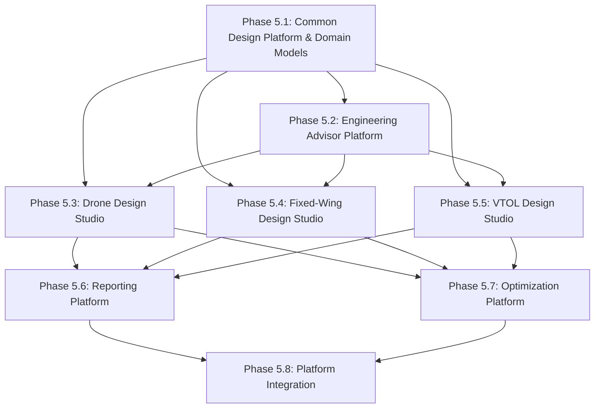
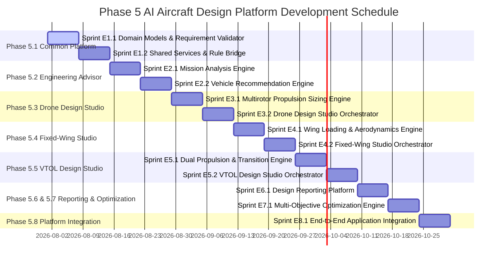

# Phase 5: AI Aircraft Design Platform Implementation Plan & Roadmap

> **Document Status**: Official Execution Roadmap  
> **Target System**: Torq Wings Design Studio Backend  
> **Phase**: Phase 5.0 – Implementation Roadmap  
> **Blueprint Reference**: [`docs/architecture/phase5_ai_aircraft_design_platform.md`](file:///c:/Users/acer/Documents/torqwings%20studio%20v2/docs/architecture/phase5_ai_aircraft_design_platform.md)  
> **Component Reference**: [`docs/architecture/phase5_component_specification.md`](file:///c:/Users/acer/Documents/torqwings%20studio%20v2/docs/architecture/phase5_component_specification.md)  
> **Author**: Torq Wings Core Engineering Team  
> **Version**: 1.0.0  

---

## Executive Summary

This document specifies the official implementation roadmap for **Phase 5 – AI Aircraft Design Platform** of Torq Wings Design Studio. The execution plan breaks down Phase 5 development into 8 sequential sub-phases (Phases 5.1 through 5.8) encompassing 12 distinct engineering sprints.

---

## 1. Dependency Graph

The execution flow enforces strict unidirectional dependencies with zero circular references:



---

## 2. Master Implementation Gantt Chart



---

## 3. Sub-Phase & Sprint Specifications

---

### Phase 5.1: Common Design Platform & Domain Models

#### Sprint E1.1: Domain Models & Requirement Validation
- **Objective**: Establish foundational Phase 5 domain models and requirement validation.
- **Components**: `RequirementModel`, `ValidatedRequirements`, `MissionProfile`, `DesignContext`, `RequirementValidator`.
- **Deliverables**: Tested domain dataclasses and `RequirementValidator` class in `backend/design/common/`.
- **Dependencies**: Phase 1–4 Backend Infrastructure.
- **Success Criteria**: 100% test coverage for valid/invalid input requirement cases.
- **Expected Duration**: 7 Days.
- **Review Checklist**:
  - [ ] `@dataclass(slots=True)` applied to all models.
  - [ ] Physical feasibility rules enforced.

#### Sprint E1.2: Shared Services & Rule Bridge
- **Objective**: Implement shared physics calculators and Phase 4 rule engine integration bridge.
- **Components**: `PowerBudgetCalculator`, `WeightBreakdownManager`, `AerodynamicEstimator`, `RuleVerificationBridge`.
- **Deliverables**: Reusable physics calculation services in `backend/design/shared/`.
- **Dependencies**: Sprint E1.1.
- **Success Criteria**: Correct power and mass property calculations matching analytical benchmarks.
- **Expected Duration**: 7 Days.

---

### Phase 5.2: Engineering Advisor Platform

#### Sprint E2.1: Mission Analysis Engine
- **Objective**: Compute mission power, drag, energy budget, and payload fraction.
- **Components**: `MissionAnalysisEngine`, `MissionPhysicsSummary`.
- **Deliverables**: `MissionAnalysisEngine` in `backend/design/advisor/`.
- **Dependencies**: Sprint E1.2.
- **Success Criteria**: Accurate hover vs cruise power estimations.
- **Expected Duration**: 7 Days.

#### Sprint E2.2: Vehicle Recommendation Engine
- **Objective**: Implement multi-criteria vehicle category scoring and explainable recommendation reporting.
- **Components**: `VehicleRecommendationEngine`, `RecommendationRanker`, `RecommendationExplanationGenerator`, `RecommendationReport`.
- **Deliverables**: MCDA recommendation engine producing physics-based explanations.
- **Dependencies**: Sprint E2.1.
- **Success Criteria**: Explanations generated for every candidate category without automatic selection.
- **Expected Duration**: 7 Days.

---

### Phase 5.3: Drone Design Studio (Multirotor)

#### Sprint E3.1: Multirotor Propulsion Sizing Engine
- **Objective**: Implement motor, propeller, ESC, and battery selection algorithms for multirotors.
- **Components**: `MotorSelectionEngine`, `PropellerSelectionEngine`, `ESCSelectionEngine`, `BatterySelectionEngine`.
- **Deliverables**: Component selection engines in `backend/design/drone/`.
- **Dependencies**: Sprint E1.2.
- **Success Criteria**: Ensures \(\ge 2.0:1\) thrust-to-weight ratio and ESC thermal headroom.
- **Expected Duration**: 7 Days.

#### Sprint E3.2: Drone Design Studio Orchestrator
- **Objective**: Assemble complete `DroneDesignStudio` workflow and frame sizing.
- **Components**: `FrameSelectionEngine`, `WeightEstimator`, `DroneDesignStudio`, `DroneDesign`.
- **Deliverables**: Complete multirotor design studio orchestrator.
- **Dependencies**: Sprint E3.1, Sprint E2.2.
- **Success Criteria**: End-to-end multirotor sizing producing verified `DroneDesign` specs.
- **Expected Duration**: 7 Days.

---

### Phase 5.4: Fixed-Wing Design Studio

#### Sprint E4.1: Wing Loading & Aerodynamics Engine
- **Objective**: Implement stall speed, wing area, aspect ratio, and drag polar calculations.
- **Components**: `WingSizingEngine`, `AirfoilSelectionEngine`, `PerformanceAnalyzer`.
- **Deliverables**: Aerodynamic wing sizing engines in `backend/design/fixed_wing/`.
- **Dependencies**: Sprint E1.2.
- **Success Criteria**: Wing sizing satisfies stall speed and glide ratio requirements.
- **Expected Duration**: 7 Days.

#### Sprint E4.2: Fixed-Wing Studio Orchestrator
- **Objective**: Assemble complete `FixedWingDesignStudio` including tail and fuselage sizing.
- **Components**: `TailSizingEngine`, `FuselageSizingEngine`, `FixedWingDesignStudio`, `FixedWingDesign`.
- **Deliverables**: End-to-end fixed-wing UAV sizing studio.
- **Dependencies**: Sprint E4.1, Sprint E2.2.
- **Success Criteria**: Produces statically stable fixed-wing design specifications.
- **Expected Duration**: 7 Days.

---

### Phase 5.5: VTOL Design Studio

#### Sprint E5.1: Dual Propulsion & Transition Engine
- **Objective**: Implement hover lift rotor sizing, cruise pusher sizing, and transition energy calculation.
- **Components**: `HoverPropulsionEngine`, `CruisePropulsionEngine`, `TransitionAnalysisEngine`.
- **Deliverables**: Dual propulsion sizing engines in `backend/design/vtol/`.
- **Dependencies**: Sprint E3.1, Sprint E4.1.
- **Success Criteria**: Computes hover-to-cruise transition energy penalty accurately.
- **Expected Duration**: 7 Days.

#### Sprint E5.2: VTOL Design Studio Orchestrator
- **Objective**: Assemble complete `VTOLDesignStudio`.
- **Components**: `VTOLConfigurationEngine`, `ControlAllocationEngine`, `VTOLDesignStudio`, `VTOLDesign`.
- **Deliverables**: Hybrid VTOL design studio orchestrator.
- **Dependencies**: Sprint E5.1, Sprint E2.2.
- **Success Criteria**: Successfully sizes Lift+Cruise and Tilt-Rotor aircraft configurations.
- **Expected Duration**: 7 Days.

---

### Phase 5.6 & 5.7: Reporting & Optimization Platform

#### Sprint E6.1: Design Reporting Platform
- **Objective**: Implement design summary report generation in PDF, JSON, and Markdown formats.
- **Components**: `DesignReportGenerator`, `DroneDesignReportGenerator`.
- **Deliverables**: Report generator module in `backend/design/reports/`.
- **Dependencies**: Sprints E3.2, E4.2, E5.2.
- **Success Criteria**: Generates comprehensive engineering design reports.
- **Expected Duration**: 7 Days.

#### Sprint E7.1: Multi-Objective Optimization Engine
- **Objective**: Implement Pareto-optimal trade-off optimization across mass, endurance, and cost.
- **Components**: `OptimizationEngine`, `PerformanceAnalyzer`.
- **Deliverables**: Multi-objective design optimizer.
- **Dependencies**: Sprints E3.2, E4.2, E5.2.
- **Success Criteria**: Identifies Pareto frontier for trade-off parameters.
- **Expected Duration**: 7 Days.

---

### Phase 5.8: Platform Integration & Application Root

#### Sprint E8.1: End-to-End Application Integration
- **Objective**: Integrate Phase 5 Design Platform into `TorqWingsApplication` root.
- **Components**: `DesignEngineRouter`, `TorqWingsApplication`.
- **Deliverables**: Unified application entry point managing complete design workflows.
- **Dependencies**: All previous sprints (E1.1 through E7.1).
- **Success Criteria**: All unit and integration test suites pass (100% passing).
- **Expected Duration**: 7 Days.

---

## 4. Major Milestones

```
M1: Common Platform Complete       (End of Sprint E1.2)
M2: Engineering Advisor Complete    (End of Sprint E2.2)
M3: Drone Design Studio Complete    (End of Sprint E3.2)
M4: Fixed-Wing Studio Complete      (End of Sprint E4.2)
M5: VTOL Studio Complete            (End of Sprint E5.2)
M6: Reporting & Optimization Done   (End of Sprint E7.1)
M7: Platform Integration Complete   (End of Sprint E8.1)
M8: Phase 5 Release Candidate       (Final Sign-Off)
```

---

## 5. Risk Management & Quality Gates

### Risk Matrix

| Risk ID | Risk Description | Severity | Mitigation Strategy |
| :--- | :--- | :--- | :--- |
| **R-01** | Multi-variable propulsion matching fails to converge | High | Enforce bounded discrete grid search over component databases |
| **R-02** | Complex transition physics delays VTOL studio | Medium | Use empirical transition power multipliers derived from Knowledge Base |
| **R-03** | Rule verification performance bottlenecks design loop | Medium | Cache invariant graph rule lookups in `GraphIndexer` |

### Quality Gates

Every sprint must satisfy five mandatory quality gates before approval:

1. **Code Review**: Clean Architecture compliance and zero lint errors.
2. **Unit Testing**: Minimum 95% line coverage on all newly added engines.
3. **Integration Testing**: End-to-end verification against workspace engineering knowledge base.
4. **Rule Verification**: Zero unhandled Phase 4 rule violations.
5. **Documentation**: Complete module, class, and method docstrings.

---

## 6. Conclusion

This implementation plan establishes a rigid, deterministic roadmap for building Phase 5 of Torq Wings Design Studio. By following the sequential sprint progression and strict quality gates, the engineering team guarantees timely, reliable execution without architectural churn.
