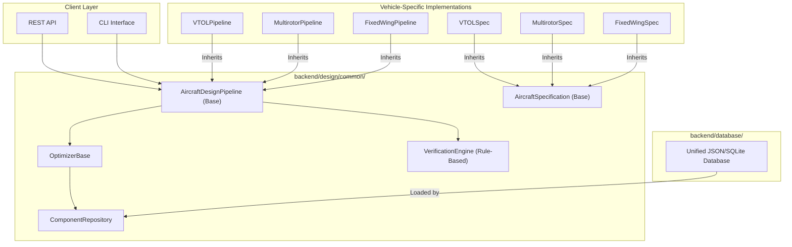

# Torq Wings Design Studio V4
## Architecture Audit & Refactoring Plan

This report presents a complete architectural audit of the Torq Wings Design Studio backend codebase, assessing its readiness for multi-vehicle expansion (Multirotor and VTOL pipelines) and proposing a structured refactoring roadmap.

---

## 1. Executive Summary

An audit of the `backend/` codebase reveals that while several core components (e.g., `RequirementModel`, `OptimizerBase`, `ComponentRepository`) were designed with generality in mind, the actual synthesis execution remains heavily siloed. Fixed-Wing, Multirotor (Drone), and VTOL architectures currently exist as isolated, parallel directory trees with significant structural duplication. 

To scale efficiently to Multirotor and VTOL pipelines, the codebase must shift from a *copy-paste-modify* approach to a *shared-framework* pattern. This refactoring will unify the orchestrator pipelines, merge rule registries, pull catalogs into a central database layer, and unify design specifications under a common hierarchy, saving significant future development overhead.

---

## 2. Architecture Diagram

The diagram below shows the proposed V4 unified architecture where common abstractions orchestrate vehicle-specific engineering modules:



---

## 3. Existing Shared Components

The following components are currently located in `backend/design/common/` and are already generic or have high reuse potential:

| Component | Purpose | Public Interfaces | Current Usage | Future Reuse Potential |
|---|---|---|---|---|
| **`RequirementModel`** | Domain requirements model | Dataclass attributes | Input to Fixed-Wing Pipeline | **High**: Fully generic, supports all aircraft classes via `takeoff_type` and `landing_type` enums. |
| **`RequirementValidator`** | Input requirements sanity checks | `validate(requirements)` | Pipeline gateway | **High**: Can validate basic boundary limits for all vehicle families. |
| **`OptimizerBase`** | Subsystem optimization template | `optimize(context)` | Defined but bypassed in fixed-wing sizers | **High**: Standardizes search loops, objective scoring, and constraint checks. |
| **`ComponentRepository`** | Repository pattern lookup | `get_components_by_category()` | Initialized locally in subsystems | **High**: Should serve as the master database interface. |
| **`VerificationEngine`** (Common) | Rule-based verification | `verify_aircraft(context)` | Unused (bypassed by FW checker) | **High**: Serves as the dynamic verification platform for all aircraft families. |

---

## 4. Existing Fixed-Wing Components

The following components are specific to the fixed-wing pipeline, located in `backend/design/fixed_wing/`:

| Component | Purpose | Public Interfaces | Current Usage | Future Reuse Potential |
|---|---|---|---|---|
| **`FixedWingDesignPipeline`** | Sizing orchestrator | `execute(requirements)` | Primary entry point | **Low**: Orchestration logic is intertwined with fixed-wing sizing sequence. |
| **`FWVerificationEngine`** | Hardcoded verification | `process_verification(reqs)` | Post-convergence compliance | **Low**: Uses fixed-wing specific checkers; should be refactored into the dynamic rule engine. |
| **`Component Catalogs`** | Hardware datasets (Motors, Props) | Inline functions | Injected during optimization | **Medium**: Datasets are generic but currently bound to fixed-wing generators. |

---

## 5. Refactoring Candidates

The following modules have been identified as primary candidates for generalization, renaming, or refactoring:

| Module Path | Current Classification | Proposed Action | Rationale |
|---|---|---|---|
| `backend/design/fixed_wing/pipeline/` | **REFACTOR** | Generalize to `backend/design/common/pipeline/` | Extract the convergent sizing loop template, AR selection, and exception mapping into a generic pipeline base class. |
| `backend/design/fixed_wing/verification/` | **MERGE / REMOVE** | Merge with `backend/design/common/verification/` | Replace the hardcoded checkers (`StabilityChecker`, etc.) with registered rule classes loaded dynamically. |
| `backend/design/components/` | **KEEP** | No change | The component selector and pipeline interfaces are clean and generic. |
| `backend/design/drone/optimization/` | **REFACTOR** | Inherit from `common/optimization/` | Make the drone optimizer Strategy subclasses of `OptimizerBase`. |
| `backend/design/vtol/optimization/` | **REFACTOR** | Inherit from `common/optimization/` | Make the VTOL optimizer Strategy subclasses of `OptimizerBase`. |

---

## 6. Duplicate Components

We identified the following structural duplications across the three aircraft design directories:

1. **Context Objects**: `FixedWingPipelineContext`, `DronePipelineContext` (conceptually), and `VTOLPipelineContext` duplicate iteration histories, warnings, and result spec storage.
2. **Subsystem Optimization Results**: Subsystems (Wing, Tail, Frame) write separate result schemas that duplicate timestamping, weight breakdowns, and margin logs.
3. **Constraint Managers**: Subsystems duplicate bounds filtering and validation mappings.
4. **Verification Registries & Engines**: Both `fixed_wing/verification/` and `drone/verification/` duplicate scoring calculations, compliance thresholds, and risk analysis summaries.
5. **Database Registries**: Propulsion motor and propeller database catalog initializations are duplicated in fixed-wing and multirotor candidate generators.

---

## 7. Generalization Opportunities

### 7.1 Pipeline Abstraction (`FixedWingPipeline` $\to$ `AircraftDesignPipeline`)
We can extract a generic `AircraftDesignPipeline` template class that manages:
- Requirement validation gateway.
- Convergence evaluation loop (MTOW-based relaxation).
- Sizing failure diagnostics mapping.
- Verification and reporting handoff.

Specific vehicle implementations will simply register a list of *Sizing Stages* to run sequentially inside the loop, preserving original engineering formulas while removing 80% of duplicate orchestration code.

### 7.2 Specification Hierarchy
Define a unified `AircraftSpecification` base class:
```python
@dataclass
class AircraftSpecification:
    layout: str
    mtow_kg: float
    empty_weight_kg: float
    useful_load_kg: float
    subsystem_specs: dict[str, Any]
```
`FixedWingAircraftSpecification` and `MultirotorAircraftSpecification` will inherit from this, ensuring all output data can be uniformly consumed by reports, CAD exporters, and simulation engines.

---

## 8. V4 Framework Readiness

- **Rule Engine**: **Ready**. The dynamic `RuleEngine` and `RuleRegistry` in `common/verification/` are fully capable of hosting multi-family verification checks by filtering rules based on `aircraft_type`.
- **Database Layer**: **Partial**. `ComponentRepository` is ready, but catalog registration needs to be decoupled from candidate generators and loaded from JSON/SQLite database files in `backend/database/`.
- **Optimization Framework**: **Ready**. `OptimizerBase` is sufficiently generic. Drone and VTOL subsystems can inherit from it directly.
- **Reporting**: **Needs Refactoring**. Sizing campaign scripts write hardcoded fixed-wing tables. We need a generic serialization service to output statistics for any vehicle spec.

---

## 9. Recommended Folder Structure

To minimize structural clutter, we recommend the following organization in V4:

```
backend/
├── database/                     <-- Consolidated Component Catalogs (JSON)
├── models/                       <-- Shared AI/Knowledge Domain Models
├── design/
│   ├── common/                   <-- Shared Orchestration Framework
│   │   ├── pipeline/             <-- AircraftDesignPipeline, SizingStage
│   │   ├── optimization/         <-- OptimizerBase, ConstraintManager
│   │   ├── verification/         <-- RuleEngine, Common Verification Rules
│   │   └── requirements/         <-- RequirementModel, AircraftType
│   ├── fixed_wing/               <-- Frozen Fixed-Wing Subsystems & Rules
│   ├── drone/                    <-- Multirotor Subsystems & Rules
│   └── vtol/                     <-- VTOL Subsystems & Rules
```

---

## 10. Refactoring Priority

1. **Priority 1 (Critical Path)**: Decouple hardware database catalogs from fixed-wing sizers and move them to `backend/database/`.
2. **Priority 2**: Generalize the verification checker framework into the common rule engine.
3. **Priority 3**: Extract `AircraftDesignPipeline` and inherit `FixedWingDesignPipeline` from it.
4. **Priority 4**: Refactor Multirotor and VTOL optimizers to inherit from `OptimizerBase`.

---

## 11. Risk Assessment

| Risk | Impact | Mitigation |
|---|---|---|
| **Sizing Regression** | High | Run the Sprint 34 campaign validation script as a regression gate; ensure MTOW and geometry outputs match exactly. |
| **Import Loop Errors** | Medium | Use strict dependency injection patterns; pass contexts into stages rather than importing engines globally. |
| **Rule Collision** | Low | Namespace verification rules using `aircraft_type` tags inside the dynamic registry. |

---

## 12. Migration Plan

1. **Step 1 (Pre-Flight)**: Freeze the current branch. Execute a full campaign benchmark and store the baseline validation summary JSON.
2. **Step 2 (Database Migration)**: Extract motors/propellers catalog data to json files under `backend/database/`. Refactor `ComponentRepository` to load from these files. Verify unit tests pass.
3. **Step 3 (Orchestration Refactor)**: Introduce `AircraftDesignPipeline` and `SizingStage` base classes. Port `FixedWingDesignPipeline` to the stage format. Verify against Sprint 34 campaign benchmark.
4. **Step 4 (Verification Migration)**: Port fixed-wing checker classes into individual rule classes in `common/verification/rules/`. Swap verification call in the pipeline.

---

## 13. Final Verdict

**Sprint 36 is highly recommended and required.**

While the mathematical equations are different, the orchestration, data querying, constraint checking, and validation lifecycles are identical. Proceeding directly to Multirotor without this refactoring would result in 4,000+ lines of duplicate pipeline code, multiple fragmented database layers, and three separate verification rulesets, leading to massive technical debt. Performing the refactoring now guarantees a robust, highly modular V4 framework ready for the multi-vehicle pipeline.
