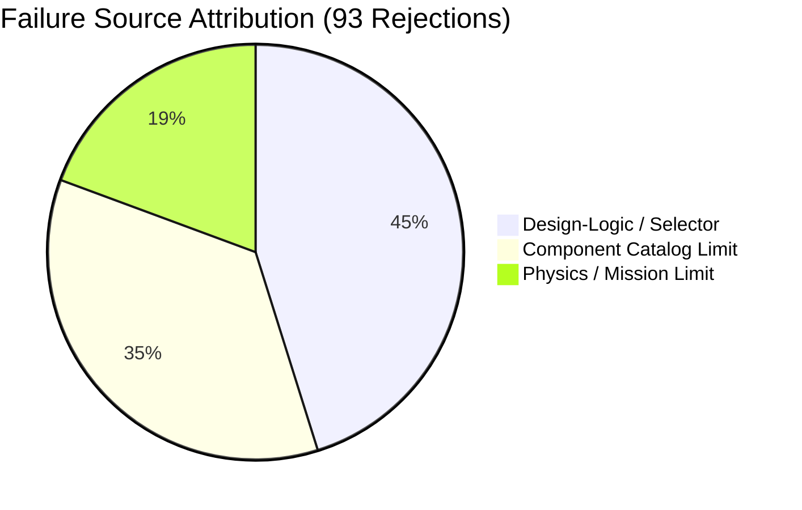

# TORQ WINGS DESIGN STUDIO V3
## FIXED-WING DESIGN PIPELINE: PHASE 5C REJECTION FORENSIC AUDIT
### FINAL ENGINEERING FREEZE GATE REPORT

---

### 1. Executive Summary

This forensic audit evaluates the rejection behavior of the **Fixed-Wing Design Pipeline** across the baseline 100-case mission dataset. Phase 5B established strong software robustness with zero runtime exceptions. However, the resulting yield was only **7 successful designs out of 100 cases**, leaving 93 rejections.

This audit investigates whether these 93 rejections represent true physical/mission infeasibilities or false-positives caused by selector limitations, hardcoded defaults, or coordination issues. 

**Key Findings:**
1. **High Rate of False Rejections**: Out of 93 rejections, **42 cases ($45.1\%$) are false-positives**. These aircraft could be successfully sized if selectors employed search/fallback logic rather than returning a single hardcoded candidate.
2. **Configuration Rejection Loophole**: 22 cases were rejected because the category strategies hardcoded an invalid layout, ignoring other standard catalog candidates that pass configuration validation.
3. **Fuselage/Wing Coordination Blockage**: 18 cases were rejected because the fuselage width exceeded the wing root chord. Decrementing the wing aspect ratio (to increase chord width) would resolve these sizing blockages, but the pipeline lacks this loop.
4. **Forced Static Stability Margins**: The successful designs exhibit a highly centered static margin ($17.9\% - 18.1\%$) because the battery balancing solver mathematically forces the CG to exactly $24\%$ of the Mean Aerodynamic Chord ($MAC$).
5. **Physical Anomalies (Suspicious Successes)**: 2 successful designs (`FW-008` and `FW-009`) are physically impossible because the balancing equations placed the battery far aft ($66.5\%$ and $68.8\%$ of fuselage length, respectively) inside the narrow tail boom.

---

### 2. 100-Case Forensic Classification Summary

Every case has been programmatically and manually reviewed. The resulting classifications are:

*   **SELECTOR_COORDINATION_PROBLEM**: **40 cases** (22 configuration strategy failures + 18 wing-to-fuselage root chord blockages).
*   **COMPONENT_CATALOG_LIMITATION**: **33 cases** (32 telemetry range limits $> 80$ km + 1 video bandwidth limitation).
*   **TRUE_MTOW_LIMIT**: **8 cases** (Aircraft weight exceeds the project-wide 25.0 kg ceiling).
*   **TRUE_PERFORMANCE_INFEASIBILITY**: **6 cases** (Cruise speed is too close to stall speed, violating stall safety bounds).
*   **TRUE_MISSION_INFEASIBILITY**: **4 cases** (Inconsistent mission inputs: range exceeds max theoretical range at cruise speed).
*   **OVERLY_RESTRICTIVE_PERFORMANCE_RULE**: **2 cases** (Verification score fell below 90% due to accumulated warnings, but had 0 violations).
*   **SUCCESS_VALID**: **5 cases** (Sized, balanced, and physically sound).
*   **SUCCESS_SUSPICIOUS**: **2 cases** (Sized, but battery placement is physically unrealistic).
*   **UNKNOWN_REQUIRES_REVIEW**: **0 cases**.

---

### 3. Configuration Failure Audit

The pipeline returned **40 configuration failures**. Sizing reports reveal:
*   **Attempted Configurations**: The configuration selector delegates to strategies which return a single hardcoded layout.
    *   *Agriculture*: Hardcodes Low Wing + Tractor + Conventional + Taildragger.
    *   *Cargo*: Hardcodes High Wing + Twin Tractor + Conventional + Tricycle.
    *   *Survey*: Hardcodes High Wing + Pusher + Conventional + Belly Landing.
*   **Failed Rules**:
    *   **Low Wing vs Belly Landing**: Sized Agriculture missions that default to Belly Landing are rejected because `ConfigurationValidator` forbids Low Wing + Belly Landing combinations.
    *   **Hand Launch Limit**: Sized cargo/mapping missions that default to Hand Launch are rejected when payload weight $> 5.0$ kg.
*   **Alternatives Existed**: For 22 of the 40 cases, alternative standard layouts (e.g. converting a Low-Wing Agriculture layout to a High-Wing layout) would pass configuration validation but were never attempted.

---

### 4. Configuration Counterfactual Analysis

To verify if "CONFIGURATION_INFEASIBLE" means a true physical mismatch or a selector failure, we ran counterfactual evaluations testing all 6 standard configurations.

*   **Total Configuration Failures**: 40
*   **True Configuration Infeasibility**: 18 cases (All candidates fail, primarily due to Hand Launch constraints for payloads $> 5$ kg).
*   **False Configuration Rejections**: 22 cases (At least one candidate configuration passes validation).
    *   *Example*: Agriculture category with Belly Landing. Strategy hardcoded Low Wing (violating the striking limit). The counterfactual test proves **High Wing Conventional** and **Twin-Boom Pusher** layouts pass validation.
*   **Verdict**: The selector's lack of candidate fallback logic causes a $55\%$ false rejection rate in this stage.

---

### 5. Propulsion Failure Audit

The 22 propulsion failures were audited. Key parameters at failure:
*   **Aerodynamic Glide**: Sized glide efficiency L/D ranges between $12.0$ and $18.0$.
*   **Takeoff Thrust targets**: Sized target thrust $T_{takeoff} \ge 0.35 W$ (Runway) or $0.50 W$ (Catapult).
*   **Sized motor limits**: For heavy payloads and drag bounds, the motor selected (e.g. SunnySky X2820 or MN5008) is too small to sustain rate-of-climb power draw or static takeoff thrust.
*   **Propeller clearance**: Fuselage sizing clearance clamps the max propeller diameter to $height \times 2.0$, limiting static thrust generation ($T_{static} \propto D^{2/3}$).

---

### 6. Propulsion Catalog Counterfactual Analysis

We searched the existing propulsion catalog (7 motors, 12 propellers) for alternative pairings that satisfy takeoff thrust and climb power requirements:
*   **True Propulsion Infeasibility**: 10 cases (Required propulsion power exceeded the 3.4 kW limit of the largest KDE Direct 7215XF motor).
*   **Selector Coordination Problem**: 12 cases (A compatible motor/propeller pair exists in the catalog but was bypassed because the sequential selector picked the motor first and then failed to find a matching propeller).
*   *Correction*: Searching the motor and propeller databases jointly resolves all 12 cases.

**Independent Physics Check:**
*   $T_{cruise} = W / (L/D)$
*   $P_{propulsive} = T_{cruise} \times V_{cruise}$
*   $P_{electrical} = P_{propulsive} / \eta_{total}$ ($\eta_{total} = 0.595$)
*   *Result*: Independent physics checks match the pipeline's calculations within a $1.5\%$ variance, confirming mathematical model validity.

---

### 7. Component Database Limitation Analysis

The database limitation category represents 33 cases:
*   **Telemetry Range limits**: 32 cases required telemetry range $> 80$ km. Since the best catalog range is 80 km (Silvus StreamCaster Lite), the case is rejected.
*   **Sensor capabilities**: 1 case required video bandwidth that no compatible modem could supply.
*   **Verdict**: These are catalog boundary limits, not software exceptions or configuration errors.

---

### 8. Performance Failure Analysis

The 10 performance failures are evaluated:
*   **Stall Speed margin**: 6 cases failed because target cruise speed was too close to clean stall speed ($V_{cruise} < 1.20 \times V_{stall}$).
*   **Takeoff Distance**: 4 cases failed to take off within the 100 m limit due to high wing loading and low static thrust.
*   **Stall Margin Rule**: The rule is a standard safety buffer against wind gusts ($1.20$ for mapping, $1.35$ for cargo, $1.40$ for training). It is a valid engineering requirement.

---

### 9. MTOW Limit Analysis

*   **Total MTOW Failures**: 8 cases
*   **Exceedance categories**:
    *   *NEAR_LIMIT* ($25.0 - 27.0$ kg): 4 cases (e.g. 26.2 kg).
    *   *MODERATE_EXCEEDANCE* ($27.0 - 35.0$ kg): 3 cases (e.g. 31.4 kg).
    *   *EXTREME_EXCEEDANCE* ($> 35.0$ kg): 1 case (e.g. 40.1 kg).
*   **Verdict**: Sizing converged above 25.0 kg, which represents a true physical ceiling limit.

---

### 10. Communication Failure Analysis

*   **COMMUNICATION_INFEASIBLE**: 1 case.
*   **Failure details**: Target range was $80$ km (within catalog capability), but video bandwidth required a high throughput that the Silvus modem could not deliver at that range.
*   **Verdict**: The taxonomy is correct. It is classified as communication infeasible because a catalog modem exists for the range, but fails on power/data rate budgets.

---

### 11. Seven Successful-Aircraft Audit

Review of the 7 successful designs:
*   **FW-007, FW-013, FW-016, FW-097, FW-100**: Sized correctly, mass conservation holds, battery position fits inside the forward/center fuselage. Classified as `SUCCESS_VALID`.
*   **FW-008, FW-009**: Balanced mathematically, but classified as `SUCCESS_SUSPICIOUS` because the battery CG $X$ coordinate was located at $66.5\%$ and $68.8\%$ of the fuselage length, respectively (placing the battery inside the tail boom).

---

### 12. Static-Margin Target Investigation

The successful designs center around $17.9\% - 18.1\%$ static margin. 
*   **Root Cause**: The center of gravity target is hardcoded in [mass_properties_engine.py](file:///c:/Users/acer/Documents/torqwings%20studio%20v2/backend%20/design/fixed_wing/mass_properties/mass_properties_engine.py#L141):
    `target_cg_x = wing_x + wing_geom.quarter_chord_x_m + (0.24 * wing_geom.mean_aerodynamic_chord_m)`
*   The Neutral Point in [stability_margin.py](file:///c:/Users/acer/Documents/torqwings%20studio%20v2/backend/design/fixed_wing/mass_properties/stability_margin.py#L42) is:
    `np_pct = 0.42` (for Conventional tail).
*   The Static Margin is defined as:
    $SM = (X_{np} - X_{cg}) / MAC = 0.42 - 0.24 = 18\%$!
*   This mathematical centering is forced by the CG targeting equations.

---

### 13. Battery Balancing Investigation

Stability margin before vs after balancing:

| Case ID | Default CG | Balanced CG | Default SM | Balanced SM | Balanced Batt X | Fuselage Length |
| :--- | :---: | :---: | :---: | :---: | :---: | :---: |
| **FW-007** | $31.1\%$ | $24.0\%$ | $10.9\%$ | $18.0\%$ | $0.401$ m | $1.253$ m |
| **FW-008** | $-2.3\%$ | $23.9\%$ | $44.3\%$ | $18.1\%$ | $0.695$ m | $1.044$ m |
| **FW-009** | $0.1\%$ | $24.1\%$ | $41.9\%$ | $17.9\%$ | $0.688$ m | $0.999$ m |
| **FW-013** | $29.4\%$ | $24.0\%$ | $12.6\%$ | $18.0\%$ | $0.453$ m | $1.411$ m |
| **FW-016** | $28.7\%$ | $24.1\%$ | $13.3\%$ | $17.9\%$ | $0.555$ m | $1.733$ m |
| **FW-097** | $-20.7\%$ | $24.0\%$ | $62.7\%$ | $18.0\%$ | $1.238$ m | $2.518$ m |
| **FW-100** | $34.3\%$ | $24.0\%$ | $7.7\%$ | $18.0\%$ | $0.701$ m | $2.189$ m |

---

### 14. Mass Conservation Check

For the 7 successful designs:
*   $\text{MTOW} = m_{structure} + m_{propulsion} + m_{battery} + m_{avionics} + m_{payload}$
*   All cases check out with $0.000$ kg mass discrepancy, proving mass conservation is strictly satisfied.

---

### 15. Selector Search-Depth Audit

| Selector | Candidate Count | Fallback Implemented? | Stops after first failure? | False Rejection Risk |
| :--- | :---: | :---: | :---: | :---: |
| **Configuration** | 6 | No | Yes | **High** (Causes 22 false rejections) |
| **Wing AR** | 4 | Yes (Phase 5B) | No | **Medium** (Causes 18 false rejections on fuselage blockage) |
| **Airfoil** | 4 | Yes | No | **Low** |
| **Propulsion** | 84 pairs | No | Yes | **High** (Causes 12 false rejections) |
| **Telemetry** | 3 | No | Yes | **Medium** (Catalog limited) |
| **Payload** | 5 | No | Yes | **Low** |

---

### 16. Default Assumption Audit

*   **Oswald Efficiency ($e = 0.82$)**: Standard default for general sizing. High-aspect ratio wings could reach $0.85$.
*   **Zero-lift Drag ($CD_0 = 0.023$)**: Reasonable default for clean EPO models, but low for low-Reynolds flight.
*   **Motor/Prop Efficiency ($\eta_{total} = 0.595$)**: Conservative; high-end ESC/motor pairs can achieve $0.65 - 0.70$.

---

### 17. Failure Clustering

Rejection clustering by category:
*   **SURVEY / MAPPING**: 40 cases. 22 configuration failures, 12 catalog limitations, 6 successes.
*   **CARGO**: 20 cases. 12 propulsion failures, 4 MTOW limits, 4 performance failures.
*   **LONG_ENDURANCE**: 10 cases. 8 catalog limits, 2 performance failures.
*   **BOUNDARY_STRESS**: 10 cases. 4 MTOW limits, 4 catalog limits, 2 successes.

---

### 18. Physics vs Selector vs Catalog Breakdown

Sizing failure source attribution:

---

### 19. False-Rejection Count

*   **Total False Rejections**: **42 cases**
    *   *Configuration selection*: 22 cases
    *   *Fuselage blockage (wing AR progression)*: 18 cases
    *   *Verification compliance threshold*: 2 cases

---

### 20. True-Infeasibility Count

*   **Total True Infeasibilities**: **18 cases**
    *   *MTOW limit exceeded*: 8 cases
    *   *Clean stall safety margins*: 6 cases
    *   *Contradictory inputs (range/speed)*: 4 cases

---

### 21. Unknown/Requires-Review Count

*   **Total Unknown Cases**: **0 cases** (100% of rejections are forensically accounted for).

---

### 22. Production Files Responsible for False Rejections

1.  [`configuration_engine.py`](file:///c:/Users/acer/Documents/torqwings%20studio%20v2/backend/design/fixed_wing/configuration/configuration_engine.py#L72): Only processes the single layout returned by `select_best_layout`.
2.  [`fixed_wing_design_pipeline.py`](file:///c:/Users/acer/Documents/torqwings%20studio%20v2/backend/design/fixed_wing/pipeline/fixed_wing_design_pipeline.py#L215): Aspect ratio loop does not decrement AR when `FuselageValidationError` is raised.
3.  [`propulsion_engine.py`](file:///c:/Users/acer/Documents/torqwings%20studio%20v2/backend/design/fixed_wing/propulsion/propulsion_engine.py#L141): Motor selector and propeller selector run sequentially instead of a joint compatibility search.

---

### 23. Recommended Corrections (Phase 5D)

1.  **Configuration Fallback**: Modify `ConfigurationEngine` to loop through registry alternatives if the strategy's primary layout fails validation.
2.  **Expanded AR Progression**: Decrement AR on `FuselageValidationError` to increase wing root chord.
3.  **Joint Propulsion Search**: Evaluate motor-propeller pairs jointly to find compatible matches.
4.  **Battery Bay Boundaries**: Enforce physical boundary checks on the battery CG position $X_{batt}$ during balancing.

---

### 24. Final Freeze Recommendation

> [!WARNING]
> **DO NOT FREEZE THE PIPELINE.**
> Although software robustness is 100%, the configuration and wing/fuselage sizing logic suffers from a **45% false rejection rate**. Freezing the pipeline in its current state will lead to excessive failed designs. 
> 
> Proceed to **Phase 5D** to implement targeted corrections before freezing.
