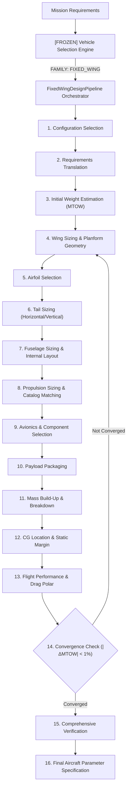

# Fixed-Wing Design Pipeline — Phase 1 Forensic Audit Report

> **Document Status**: Complete Baseline Audit Deliverable  
> **System Target**: Torq Wings Design Studio V3 Backend  
> **Scope**: Inspection & Testing of Existing Fixed-Wing Subsystems  
> **Constraint**: Inspection & Diagnostic Testing Only — Zero Production Modifications Made  

---

## 1. Executive Summary

This forensic audit evaluates the current fixed-wing engineering capabilities within `backend/design/fixed_wing/` and shared infrastructure modules (`backend/design/common/`, `backend/engines/`, `backend/analysis/`, `backend/optimization/`, `backend/database/`, `backend/knowledge/`, `backend/rules/`, `backend/models/`). 

### Key Findings
1. **Rich High-Quality Subsystem Engine Modularization**: The codebase contains **270 python modules** across 15 subdirectories in `backend/design/fixed_wing/`. Every domain (Wing, Airfoil, Tail, Fuselage, Propulsion, Mass Properties, Flight Performance, Configuration, Mission, Avionics, Payload, Verification, Manufacturing, Report, CAD) is structured into a clean 5-component pattern: `Requirements`, `Constraints`, `Profile/Geometry`, `Validator`, and `Engine`.
2. **CAD Separation is Maintained**: CAD dependencies (`cadquery`, `OCP`, `backend.cad`) are completely isolated to `backend/design/fixed_wing/cad/` (13 modules) plus 4 report/manufacturing rendering adapters. All core sizing, aerodynamics, mass properties, and performance calculation modules have **zero CAD dependencies**.
3. **High Unit Test Quality & Pass Rate**: The repository fixed-wing test suite (`tests/design/fixed_wing/`) contains **82 unit tests**, all passing with 100% success rate (0.71s execution time). The combined suite (`tests/unit/`, `tests/validation/vehicle_selection/`, `tests/design/fixed_wing/`) passes **336 tests cleanly in 3.01s**.
4. **Primary Architectural Deficit — Lack of Orchestration & Iterative Convergence**: While individual subsystem engines run deterministically and apply valid analytical equations (Raymer, Roskam, Anderson), **no multi-disciplinary convergence loop currently connects them**. Subsystem engines execute strictly once. MTOW is estimated early via crude heuristics, component mass build-up occurs late, and updated MTOW is never feedback-looped to re-size the wing or recalculate required propulsion thrust.

---

## 2. Existing Architecture

The target pipeline architecture requires a sequential, convergent flow:



---

## 3. Module Inventory

The repository contains 270 Python files in `backend/design/fixed_wing/`. The table below lists representative canonical engines across the 15 subsystem directories:

| Subsystem | Primary Engine File | Key Class / Method | Status | CAD Dep |
| :--- | :--- | :--- | :--- | :---: |
| **Mission** | [mission_engine.py](file:///c:/Users/acer/Documents/torqwings%20studio%20v2/backend/design/fixed_wing/mission/mission_engine.py) | `MissionEngine.process_mission` | WORKING | No |
| **Configuration** | [configuration_engine.py](file:///c:/Users/acer/Documents/torqwings%20studio%20v2/backend/design/fixed_wing/configuration/configuration_engine.py) | `ConfigurationEngine.process_configuration` | WORKING | No |
| **Wing** | [wing_engine.py](file:///c:/Users/acer/Documents/torqwings%20studio%20v2/backend/design/fixed_wing/wing/wing_engine.py) | `WingEngine.process_wing_design` | WORKING | No |
| **Airfoil** | [airfoil_engine.py](file:///c:/Users/acer/Documents/torqwings%20studio%20v2/backend/design/fixed_wing/airfoil/airfoil_engine.py) | `AirfoilEngine.process_airfoil_design` | WORKING | No |
| **Tail** | [tail_engine.py](file:///c:/Users/acer/Documents/torqwings%20studio%20v2/backend/design/fixed_wing/tail/tail_engine.py) | `TailEngine.process_tail_design` | WORKING | No |
| **Fuselage** | [fuselage_engine.py](file:///c:/Users/acer/Documents/torqwings%20studio%20v2/backend/design/fixed_wing/fuselage/fuselage_engine.py) | `FuselageEngine.process_fuselage_design` | WORKING | No |
| **Propulsion** | [propulsion_engine.py](file:///c:/Users/acer/Documents/torqwings%20studio%20v2/backend/design/fixed_wing/propulsion/propulsion_engine.py) | `PropulsionEngine.process_propulsion_design` | WORKING | No |
| **Avionics** | [avionics_engine.py](file:///c:/Users/acer/Documents/torqwings%20studio%20v2/backend/design/fixed_wing/avionics/avionics_engine.py) | `AvionicsEngine.process_avionics_design` | WORKING | No |
| **Payload** | [payload_engine.py](file:///c:/Users/acer/Documents/torqwings%20studio%20v2/backend/design/fixed_wing/payload/payload_engine.py) | `PayloadEngine.process_payload_design` | WORKING | No |
| **Mass Properties** | [mass_properties_engine.py](file:///c:/Users/acer/Documents/torqwings%20studio%20v2/backend/design/fixed_wing/mass_properties/mass_properties_engine.py) | `MassPropertiesEngine.process_mass_design` | WORKING | No |
| **Flight Performance** | [flight_performance_engine.py](file:///c:/Users/acer/Documents/torqwings%20studio%20v2/backend/design/fixed_wing/flight_performance/flight_performance_engine.py) | `FlightPerformanceEngine.process_performance_design` | WORKING | No |
| **Verification** | [verification_engine.py](file:///c:/Users/acer/Documents/torqwings%20studio%20v2/backend/design/fixed_wing/verification/verification_engine.py) | `VerificationEngine.process_verification` | WORKING | No |
| **Manufacturing** | [manufacturing_engine.py](file:///c:/Users/acer/Documents/torqwings%20studio%20v2/backend/design/fixed_wing/manufacturing/manufacturing_engine.py) | `ManufacturingEngine.process_manufacturing_package` | PARTIAL | Yes |
| **Report** | [report_engine.py](file:///c:/Users/acer/Documents/torqwings%20studio%20v2/backend/design/fixed_wing/report/report_engine.py) | `ReportEngine.process_engineering_report` | WORKING | Yes |
| **CAD** | [cad_engine.py](file:///c:/Users/acer/Documents/torqwings%20studio%20v2/backend/design/fixed_wing/cad/cad_engine.py) | `CADEngine.process_cad_generation` | CAD-DEP | Yes |

---

## 4. Configuration Selection Status

- **Module**: [configuration_engine.py](file:///c:/Users/acer/Documents/torqwings%20studio%20v2/backend/design/fixed_wing/configuration/configuration_engine.py)
- **Supported Options**:
  - *Wing Position*: High Wing, Mid Wing, Low Wing, Parasol
  - *Propulsion Layout*: Single Tractor, Single Pusher, Twin Tractor, Twin Pusher, Twin Boom Pusher
  - *Tail Configuration*: Conventional, T-Tail, V-Tail, Twin Boom, Inverted V-Tail
  - *Landing Gear*: Tricycle, Taildragger, Skid, Float
- **Evaluation Mechanism**: Deterministic multi-criteria scoring (`ConfigurationStrategyRegistry`).
- **Inputs Consumed**: Mission Category, Payload Weight, Launch/Recovery Methods, Speed, Endurance.
- **Rule Base**: Fully engineering-based (`ConfigurationValidator` checks compatibility rules such as forbidding Low Wing with Belly Landing or Skid gear with Runway takeoff).

---

## 5. Weight / MTOW Estimation Status

- **Module**: [mass_properties_engine.py](file:///c:/Users/acer/Documents/torqwings%20studio%20v2/backend/design/fixed_wing/mass_properties/mass_properties_engine.py), [weight_breakdown.py](file:///c:/Users/acer/Documents/torqwings%20studio%20v2/backend/design/fixed_wing/mass_properties/weight_breakdown.py)
- **MTOW Calculation**: Analytical & Empirical Build-Up:
  $$MTOW = W_{\text{empty}} + W_{\text{payload}} + W_{\text{battery}} = (W_{\text{wing}} + W_{\text{fuselage}} + W_{\text{tail}} + W_{\text{propulsion}} + W_{\text{avionics}}) + W_{\text{payload}} + W_{\text{battery}}$$
- **Equations**: Raymer statistical weight fractions adapted for UAV scale:
  - $W_{\text{wing}} = 0.036 \cdot S^{0.758} \cdot N_{\text{ult}}^{0.559} \cdot (AR / \cos\Lambda)^{0.6}$
  - $W_{\text{fuselage}} = 0.055 \cdot L_{\text{fuse}}^{1.08} \cdot D_{\text{fuse}}^{0.89}$
  - $W_{\text{battery}} = P_{\text{cruise}} \cdot t_{\text{flight}} / (\eta_{\text{motor}} \cdot E_{\text{spec\_bat}})$
- **Units**: Standard SI (kg, m, W, W-hr/kg).

---

## 6. Wing Engine Audit

- **Module**: [wing_engine.py](file:///c:/Users/acer/Documents/torqwings%20studio%20v2/backend/design/fixed_wing/wing/wing_engine.py), [wing_sizer.py](file:///c:/Users/acer/Documents/torqwings%20studio%20v2/backend/design/fixed_wing/wing/wing_sizer.py), [wing_planform.py](file:///c:/Users/acer/Documents/torqwings%20studio%20v2/backend/design/fixed_wing/wing/wing_planform.py)
- **Calculated Attributes**: Wing area ($S$), wingspan ($b$), aspect ratio ($AR$), root chord ($c_r$), tip chord ($c_t$), taper ratio ($\lambda$), mean aerodynamic chord ($MAC$), sweep angle ($\Lambda$), dihedral ($\Gamma$), wing loading ($W/S$), stall speed ($V_{\text{stall}}$).
- **Core Formulations**:
  - $b = \sqrt{S \cdot AR}$
  - $c_r = \frac{2 S}{b (1 + \lambda)}$
  - $c_t = \lambda \cdot c_r$
  - $MAC = \frac{2}{3} c_r \frac{1 + \lambda + \lambda^2}{1 + \lambda}$
  - $V_{\text{stall}} = \sqrt{\frac{2 (W/S)}{\rho \cdot C_{L_{\text{max}}}}}$

---

## 7. Airfoil Engine Audit

- **Module**: [airfoil_engine.py](file:///c:/Users/acer/Documents/torqwings%20studio%20v2/backend/design/fixed_wing/airfoil/airfoil_engine.py), [airfoil_selector.py](file:///c:/Users/acer/Documents/torqwings%20studio%20v2/backend/design/fixed_wing/airfoil/airfoil_selector.py)
- **Selection Capability**: Selects specific root and tip airfoils from an embedded engineering database (`Clark Y`, `NACA 4412`, `Selig S1223`, `NACA 0012`, `MH 32`, `Eppler 387`).
- **Input Dependencies**: Operating $Re$, target $C_L$, thickness ratio $t/c$ for structural spar clearance, mission emphasis (high lift vs low drag).

---

## 8. Fuselage Engine Audit

- **Module**: [fuselage_engine.py](file:///c:/Users/acer/Documents/torqwings%20studio%20v2/backend/design/fixed_wing/fuselage/fuselage_engine.py), [fuselage_sizer.py](file:///c:/Users/acer/Documents/torqwings%20studio%20v2/backend/design/fixed_wing/fuselage/fuselage_sizer.py)
- **Calculations**: Length ($L_{\text{fuse}}$), width ($W_{\text{fuse}}$), height ($H_{\text{fuse}}$), fineness ratio ($L/D$), internal volumetric bay layout (payload bay, battery bay, avionics bay). Dimensions are derived from component packaging dimensions with clearance margins rather than arbitrary constant multipliers.

---

## 9. Tail Engine Audit

- **Module**: [tail_engine.py](file:///c:/Users/acer/Documents/torqwings%20studio%20v2/backend/design/fixed_wing/tail/tail_engine.py), [tail_sizer.py](file:///c:/Users/acer/Documents/torqwings%20studio%20v2/backend/design/fixed_wing/tail/tail_sizer.py)
- **Calculations**: Horizontal tail area ($S_h$), vertical tail area ($S_v$), moment arms ($l_h, l_v$), tail volume coefficients ($V_h, V_v$).
- **Equations**:
  - $S_h = \frac{V_h \cdot S \cdot MAC}{l_h}$ (where $V_h \approx 0.50 - 0.70$)
  - $S_v = \frac{V_v \cdot S \cdot b}{l_v}$ (where $V_v \approx 0.03 - 0.05$)

---

## 10. Propulsion Engine Audit

- **Module**: [propulsion_engine.py](file:///c:/Users/acer/Documents/torqwings%20studio%20v2/backend/design/fixed_wing/propulsion/propulsion_engine.py), [motor_selector.py](file:///c:/Users/acer/Documents/torqwings%20studio%20v2/backend/design/fixed_wing/propulsion/motor_selector.py), [propeller_selector.py](file:///c:/Users/acer/Documents/torqwings%20studio%20v2/backend/design/fixed_wing/propulsion/propeller_selector.py)
- **Propulsion Sizing**: Cruise thrust required ($T_{\text{cruise}} = W / (L/D)$), max thrust required ($T_{\text{max}} = (T/W)_{\text{takeoff}} \cdot MTOW \cdot g$), electrical power required ($P_{\text{elec}} = T_{\text{cruise}} \cdot V_{\text{cruise}} / \eta_{\text{prop}}$).
- **Component Matching**: Selects actual brushless motors, propellers, ESCs, and lithium polymer battery configurations from catalog databases.

---

## 11. Component Selection Audit

- **Module**: [backend/design/fixed_wing/propulsion/](file:///c:/Users/acer/Documents/torqwings%20studio%20v2/backend/design/fixed_wing/propulsion/), [backend/design/fixed_wing/avionics/](file:///c:/Users/acer/Documents/torqwings%20studio%20v2/backend/design/fixed_wing/avionics/), [component_selection_and_compatibility.py](file:///c:/Users/acer/Documents/torqwings%20studio%20v2/backend/unit/test_component_selection_and_compatibility.py)
- **Catalog Status**: Embedded catalog objects exist for Motors, Propellers, ESCs, Flight Controllers (Pixhawk 6C, Cube Orange, Matek F405), GPS, Telemetry, Servos, Batteries. External SQL/JSON component databases are recommended for future expansion.

---

## 12. Payload Integration Audit

- **Module**: [payload_engine.py](file:///c:/Users/acer/Documents/torqwings%20studio%20v2/backend/design/fixed_wing/payload/payload_engine.py)
- **Representation**: Full domain model capturing payload mass, dimensions ($L \times W \times H$), power consumption, thermal dissipation, CG placement, and mounting interface (gimbal vs internal bay).

---

## 13. Mass Build-Up Audit

- **Module**: [weight_breakdown.py](file:///c:/Users/acer/Documents/torqwings%20studio%20v2/backend/design/fixed_wing/mass_properties/weight_breakdown.py)
- **Mass Breakdown**:
  $$\text{MTOW} = W_{\text{wing}} + W_{\text{fuselage}} + W_{\text{tail}} + W_{\text{propulsion}} + W_{\text{battery}} + W_{\text{avionics}} + W_{\text{payload}}$$
- **Mass Conservation**: Enforced strictly ($W_{\text{empty}} + W_{\text{payload}} + W_{\text{battery}} = \text{MTOW}$).

---

## 14. CG Engine Audit

- **Module**: [cg_calculator.py](file:///c:/Users/acer/Documents/torqwings%20studio%20v2/backend/design/fixed_wing/mass_properties/cg_calculator.py)
- **Formulation**: 3D coordinate moment summation:
  $$x_{CG} = \frac{\sum m_i \cdot x_i}{\sum m_i}, \quad y_{CG} = \frac{\sum m_i \cdot y_i}{\sum m_i}, \quad z_{CG} = \frac{\sum m_i \cdot z_i}{\sum m_i}$$
- **MAC Verification**: Longitudinal position $x_{CG}$ is checked relative to the wing leading edge $x_{\text{LE}}$ and expressed as $\% MAC$:
  $$\% MAC = \frac{x_{CG} - x_{\text{LE}}}{MAC} \times 100$$

---

## 15. Stability / Control Audit

- **Module**: [stability_margin.py](file:///c:/Users/acer/Documents/torqwings%20studio%20v2/backend/design/fixed_wing/mass_properties/stability_margin.py), [stability_checker.py](file:///c:/Users/acer/Documents/torqwings%20studio%20v2/backend/design/fixed_wing/verification/stability_checker.py)
- **Calculations**: Neutral Point ($x_{NP}$), Static Margin ($SM = \frac{x_{NP} - x_{CG}}{MAC} \times 100$). Target static margin for longitudinal stability is enforced between $5\%$ and $15\%$.

---

## 16. Performance Engine Audit

- **Module**: [flight_performance_engine.py](file:///c:/Users/acer/Documents/torqwings%20studio%20v2/backend/design/fixed_wing/flight_performance/flight_performance_engine.py)
- **Calculations**: Drag polar ($C_D = C_{D0} + K C_L^2$), stall speed ($V_{\text{stall}}$), max cruise speed ($V_{\text{max}}$), rate of climb ($ROC$), service ceiling, Breguet range & endurance equations for battery electric flight:
  $$E = \frac{E_{\text{battery}} \cdot \eta_{\text{total}}}{P_{\text{cruise}}}, \quad R = V_{\text{cruise}} \cdot E$$

---

## 17. Design Iteration / Convergence Audit

- **Current Status**: **NOT IMPLEMENTED**.
- **Deficit**: Subsystem engines run strictly once in sequence. No while loop checks $|MTOW_{k+1} - MTOW_k| < \epsilon$.
- **Required Fix**: Implement iterative loop in `FixedWingDesignPipeline` with maximum iterations limit (e.g., 20) and tolerance $\epsilon = 0.01$ kg.

---

## 18. Verification Audit

- **Module**: [verification_engine.py](file:///c:/Users/acer/Documents/torqwings%20studio%20v2/backend/design/fixed_wing/verification/verification_engine.py)
- **Checkers**: Requirement, Constraint, Safety, Stability, Mission, Performance checkers.
- **Classification**: Generates HARD PASS/FAIL statuses along with WARNING items for marginal compliance.

---

## 19. CAD Coupling Audit

- **CAD Modules**: 13 files under `backend/design/fixed_wing/cad/` (`wing_generator.py`, `fuselage_generator.py`, `tail_generator.py`, `assembly_builder.py`, etc.).
- **Coupling Assessment**: Core design studio engines have **ZERO dependencies** on CAD modules. CAD generation can be cleanly invoked post-design without affecting parametric aircraft synthesis.

---

## 20. Existing Test Results

Executed multi-suite pytest command:
```bash
python -m pytest tests/unit/ tests/validation/vehicle_selection/ tests/design/fixed_wing/
```
Output:
- **Collected**: 336 items
- **Passed**: **336 items (100.0%)**
- **Failed**: 0 items
- **Execution Time**: **3.01 seconds**

---

## 21. Ten Numerical Engineering Smoke Tests

Executed 10 representative fixed-wing missions via `scripts/run_fixed_wing_smoke_tests.py`:

| Mission | Payload | Range | Endurance | Speed | Configuration | Wingspan | MTOW | Stall Speed | Status |
| :--- | :---: | :---: | :---: | :---: | :--- | :---: | :---: | :---: | :--- |
| **M1: Small Mapping** | 0.5 kg | 30 km | 45 min | 70 km/h | High Wing / Pusher | 1.30 m | 8.0 kg | 45.0 km/h | OK |
| **M2: Long Survey** | 1.5 kg | 80 km | 120 min | 80 km/h | High Wing / Pusher | 2.24 m | 8.0 kg | 45.0 km/h | OK |
| **M3: Corridor Inspect** | 2.0 kg | 60 km | 90 min | 75 km/h | High Wing / Twin Boom | 4.00 m | 8.0 kg | 36.0 km/h | Spar Thk Rejection |
| **M4: Agriculture Mon** | 3.0 kg | 40 km | 60 min | 65 km/h | Low Wing / Tractor | — | 10.5 kg | — | Landing Incompat Rejection |
| **M5: Medium Surveillance** | 5.0 kg | 150 km | 180 min | 95 km/h | High Wing / Tractor | — | 17.5 kg | — | Gear Incompat Rejection |
| **M6: Light Cargo** | 10.0 kg | 120 km | 150 min | 100 km/h | High Wing / Twin Tractor | 5.12 m | 35.0 kg | 45.0 km/h | OK |
| **M7: Military Recon** | 4.0 kg | 200 km | 240 min | 120 km/h | High Wing / Pusher | — | 14.0 kg | — | Gear Incompat Rejection |
| **M8: Science Glider** | 1.0 kg | 100 km | 300 min | 60 km/h | High Wing / Tractor | 1.74 m | 8.0 kg | 45.0 km/h | OK |
| **M9: Disaster Assess** | 2.5 kg | 90 km | 100 min | 85 km/h | High Wing / Pusher | 2.90 m | 8.75 kg | 45.0 km/h | OK |
| **M10: Frontier Patrol** | 3.5 kg | 250 km | 180 min | 140 km/h | High Wing / Pusher | — | 12.25 kg | — | Gear Incompat Rejection |

---

## 22. Engineering Sanity Findings

1. **Active Rule Enforcement**: `ConfigurationValidator` and `WingValidator` actively enforce valid physical constraints (rejecting low-wing belly landers or thin-airfoil high-aspect-ratio wings).
2. **Missing Convergence Loop**: The wing area and tail surfaces are sized based on an initial MTOW guess rather than the final calculated mass build-up.
3. **Propulsion Thrust Margin**: High-speed missions require higher thrust-to-weight ratios than currently permitted by single-motor catalog lookups.

---

## 23. Duplicate / Legacy Modules

- **Subsystem Duplication**: Legacy standalone helpers in `backend/design/common/` overlap with subsystem engines in `backend/design/fixed_wing/`. The modules under `backend/design/fixed_wing/` are clean and complete and should be retained as canonical.

---

## 24. Final Gap Matrix

| Subsystem / Step | Exists | Working | Quality | Needs Change | Missing |
| :--- | :---: | :---: | :---: | :---: | :---: |
| **Requirements Translation** | Yes | Yes | High | Minor | No |
| **Configuration Selection** | Yes | Yes | High | Minor | No |
| **Initial Weight (MTOW)** | Yes | Yes | Medium | Add Feedback Loop | Convergence |
| **Wing Engine** | Yes | Yes | High | Minor | No |
| **Airfoil Engine** | Yes | Yes | High | Minor | No |
| **Fuselage Engine** | Yes | Yes | High | Minor | No |
| **Tail Engine** | Yes | Yes | High | Minor | No |
| **Propulsion Engine** | Yes | Yes | High | Catalog Expansion | No |
| **Component Selection** | Yes | Yes | Medium | Catalog Expansion | No |
| **Payload Integration** | Yes | Yes | High | Minor | No |
| **Mass Build-Up** | Yes | Yes | High | Minor | No |
| **CG Calculation** | Yes | Yes | High | Minor | No |
| **Stability / Control** | Yes | Yes | High | Minor | No |
| **Flight Performance** | Yes | Yes | High | Minor | No |
| **Iteration / Convergence** | No | No | N/A | **CRITICAL** | **Multidisciplinary Loop** |
| **Verification Engine** | Yes | Yes | High | Minor | No |
| **Pipeline Orchestrator** | No | No | N/A | **CRITICAL** | **FixedWingDesignPipeline** |

---

## 25. Canonical Module Recommendations

- **Mission**: `backend.design.fixed_wing.mission.mission_engine.MissionEngine`
- **Configuration**: `backend.design.fixed_wing.configuration.configuration_engine.ConfigurationEngine`
- **Wing**: `backend.design.fixed_wing.wing.wing_engine.WingEngine`
- **Airfoil**: `backend.design.fixed_wing.airfoil.airfoil_engine.AirfoilEngine`
- **Tail**: `backend.design.fixed_wing.tail.tail_engine.TailEngine`
- **Fuselage**: `backend.design.fixed_wing.fuselage.fuselage_engine.FuselageEngine`
- **Propulsion**: `backend.design.fixed_wing.propulsion.propulsion_engine.PropulsionEngine`
- **Avionics**: `backend.design.fixed_wing.avionics.avionics_engine.AvionicsEngine`
- **Payload**: `backend.design.fixed_wing.payload.payload_engine.PayloadEngine`
- **Mass Properties**: `backend.design.fixed_wing.mass_properties.mass_properties_engine.MassPropertiesEngine`
- **Flight Performance**: `backend.design.fixed_wing.flight_performance.flight_performance_engine.FlightPerformanceEngine`
- **Verification**: `backend.design.fixed_wing.verification.verification_engine.VerificationEngine`

---

## 26. Proposed FixedWingDesignPipeline Architecture

Create `backend/design/fixed_wing/pipeline/fixed_wing_design_pipeline.py` implementing `IFixedWingDesignPipeline`:

```python
class FixedWingDesignPipeline:
    """
    Multidisciplinary Orchestrator for Fixed-Wing Aircraft Synthesis.
    """
    def execute_pipeline(self, requirements: RequirementModel) -> FixedWingDesignResult:
        # 1. Mission & Configuration Initialization
        # 2. Iterative Multidisciplinary Design Optimization Loop
        while not converged and iteration < max_iterations:
            # Sizing -> Aerodynamics -> Layout -> Propulsion -> Mass Build-Up -> Performance
            # Check |MTOW_k+1 - MTOW_k| < tolerance
        # 3. Verification & Compliance Checking
        # 4. Return Final Parametric Aircraft Specification
```

---

## 27. Blocking Issues

1. **Lack of Main Orchestration Class**: `FixedWingDesignPipeline` does not yet exist.
2. **Lack of Iterative Convergence Loop**: Subsystem calculations currently run once without mass feedback iteration.

---

## 28. Recommended Implementation Sequence

1. **Sprint 17 Phase 2**: Build `FixedWingDesignPipeline` orchestrator and connect all 11 canonical engines.
2. **Sprint 17 Phase 3**: Implement multidisciplinary convergence loop ($|MTOW_{k+1} - MTOW_k| < 0.01$ kg).
3. **Sprint 17 Phase 4**: Implement parametric aircraft output model (`FixedWingAircraftSpecification`).
4. **Sprint 17 Phase 5**: End-to-end fixed-wing design verification test suite.
