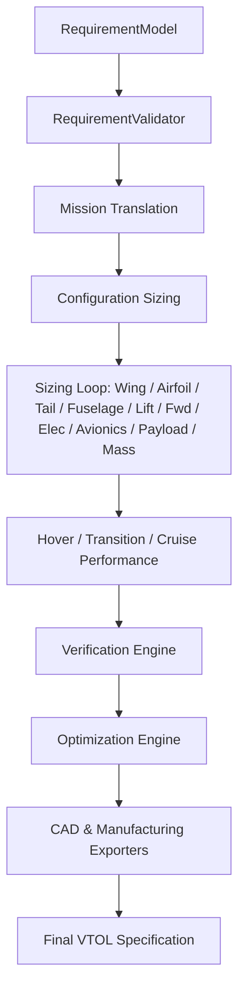

# Torq Wings VTOL Architecture & Engineering Handbook
## Version: 4.0.0
## Release Candidate: August 2026

---

## PART I — INTRODUCTION

### CHAPTER 1: What Is the Torq Wings VTOL Design System?
The Torq Wings VTOL (Vertical Takeoff and Landing) design system is an automated, multi-disciplinary sizing and optimization platform. It bridges the vertical lift performance of multirotors with the high-speed cruise efficiency of fixed-wing aircraft.

VTOL design is highly coupled and complex because the aircraft operates across three distinct regimes:
1. **Hover**: Vertical thrust supports the weight entirely using rotor systems.
2. **Transition**: Dynamics shift dynamically as wing-borne lift builds and rotor thrust decreases.
3. **Cruise**: The wing supports the weight entirely, powered by forward cruise thrusters.

The system determines component matches, sizes structural geometry, optimizes mass balances, simulates transition schedules, and certifies safety margins.

---

### CHAPTER 2: VTOL Aircraft for Beginners
For a beginner, the aircraft design variables are:
- **Hover Lift**: Upward force produced by the vertical rotors to lift the MTOW.
- **Wing Lift**: Lift generated by wing surfaces when moving forward.
- **Drag**: Air resistance opposing forward motion.
- **Vertical Propulsion**: Sized motor-propeller layout providing lift.
- **Forward Propulsion**: Tractor or pusher motor-propeller layout providing cruise thrust.
- **Battery & Energy**: Dual-demand battery supplying peak hover current and high capacity for cruise endurance.

The software automates the sizing of these disciplines and integrates them into one unified vehicle configuration.

---

### CHAPTER 3: Why VTOL Design is a Coupled Problem
VTOL sizing is uniquely coupled because of weight-feedback iterations:

```
               Takeoff Mass (MTOW)
                        │
                        ▼
               Hover Power Demand
                        │
                        ▼
               VTOL Rotor Mass
                        │
                        ▼
             Sized Battery Weight
                        │
                        ▼
              Wing Reference Area
                        │
                        ▼
             Cruise Drag & Propulsion
                        │
                        ▼
               Battery Mass Update
```

Changes in structural wing area or battery capacity feed back to increase MTOW, which recursively raises the required hover thrust and motor sizes.

---

## PART II — COMMON REQUIREMENTS

### CHAPTER 4: Requirement Model
The entry interface utilizes the common `RequirementModel` class:

| Parameter | Type | Required | Meaning | Downstream Effect |
|---|---|---|---|---|
| `payload_weight_kg` | `float` | Yes | Mass of payload camera or sensor. | Sizers require coordinate spacing to package. |
| `target_flight_time_min` | `float` | Yes | Total target endurance. | Direct parameter for battery sizing. |
| `target_range_km` | `float` | Yes | Target cruise range. | Sizes wing aerodynamic aspect ratio. |
| `cruise_speed_kmh` | `float` | Yes | Target flight speed. | Sets dynamic pressure bounds for lift. |
| `environment` | `OperatingEnvironment` | Yes | Rural, Urban, Mountain, etc. | Maps default strategy priority factors. |

---

### CHAPTER 5: VTOL Mission Strategy
The mission analyzer classifies inputs into VTOL-specific strategies (e.g., Lift+Cruise, Tilt-Rotor) and builds requirements including hover duration limits and transition speed margins.

---

## PART III — VTOL PIPELINE ORCHESTRATION

### CHAPTER 6: VTOL Pipeline Entry Point
The entry point class is `VTOLDesignPipeline` in [vtol_design_pipeline.py](file:///c:/Users/acer/Documents/torqwings%20studio%20v2/backend/design/vtol/pipeline/vtol_design_pipeline.py).
The entry method is `execute(requirements)`.



---

### CHAPTER 7: VTOL Pipeline Context & Results
The context `VTOLPipelineContext` stores intermediate results. The pipeline consolidates sizer outputs into `VTOLAircraftSpecification`, capturing details of all engines.

---

### CHAPTER 8: VTOL Stage Order

| Stage | Module Path | Inputs | Calculations | Outputs |
|---|---|---|---|---|
| **Mission** | `mission/mission_engine.py` | `RequirementModel` | Evaluates targets | `MissionResult` |
| **Configuration** | `configuration/configuration_engine.py` | `MissionResult` | Selects VTOL type | `ConfigurationResult` |
| **Wing Sizer** | `wing/wing_engine.py` | `WingRequirements` | Sizes area & span | `WingResult` |
| **Airfoil** | `airfoil/airfoil_engine.py` | `AirfoilRequirements` | Matches polar maps | `AirfoilResult` |
| **Tail Sizer** | `tail/tail_engine.py` | `TailRequirements` | Volume coefficients | `TailResult` |
| **Fuselage** | `fuselage/fuselage_engine.py` | `FuselageRequirements` | Enclosures volume | `FuselageResult` |
| **Lift System** | `lift_system/lift_system_engine.py` | `LiftSystemRequirements` | Sizes lift rotors | `LiftSystemResult` |
| **Forward Prop** | `forward_propulsion/forward_propulsion_engine.py` | `ForwardPropulsionRequirements` | Sizes cruise motors | `ForwardPropulsionResult` |
| **Electrical** | `electrical/electrical_engine.py` | `ElectricalRequirements` | Sizes wiring | `ElectricalResult` |
| **Avionics** | `avionics/avionics_engine.py` | `AvionicsRequirements` | Selects FC / GPS | `AvionicsResult` |
| **Payload** | `payload/payload_engine.py` | `PayloadRequirements` | Internal layouts | `PayloadResult` |
| **Mass Properties**| `mass_properties/mass_properties_engine.py`| `MassRequirements` | AUW and cg | `MassPropertiesResult` |
| **Hover Perf** | `hover_performance/hover_engine.py` | `HPRequirements` | Hover thrust checks | `HoverPerformanceResult` |
| **Transition** | `transition/transition_engine.py` | `TransRequirements` | Blended power schedule | `TransitionResult` |
| **Cruise Perf** | `cruise_performance/cruise_engine.py` | `CruiseReqs` | Aerodynamic ranges | `CruisePerformanceResult` |
| **Verification** | `verification/verification_engine.py` | `VerificationRequirements` | Verifies limits | `VerificationResult` |
| **Optimization** | `optimization/optimization_engine.py` | `OptimizationRequirements` | Multi-objective checks | `OptimizationResult` |
| **CAD** | `cad/cad_engine.py` | `CADRequirements` | Assemblies lofts | `CADResult` |

---

## PART IV — VTOL CONFIGURATION

### CHAPTER 9: VTOL Configuration Engine
The supported VTOL configurations are:
1. **Lift + Cruise**: Dedicated vertical lift rotors on booms, and a separate cruise propeller.
2. **Quadplane**: Standard fixed-wing airframe with 4 hover motors arranged on wing under booms.
3. **Tilt-Rotor**: Rotors rotate between vertical (hover) and horizontal (cruise) positions.
4. **Tilt-Wing**: The entire wing tilts to provide vertical lift.

---

### CHAPTER 10: Configuration Selection
The configuration is selected based on target flight speed and range. For high-speed survey missions, Tilt-Rotor configurations are preferred to minimize boom drag. Shorter mapping missions fallback to Lift+Cruise configurations for simplicity.

---

## PART V — WING

### CHAPTER 11: VTOL Wing Engine
The Wing Sizer sizes the wing reference area ($S$) based on cruise lift:
$$S = \frac{2 \cdot MTOW \cdot g}{\rho \cdot V_{cruise}^2 \cdot C_{L,cruise}}$$
Aspect ratios are swept between $[8.0, 14.0]$ to optimize aerodynamics.

---

### CHAPTER 12: Airfoil Engine
The Airfoil Engine maps root and tip profiles based on thickness ratios. Airfoils are selected to balance high lift-to-drag ($L/D$) in cruise against low pitching moments ($C_{m0}$) during transition.

---

## PART VI — FUSELAGE AND TAIL

### CHAPTER 13: Fuselage Engine
Sizes structural pod envelopes to pack payload and avionics modules, and calculates boom integration coordinates for mounting lift rotors.

---

### CHAPTER 14: Tail Engine
Sizes stabilizers using pitch/yaw volume coefficients to ensure adequate control authority during transitional phases.

---

## PART VII — PROPULSION

### CHAPTER 15: VTOL Propulsion Architecture
The propulsion system is split into two independent architectures:
- **Vertical-Lift Propulsion**: Sized to support MTOW in hover with a safety factor $\ge 1.30$.
- **Cruise Propulsion**: Sized to balance clean aerodynamic drag at operational speeds.

```
                   Aircraft Takeoff Mass (MTOW)
                   ┌─────────────┴─────────────┐
                   ▼                           ▼
          Hover Thrust Target         Cruise Drag Target
                   │                           │
                   ▼                           ▼
         [Lift Motors & Props]       [Cruise Motor & Prop]
```

---

### CHAPTER 16: Vertical-Lift Propulsion
Required thrust per lift rotor (accounting for coaxial power loss coefficients):
$$T_{rotor} = \frac{MTOW \cdot g \cdot safety\_factor}{Motor\_Count \cdot (1 - 0.5 \cdot Coaxial\_Loss)}$$

---

### CHAPTER 17: Cruise Propulsion
Tractor/pusher motor selects the propeller diameter that matches cruise efficiency targets:
$$Thrust_{cruise} = Drag_{cruise} = \frac{1}{2} \cdot \rho \cdot V_{cruise}^2 \cdot S \cdot C_d$$

---

## PART VIII — ELECTRICAL SYSTEM

### CHAPTER 18: VTOL Electrical Architecture
`ElectricalEngine` sizes dual power paths supplying both lift ESCs (high peak current) and cruise ESCs, sizing cabling gauges (e.g. AWG 12 for main battery connections).

---

## PART IX — MASS AND CG

### CHAPTER 19: VTOL Mass Model
Weight buildup accumulates structural and propulsion categories:
$$MTOW = W_{wing} + W_{fuse} + W_{tail} + W_{lift\_prop} + W_{cruise\_prop} + W_{battery} + W_{payload}$$

---

### CHAPTER 20: VTOL Center of Gravity
CG is calculated in 3D relative to the nose. Longitudinal CG ($X_{cg}$) must align with the aerodynamic center ($X_{ac}$):
$$X_{cg} = \frac{\sum W_i \cdot X_i}{MTOW}$$
Hover stability requires that the vertical thrust vector center aligns exactly with the CG to prevent pitching moments.

---

## PART X — HOVER PERFORMANCE

### CHAPTER 21: Hover Performance Engine
Calculates motor power requirements in hover:
$$P_{hover\_rotor} = \sqrt{\frac{T_{rotor}^3}{2 \cdot \rho \cdot A_{disk}}} \cdot \frac{1}{\eta_{propeller}}$$
Total hover power is:
$$P_{hover} = Motor\_Count \cdot P_{hover\_rotor} + P_{avionics}$$

---

## PART XI — CRUISE PERFORMANCE

### CHAPTER 22: Cruise Performance Engine
Estimates cruise range and flight duration:
$$Endurance_{cruise} = \frac{Capacity_{battery\_usable} \cdot Voltage}{P_{cruise} + P_{avionics}} \cdot 60.0$$

---

## PART XII — TRANSITION

### CHAPTER 23: VTOL Transition Engine
Transition schedules are computed using airspeed-based throttle transfers:
- **Hover Phase**: Lift throttle 100%, Forward throttle 0%.
- **Blended Phase**: Lift throttle transitions $100\% \to 0\%$, Forward throttle transitions $0\% \to 100\%$ as airspeed builds from 0 to stall speed.
- **Wing-Borne Phase**: Lift rotors shutdown, forward motor provides 100% propulsion.

---

## PART XIII — ENERGY AND BATTERY

### CHAPTER 24: Battery Selection
Battery capacities are sized to support the sum of hover, transition, and cruise energy budgets:
$$E_{total} = E_{hover} + E_{transition} + E_{cruise} + E_{reserve}$$

---

## PART XIV — OPTIMIZATION

### CHAPTER 25: VTOL Optimization Engine
An optimization sweep evaluates design candidates to maximize flight time while ensuring propeller tip clearances are above $50$ mm.

---

### CHAPTER 26: Sizing Convergence Loop
The convergence loop uses a relaxation damping factor ($0.25$ / $0.75$) to converge MTOW:
$$MTOW_{relaxed} = 0.75 \cdot MTOW_{new} + 0.25 \cdot MTOW_{old}$$

---

## PART XV — VERIFICATION

### CHAPTER 27: VTOL Verification Gate
Evaluates compliance boundaries at the pipeline's end:
- Hover thrust-to-weight margin $\ge 1.30$.
- Battery discharge current $\le$ C-rating limits.
- Static margin $[5\%, 25\%]$.

---

### CHAPTER 88: Final VTOL Specification
Sizing compiles all specifications into `VTOLAircraftSpecification`, including detailed performance, hover, and cruise metrics.

---

## PART XVI — CAD

### CHAPTER 29: VTOL Engineering to CAD Exporter
`VTOLCADEngine` generates assembly nodes and lofts parts. The output exporter writes STEP, STL, and IGES file packages to `exports/vtol_cad/`.

---

## PART XVII — FAILURE ARCHITECTURE

Exceptions propagate through standard classes:
- `AirfoilValidationError` $\to$ status `AIRFOIL_STRUCTURE_INCOMPATIBLE`
- `LiftSystemValidationError` $\to$ status `PROPULSION_INFEASIBLE`
- `ElectricalValidationError` $\to$ status `BATTERY_INFEASIBLE`

---

## PART XVIII — TESTING & VALIDATION

### CHAPTER 30: Unit & Integration Tests
Pytest unit tests are located in `tests/design/vtol/pipeline/test_vtol_pipeline.py`. They check the end-to-end routing, convergence history, and output formats.

---

## PART XIX — VEHICLE SELECTION HANDOFF

The Vehicle Selection Engine determines the aircraft family classifier (`VTOL`). The VTOL design pipeline then sizes the aircraft.

---

## PART XX — COMPLETE END-TO-END EXAMPLE

### CHAPTER 31: One Mission From User Input to Final VTOL
Walkthrough of a mapping mission requiring $3.5$ kg payload. The pipeline executes `execute(req)`, matches a Lift+Cruise configuration, sizes a $2.8$m wing, selects Hobbywing lift motors, sizes a 12S LiPo battery, simulates transition, and writes reports to `reports/`.

---

## PART XXI — DEBUGGING

If sizers fail, inspect:
- `lift_system_engine.py` if hover thrust limits are breached.
- `vtol_design_pipeline.py` convergence logs if MTOW diverges.

---

## SOURCE TRACEABILITY MATRIX

| Element | Source File | Class / Method | Evidence | Chapter |
|---|---|---|---|---|
| Pipeline | [vtol_design_pipeline.py](file:///c:/Users/acer/Documents/torqwings%20studio%20v2/backend/design/vtol/pipeline/vtol_design_pipeline.py) | `VTOLDesignPipeline` | Main entry point orchestrating stages | Chapter 6, 8 |
| Sizing Loop | [vtol_design_pipeline.py](file:///c:/Users/acer/Documents/torqwings%20studio%20v2/backend/design/vtol/pipeline/vtol_design_pipeline.py#L213-L406) | `execute` loop | Iterative wing/lift/fwd sizing | Chapter 6, 26 |
| Lift Sizer | [lift_system_engine.py](file:///c:/Users/acer/Documents/torqwings%20studio%20v2/backend/design/vtol/lift_system/lift_system_engine.py) | `design_lift_system` | Coaxial rotor thrust scaling | Chapter 16 |
| Transition | [transition_strategy.py](file:///c:/Users/acer/Documents/torqwings%20studio%20v2/backend/design/vtol/transition/transition_strategy.py) | `_size_transition` | Hover/wing-borne flight scheduling | Chapter 23 |

---

## FINAL CONCLUSION: How the Complete Torq Wings VTOL System Works in 10 Minutes
The VTOL Design Pipeline takes high-level requirements, selects a lift architecture, and sizes the wing and stabilizers. It matches lift and cruise propulsion setups, estimates transition flight schedules, and converges takeoff weights against battery energy capacities before writing CAD model files.

---
**THIS HANDBOOK REPRESENTS THE CURRENT VTOL IMPLEMENTATION**
