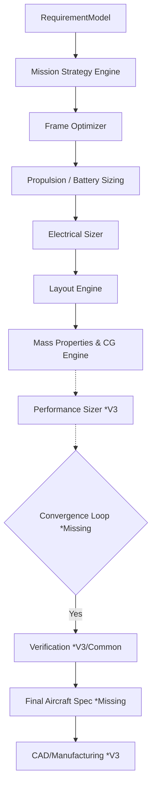
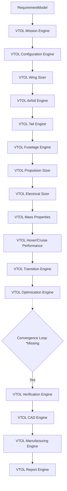

# Torq Wings Architecture Audit: Existing Subsystems Inventory & Gap Analysis

This report presents a technical inventory of the existing engineering subsystems, models, pipelines, and frameworks across the **Multirotor**, **VTOL**, and **Shared** design modules of the Torq Wings Design Studio V4.

---

## 1. Complete Multirotor Module Inventory

The repository contains two distinct multirotor design frameworks:
1.  **V4 Multirotor Optimizer Subpackage (`backend/design/multirotor/`):** The modern optimization-based sizing studio utilizing candidate-based evaluations.
2.  **V3 Drone Service Subpackage (`backend/design/drone/`):** The older sequential service-based sizing framework.

### 1.1 V4 Multirotor Subsystem Details (`backend/design/multirotor/`)

| Subsystem | Directory | Primary Engine / Class | Model / Specs | Constraints | Tests | Status |
|---|---|---|---|---|---|---|
| **Mission Strategy** | `multirotor/mission/` | `MissionStrategyEngine` | `MissionStrategySpecification` | `MissionConstraints` | `tests/design/multirotor/mission/` | **Fully Implemented** |
| **Frame Sizing** | `multirotor/frame/` | `FrameOptimizer` | `FrameSpecification` | `FrameConstraints` | `tests/design/multirotor/frame/` | **Fully Implemented** |
| **Motor Sizing** | `multirotor/motor/` | `MotorOptimizer` | `MotorSpecification` | `MotorConstraints` | `tests/design/multirotor/motor/` | **Fully Implemented** |
| **Propeller Sizing**| `multirotor/propeller/`| `PropellerOptimizer` | `PropellerSpecification` | `PropellerConstraints` | `tests/design/multirotor/propeller/`| **Fully Implemented** |
| **ESC Sizing** | `multirotor/esc/` | `EscOptimizer` | `ESCSpecification` | `EscConstraints` | `tests/design/multirotor/esc/` | **Fully Implemented** |
| **Battery Sizing** | `multirotor/battery/` | `BatteryOptimizer` | `BatterySpecification`, `PropulsionAssembly` | `BatteryConstraints` | `tests/design/multirotor/battery/` | **Fully Implemented** |
| **Electrical** | `multirotor/electrical/`| `ElectricalEngine` | `ElectricalSpecification` | `ElectricalConstraints`| `tests/design/multirotor/electrical/`| **Fully Implemented** |
| **Layout/Packaging**| `multirotor/layout/` | `LayoutEngine` | `LayoutSpecification` | `LayoutConstraints` | `tests/design/multirotor/layout/` | **Fully Implemented** |
| **Mass & CG** | `multirotor/mass_properties/`| `MassPropertiesEngine` | `MassPropertiesSpecification`| `MassConstraints` | `tests/design/multirotor/mass_properties/`| **Fully Implemented** |

### 1.2 Missing V4 Subsystems (Natively under `multirotor/`)
*   **Avionics:** Missing (weight is currently hardcoded as `0.037 kg` in the mass breakdown, but no active selection engine exists).
*   **Performance:** Missing (no active flight performance margin analysis exists).
*   **Verification:** Missing (no verification engine or automated compliance checker exists natively).
*   **CAD:** Missing (no parametric geometry generation code exists natively).
*   **Manufacturing:** Missing (no bill of materials or assembly planning exists natively).
*   **Report:** Missing (no structured report generation exists natively).

*Note: Fully implemented modules for Avionics, CAD, Manufacturing, and Report exist under the V3 `backend/design/drone/` subpackage.*

---

## 2. Complete VTOL Module Inventory (`backend/design/vtol/`)

The VTOL design studio is extremely comprehensive, containing separate service facades for all 20 subsystems. However, they operate in isolation and are not connected to a central pipeline.

| Subsystem | Directory | Primary Engine / Class | Model / Specs | Constraints | Tests | Status |
|---|---|---|---|---|---|---|
| **Mission** | `vtol/mission/` | `MissionEngine` | `MissionResult` | `MissionConstraints` | `tests/design/vtol/mission/` | **Fully Implemented** |
| **Configuration** | `vtol/configuration/` | `ConfigurationEngine` | `ConfigurationResult` | `ConfigurationConstraints`| `tests/design/vtol/configuration/`| **Fully Implemented** |
| **Airfoil** | `vtol/airfoil/` | `AirfoilEngine` | `AirfoilResult` | `AirfoilConstraints` | `tests/design/vtol/airfoil/` | **Fully Implemented** |
| **Wing** | `vtol/wing/` | `WingEngine` | `WingResult` | `WingConstraints` | `tests/design/vtol/wing/` | **Fully Implemented** |
| **Tail** | `vtol/tail/` | `TailEngine` | `TailResult` | `TailConstraints` | `tests/design/vtol/tail/` | **Fully Implemented** |
| **Fuselage** | `vtol/fuselage/` | `FuselageEngine` | `FuselageResult` | `FuselageConstraints` | `tests/design/vtol/fuselage/` | **Fully Implemented** |
| **Forward Propulsion**| `vtol/forward_propulsion/`| `ForwardPropulsionEngine` | `ForwardPropulsionResult` | `ForwardPropulsionConstraints`| `tests/design/vtol/forward_propulsion/`| **Fully Implemented** |
| **Lift System** | `vtol/lift_system/` | `LiftSystemEngine` | `LiftSystemResult` | `LiftSystemConstraints`| `tests/design/vtol/lift_system/`| **Fully Implemented** |
| **Electrical** | `vtol/electrical/` | `ElectricalEngine` | `ElectricalResult` | `ElectricalConstraints` | `tests/design/vtol/electrical/` | **Fully Implemented** |
| **Avionics** | `vtol/avionics/` | `AvionicsEngine` | `AvionicsResult` | `AvionicsConstraints` | `tests/design/vtol/avionics/` | **Fully Implemented** |
| **Payload** | `vtol/payload/` | `PayloadEngine` | `PayloadResult` | `PayloadConstraints` | `tests/design/vtol/payload/` | **Fully Implemented** |
| **Hover Performance**| `vtol/hover_performance/`| `HoverPerformanceEngine` | `HoverResult` | `HoverConstraints` | `tests/design/vtol/hover_performance/`| **Fully Implemented** |
| **Cruise Performance**| `vtol/cruise_performance/`| `CruisePerformanceEngine`| `CruiseResult` | `CruiseConstraints` | `tests/design/vtol/cruise_performance/`| **Fully Implemented** |
| **Transition** | `vtol/transition/` | `TransitionFlightEngine`| `TransitionResult` | `TransitionConstraints` | `tests/design/vtol/transition/` | **Fully Implemented** |
| **Mass Properties** | `vtol/mass_properties/` | `MassPropertiesEngine` | `MassResult` | `MassConstraints` | `tests/design/vtol/mass_properties/`| **Fully Implemented** |
| **Optimization** | `vtol/optimization/` | `OptimizationEngine` | `OptimizationResult` | `OptimizationConstraints`| `tests/design/vtol/optimization/`| **Fully Implemented** |
| **Verification** | `vtol/verification/` | `VTOLVerificationEngine`| `VerificationResult` | `VerificationConstraints`| `tests/design/vtol/verification/`| **Fully Implemented** |
| **CAD** | `vtol/cad/` | `VTOLCADEngine` | `CADResult` | `CADConstraints` | `tests/design/vtol/cad/` | **Fully Implemented** |
| **Manufacturing** | `vtol/manufacturing/` | `VTOLManufacturingEngine`| `ManufacturingResult` | `ManufacturingConstraints`| `tests/design/vtol/manufacturing/`| **Fully Implemented** |
| **Report** | `vtol/report/` | `VTOLReportEngine` | `ReportResult` | N/A | `tests/design/vtol/report/` | **Fully Implemented** |

---

## 3. Shared Infrastructure Inventory

The codebase contains a highly modular and reusable core framework located in `backend/design/common/`:

*   **Requirement Capture (`common/requirements/`):** Defines `RequirementModel` which serves as the canonical domain object carrying user design requirements across all engines.
*   **Design Context (`common/context/`):** Defines `DesignContext` which maintains shared session state, design snapshots, and category-independent execution metadata.
*   **Validation Core (`common/validation/`):** Defines `RequirementValidator` which performs core checks on incoming design parameters.
*   **Common Optimization (`common/optimization/`):** Defines `OptimizerBase`, `OptimizationCandidate`, and `OptimizationContext` classes which implement the candidate-based optimization pattern. Currently utilized by Multirotor, but can be scaled to VTOL/Fixed-Wing.
*   **Common Verification (`common/verification/`):** Contains `VerificationEngine` and `RuleEngine` which run compliance rule sets on final specifications (e.g. checking wing loadings, safety margins, and structural limits).
*   **Design Studio Routing (`design/router/`):** Contains `DesignEngineRouter` and `DesignEngineRegistry` to route design requests from the API to specific design studios based on `AircraftType`.

*Note: High-level empty folders exist under `backend/` (specifically `engines/`, `database/`, `analysis/`, and `optimization/`) which are placeholder directories. Actual engineering logic is entirely contained within `backend/design/`.*

---

## 4. Multirotor Dependency Graph

The V4 multirotor sizing engines form a strict sequential dependency graph, which is currently executed manually inside test suites:



### Dependency Connection Status
*   **Requirement $\rightarrow$ Mission:** **CONNECTED**
*   **Mission $\rightarrow$ Frame:** **CONNECTED**
*   **Frame $\rightarrow$ Propulsion (Motor/Prop/ESC/Battery):** **CONNECTED**
*   **Propulsion $\rightarrow$ Electrical:** **CONNECTED**
*   **Electrical $\rightarrow$ Layout:** **CONNECTED**
*   **Layout $\rightarrow$ Mass Properties & CG:** **CONNECTED**
*   **Mass Properties $\rightarrow$ Performance:** **NOT CONNECTED** (V4 Multirotor lacks a native performance engine; V3 `drone/` performance exists but is disconnected).
*   **Performance $\rightarrow$ Convergence:** **NOT CONNECTED** (No iterative convergence loop exists for Multirotor).
*   **Convergence $\rightarrow$ Verification:** **NOT CONNECTED**
*   **Verification $\rightarrow$ Final Specification:** **NOT CONNECTED** (No unified Multirotor spec exists).
*   **Final Specification $\rightarrow$ CAD:** **NOT CONNECTED**

---

## 5. VTOL Dependency Graph

The VTOL design studio comprises 20 individual facade engines, but is completely missing a central pipeline or convergence loop:



### Dependency Connection Status
*   **Requirement $\rightarrow$ Mission $\rightarrow$ Configuration:** **CONNECTED**
*   **Configuration $\rightarrow$ Wing $\rightarrow$ Airfoil $\rightarrow$ Tail $\rightarrow$ Fuselage:** **CONNECTED**
*   **Fuselage $\rightarrow$ Propulsion (Lift & Forward) $\rightarrow$ Electrical:** **CONNECTED**
*   **Electrical $\rightarrow$ Mass Properties:** **CONNECTED**
*   **Mass Properties $\rightarrow$ Performance (Hover & Cruise) $\rightarrow$ Transition:** **CONNECTED**
*   **Transition $\rightarrow$ Optimization:** **CONNECTED** (Mock data passes, but actual optimization values are disconnected from a physical loop).
*   **Optimization $\rightarrow$ Convergence:** **NOT CONNECTED** (No iterative feedback loop exists to resize the wing/motors based on converged MTOW).
*   **Convergence $\rightarrow$ Verification:** **NOT CONNECTED**
*   **Verification $\rightarrow$ CAD $\rightarrow$ Manufacturing $\rightarrow$ Report:** **NOT CONNECTED** (Engines exist but are not linked by an overall orchestrator).

---

## 6. Existing Pipeline/Orchestrator Inventory

The repository contains only **one** complete, end-to-end design synthesis pipeline:
*   **`FixedWingDesignPipeline` (`backend/design/fixed_wing/pipeline/fixed_wing_design_pipeline.py`):** Drives a multidisciplinary convergence loop (using `ConvergenceEvaluator` in `convergence.py`), sizing wing planforms, fuselage, propulsion, and mass properties iteratively, running a verification engine, and building a unified `FinalAircraftSpecification`.

There are **NO** existing pipeline implementations for:
*   `MultirotorPipeline` / `MultirotorDesignPipeline` / `MultirotorDesignEngine`
*   `VTOLPipeline` / `VTOLDesignPipeline` / `VTOLDesignEngine`
*   `DesignEngine` Interface wrappers for Fixed-Wing, Multirotor, or VTOL (meaning the `DesignEngineRouter` cannot dynamically dispatch design requests to any pipeline).

---

## 7. Missing Pipeline Components

To complete the end-to-end synthesis pipelines for both Multirotor and VTOL, the following components **must be built**:

1.  **`MultirotorDesignPipeline`:** A central orchestrator that sequences V4 multirotor engines, establishes an iterative convergence loop (tuning battery capacity, throttle margins, and MTOW), runs verification, and compiles a final specification.
2.  **`VTOLDesignPipeline`:** A central orchestrator that drives the 20 VTOL facades in sequence, implements a feedback loop to converge MTOW and wing area, executes verification, and builds a VTOL specification.
3.  **`MultirotorDesignEngine` & `VTOLDesignEngine` Wrappers:** Adapters implementing the `DesignEngine` abstract interface to register Fixed-Wing, Multirotor, and VTOL design pipelines into `DesignEngineRegistry`.
4.  **Final Specification Models:**
    *   Unified `MultirotorAircraftSpecification` combining frame, propulsion, layout, electrical, and mass properties specs.
    *   Unified `VTOLAircraftSpecification` consolidating wing, tail, fuselage, propulsion, electrical, mass, performance, and transition outputs.

---

## 8. Duplicate Components

We have identified major structural duplications across the repository:

*   **V3 `drone/` vs. V4 `multirotor/` Packages:**
    *   Both packages contain duplicate sizing services for Multirotor frame, battery, motor, propeller, ESC, and electrical subsystems.
    *   *Examples:* `drone/propulsion/battery_selector.py` vs `multirotor/battery/battery_optimizer.py`; `drone/mass_properties/` vs `multirotor/mass_properties/`.
*   **Aerodynamic Sizing (Fixed-Wing vs. VTOL):**
    *   `vtol/wing/`, `vtol/tail/`, `vtol/fuselage/`, `vtol/airfoil/` contain sizing equations and structural calculations that are nearly identical in physical formulation to those in `fixed_wing/wing/`, `fixed_wing/tail/`, `fixed_wing/fuselage/`, `fixed_wing/airfoil/`. (The VTOL versions differ primarily by incorporating vertical lift motor pylon mounts and rotor downwash analysis).

---

## 9. Reusable Components

The following modules can be reused directly to accelerate integration:

*   **Common Frameworks:** `RequirementModel`, `DesignContext`, `RequirementValidator`, `DesignEngineRouter`, and `VerificationEngine` (with custom VTOL/Multirotor compliance rules).
*   **Fixed-Wing Sizing Utilities:** The `ConvergenceEvaluator` in `fixed_wing/pipeline/convergence.py` can be abstracted or directly reused to handle MTOW and sizing parameter convergence for Multirotor and VTOL.
*   **V3 `drone/` Subsystems:** The fully functional V3 drone subsystems for **Avionics**, **CAD**, **Manufacturing**, and **Report** can be reused by the V4 multirotor pipeline by wrapping or mapping V4 spec outputs to match their input schemas.

---

## 10. Recommended Pipeline Integration Order

To assemble the design studio pipelines systematically, we recommend the following integration order:

```text
Step 1: Router Connection
Create wrappers implementing DesignEngine for Fixed-Wing, Multirotor, and VTOL. Register them.
↓
Step 2: Multirotor Pipeline Sizing Loop
Write MultirotorDesignPipeline sequencing strategy, frame, propulsion, electrical, layout, and mass.
↓
Step 3: Multirotor Sizing Convergence
Add ConvergenceEvaluator to the Multirotor pipeline to iterate on battery size and MTOW.
↓
Step 4: Multirotor Downstream Sizing
Connect the pipeline to V3 Avionics, CAD, Manufacturing, and Report engines.
↓
Step 5: VTOL Pipeline Sequence
Write VTOLDesignPipeline sequencing all 20 VTOL facades in order.
↓
Step 6: VTOL Convergence Loop
Add an iterative feedback loop to VTOL sizing to converge wing area, thrust limits, and MTOW.
↓
Step 7: Verification & Specs
Connect both pipelines to the common VerificationEngine and construct final specification models.
```

---

## 11. Core Code Connection Map

The following specific files must be created or connected to establish end-to-end routing and sizing:

### 11.1 Routing & API Integration
*   **`backend/design/fixed_wing/pipeline/fixed_wing_design_pipeline.py`** must be wrapped by an adapter implementing `DesignEngine` and registered.
*   **`backend/design/multirotor/pipeline/multirotor_design_engine.py`** [NEW] must be created to wrap the multirotor pipeline and register with the router registry.
*   **`backend/design/vtol/pipeline/vtol_design_engine.py`** [NEW] must be created to wrap the VTOL pipeline and register with the router registry.

### 11.2 Sizing Pipeline Implementations
*   **`backend/design/multirotor/pipeline/multirotor_design_pipeline.py`** [NEW] must connect:
    *   `MissionStrategyEngine`
    *   `FrameOptimizer`
    *   `BatteryOptimizer` (and propulsion assembly)
    *   `ElectricalEngine`
    *   `LayoutEngine`
    *   `MassPropertiesEngine`
    *   `AvionicsEngine` (from `drone/avionics`)
    *   `PerformanceEngine` (from `drone/performance`)
    *   `CADEngine` (from `drone/cad`)
    *   `ManufacturingEngine` (from `drone/manufacturing`)
    *   `ReportEngine` (from `drone/report`)
*   **`backend/design/vtol/pipeline/vtol_design_pipeline.py`** [NEW] must sequence and connect all 20 existing VTOL engines inside `backend/design/vtol/` sequentially, implementing a feedback loop.

---

## 12. Exact Files That Should NOT Be Recreated

The following files are fully implemented and robust. **Do not modify or recreate them**:

*   **Fixed-Wing Studio Sizing & Convergence:** All files in [fixed_wing/wing/](file:///c:/Users/acer/Documents/torqwings%20studio%20v2/backend/design/fixed_wing/wing/), [fixed_wing/fuselage/](file:///c:/Users/acer/Documents/torqwings%20studio%20v2/backend/design/fixed_wing/fuselage/), [fixed_wing/propulsion/](file:///c:/Users/acer/Documents/torqwings%20studio%20v2/backend/design/fixed_wing/propulsion/), and [fixed_wing/pipeline/](file:///c:/Users/acer/Documents/torqwings%20studio%20v2/backend/design/fixed_wing/pipeline/).
*   **V4 Multirotor Optimizers:** All optimizer engines in [multirotor/frame/](file:///c:/Users/acer/Documents/torqwings%20studio%20v2/backend/design/multirotor/frame/), [multirotor/motor/](file:///c:/Users/acer/Documents/torqwings%20studio%20v2/backend/design/multirotor/motor/), [multirotor/propeller/](file:///c:/Users/acer/Documents/torqwings%20studio%20v2/backend/design/multirotor/propeller/), [multirotor/esc/](file:///c:/Users/acer/Documents/torqwings%20studio%20v2/backend/design/multirotor/esc/), [multirotor/battery/](file:///c:/Users/acer/Documents/torqwings%20studio%20v2/backend/design/multirotor/battery/), [multirotor/electrical/](file:///c:/Users/acer/Documents/torqwings%20studio%20v2/backend/design/multirotor/electrical/), [multirotor/layout/](file:///c:/Users/acer/Documents/torqwings%20studio%20v2/backend/design/multirotor/layout/), and [multirotor/mass_properties/](file:///c:/Users/acer/Documents/torqwings%20studio%20v2/backend/design/multirotor/mass_properties/).
*   **VTOL Subsystems:** All existing VTOL facade engines in [vtol/wing/](file:///c:/Users/acer/Documents/torqwings%20studio%20v2/backend/design/vtol/wing/), [vtol/lift_system/](file:///c:/Users/acer/Documents/torqwings%20studio%20v2/backend/design/vtol/lift_system/), [vtol/forward_propulsion/](file:///c:/Users/acer/Documents/torqwings%20studio%20v2/backend/design/vtol/forward_propulsion/), [vtol/electrical/](file:///c:/Users/acer/Documents/torqwings%20studio%20v2/backend/design/vtol/electrical/), [vtol/mass_properties/](file:///c:/Users/acer/Documents/torqwings%20studio%20v2/backend/design/vtol/mass_properties/), [vtol/hover_performance/](file:///c:/Users/acer/Documents/torqwings%20studio%20v2/backend/design/vtol/hover_performance/), [vtol/cruise_performance/](file:///c:/Users/acer/Documents/torqwings%20studio%20v2/backend/design/vtol/cruise_performance/), [vtol/transition/](file:///c:/Users/acer/Documents/torqwings%20studio%20v2/backend/design/vtol/transition/), [vtol/cad/](file:///c:/Users/acer/Documents/torqwings%20studio%20v2/backend/design/vtol/cad/), [vtol/manufacturing/](file:///c:/Users/acer/Documents/torqwings%20studio%20v2/backend/design/vtol/manufacturing/), [vtol/report/](file:///c:/Users/acer/Documents/torqwings%20studio%20v2/backend/design/vtol/report/).

---

## 13. Final Gap Matrix

The following matrix summarizes the status and gaps of core sizing blocks across the three UAV categories:

| Sizing Block | Fixed-Wing | Multirotor (V4) | VTOL |
|---|---|---|---|
| **Mission Analysis** | ✓ Yes | ✓ Yes | ✓ Yes |
| **Configuration** | ✓ Yes | ✓ Yes | ✓ Yes |
| **Wing / Airframe** | ✓ Yes | ✓ Yes (Frame) | ✓ Yes |
| **Tail / Fuselage** | ✓ Yes | N/A | ✓ Yes |
| **Propulsion** | ✓ Yes | ✓ Yes | ✓ Yes |
| **Electrical** | ✓ Yes | ✓ Yes | ✓ Yes |
| **Layout / Packaging**| ✓ Yes | ✓ Yes | ✓ Yes |
| **Mass & CG** | ✓ Yes | ✓ Yes | ✓ Yes |
| **Performance** | ✓ Yes | ✗ **Missing** (V3 drone performance exists) | ✓ Yes |
| **Convergence Loop** | ✓ Yes | ✗ **Missing** | ✗ **Missing** |
| **Verification** | ✓ Yes | ✗ **Missing** (Can reuse common verif) | ✓ Yes |
| **CAD Generation** | ✓ Yes | ✗ **Missing** (V3 drone CAD exists) | ✓ Yes |
| **Manufacturing** | ✓ Yes | ✗ **Missing** (V3 drone manufacturing exists) | ✓ Yes |
| **Engineering Report**| ✓ Yes | ✗ **Missing** (V3 drone report exists) | ✓ Yes |
| **Unified Spec Model**| ✓ Yes | ✗ **Missing** | ✗ **Missing** |
| **Router Adapter** | ✗ **Missing** | ✗ **Missing** | ✗ **Missing** |

---

## Conclusion & Recommendations

### Core Answer:
**Do we need to BUILD new engineering engines, or do we only need to CONNECT the engines that already exist?**

*   **We do NOT need to build new engineering engines.** Substantial, high-quality, fully implemented modules exist for every required aerodynamic, propulsion, structural, CAD, and reporting task in both Multirotor and VTOL.
*   **The remaining task is purely to CONNECT the existing engines.** This requires implementing the `MultirotorDesignPipeline` and `VTOLDesignPipeline` orchestrators (which sequence and converge the existing engines, similar to the fixed-wing pipeline), creating `DesignEngine` routing adapters, and defining the final consolidated spec models.
